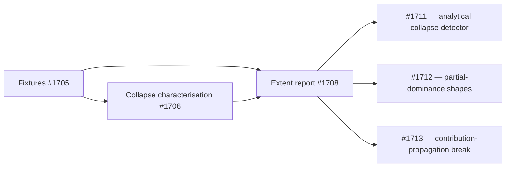

## Summary

Synthesised the #1704 characterisation work into the **extent report** — the
primary deliverable of milestone #1704 — and filed a follow-up issue for every
actionable gap. This is a **report-and-issue-filing deliverable only**: no
engine code, behaviour, or runtime surface changes (the issue's own Failure
Detection section is `N/A` for the same reason). Closes #1708.

`docs/DOMINATED_BRANCH_COLLAPSE_EXTENT.md` was expanded from the #1706
collapse-only report into the full #1704 report covering all three required
sections:

1. **Dominated-branch collapse** (MAX/MIN/IF, incl. IF condition synapses) —
   extent of automatic collapse today is **zero** on both analytical and
   empirical bases; contrasted against the full-collapse target. Grounded in
   `tests/issue_1706_dominated_branch_characterisation.rs`.
2. **Contribution propagation** across the three paths — win-fraction stats
   (`compute_selection_stats`) are **sound** (confirming NEAT-AI-Explore#513);
   the break is in candidate scoring
   (`detect_squash_weight_rescale_candidates` skips aggregates and simulates
   each neuron in isolation as `f(x)`), which explains the committed
   candidate-cache mispredictions (SELU→ABSOLUTE `+4.2e-10` predicted vs
   `−8.7e-4` actual; `d1ac1f41` 1-success/5-failure).
3. **"Not so clean" cases** — IF conditional dominance, multi-branch aggregates,
   and small-but-non-zero win fractions catalogued as findings F1–F3.

Follow-up issues filed and linked from #1704 (each behind a #1623-style
evaluate-before-accept gate):

- **G1 → #1711** — Analytical dominated-branch collapse detector + transform for
  MAX/MIN.
- **G2 → #1712** — Partially-dominated aggregate shapes.
- **G3 → #1713** — Contribution-propagation break in the expected-error-reduction
  estimator.

## Evidence

Backend/report deliverable — no web interface to screenshot. Evidence is the
committed report and the linked artefacts:

- Report: `docs/DOMINATED_BRANCH_COLLAPSE_EXTENT.md`.
- Grounding fixtures (already committed, #1705):
  `tests/fixtures/dominated_branch_collapse/` — the SELU→ABSOLUTE
  (`+4.2e-10`/`−8.7e-4`) and `d1ac1f41` (1/5) candidate-cache records the
  contribution section grades against.
- Grounding tests (already committed, #1706):
  `tests/issue_1706_dominated_branch_characterisation.rs` — the collapse
  characterisation whose results section 1 synthesises.
- Parent linkage: comment on #1704 linking the report and follow-ups #1711–#1713.

## Test Plan

No new tests — this issue is a documentation and issue-filing deliverable with
no code or behaviour change (per the issue's `N/A` Failure Detection). The
characterisation suites the report synthesises are already committed and remain
green:

- `tests/issue_1706_dominated_branch_characterisation.rs` (collapse
  characterisation).
- `tests/collapse_fixtures.rs::fixtures_load_offline` (fixture-drift guard).

This change touches only Markdown under `docs/` — no Rust source, so no
compilation, clippy, or test surface is affected. Validation run:
`./scripts/check-pr-summary-location.sh` (the PR-summary layout gate from
`quality.sh`) passes, and both Mermaid diagrams are standard `flowchart` blocks.
The full `quality.sh` gate (which runs `cargo upgrade --incompatible`) is left to
CI so an unrelated major-version dep bump is not folded into a docs-only PR.
