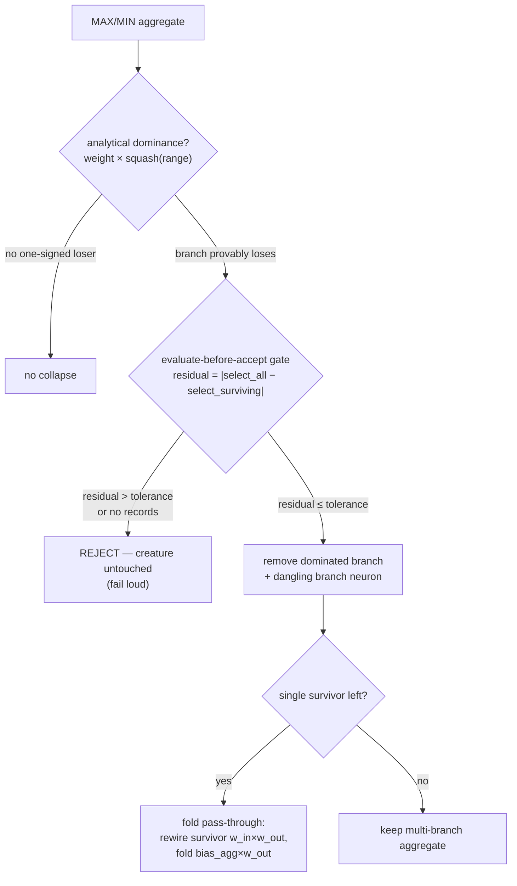

## Summary

Closes #1711.

Follow-up from the #1704 extent report (gap **G1** of
`docs/DOMINATED_BRANCH_COLLAPSE_EXTENT.md`). Before this change the engine had
**no analytical dominance proof or collapse transform** for selection aggregates
(MAXIMUM / MINIMUM): a branch could be provably losing yet, because it varies
across the observation window, the #1620/#1623 constant-neuron bias-fold
(`functionally_constant_neuron_uuids`) flagged nothing. The extent of automatic
collapse for selection aggregates was **zero**.

This PR adds a new module, `src/analysis/dominated_branch_collapse.rs`, that
closes G1:

- **Analytical-dominance detector.** A sound, sign-based proof over
  `weight × squash(range)`. Squashes whose *entire* output range is one-signed
  for every real input (`RELU`, `ABSOLUTE`, `SQUARE`, `SQRT`, `GAUSSIAN`,
  `LOGISTIC`, `SOFTPLUS`, `EXPONENTIAL`, `RELU6`, `STEP` are always `≥ 0`;
  `LOGSIGMOID` is always `≤ 0`) give a branch a provable *contribution* sign once
  multiplied by the branch weight's sign. For a MAXIMUM, a branch whose
  contribution is always `≤ 0` can never win against a branch always `≥ 0`; for a
  MINIMUM the mirror holds. Two-signed squashes (`TANH`, `IDENTITY`, `SINE`, …)
  are never flagged, so the proof only ever fires when it is provably correct.
- **Collapse transform.** Removes each dominated branch (and its now-dangling
  branch neuron) and, when a single survivor remains, folds the pass-through
  aggregate away — the survivor is rewired straight to the aggregate's targets
  with `weight_in × weight_out` and the aggregate bias folds into each target
  (`bias_agg × weight_out`). A single-input MAX/MIN equals its input, so the
  rewrite is exact.
- **Evaluate-before-accept gate**, consistent with the #1623 pattern. For every
  recorded observation the gate compares the aggregate's selection over *all*
  branches against its selection over the *surviving* branches and measures the
  residual `|select_all − select_surviving|`. A genuinely dominated branch leaves
  a zero residual and is accepted; a branch that only *looks* dominated moves the
  selection, exceeds tolerance, and is **rejected** with the creature left
  untouched. Missing records **fail loud** (no blind delete — Issue #3234).

The worked example collapses to its full target end state:

```
InputA --> Absolute --(W:-1)--+
                              +--> Max --> output   collapses to:   InputB --> ReLU --> output
InputB --> ReLU --------------+
```

**Out of scope** (unchanged, as the issue specifies): IF conditional dominance
(gap G2 / #1712) and the contribution-propagation estimator break (gap G3 /
#1713). The detector explicitly flags nothing for IF aggregates.

## Evidence

Backend/library change — no web interface to screenshot. Verified by the new
unit and integration tests (below) and the full `./quality.sh` gate passing
cleanly (fmt, clippy `-D warnings`, `cargo check`, all tests, `cargo doc
-D warnings`, release build).

### Collapse flow



## Test Plan

New in-module unit tests (`src/analysis/dominated_branch_collapse.rs`):

- `one_signed_squashes_classified`, `two_signed_and_unknown_squashes_are_mixed`,
  `contribution_sign_flips_with_negative_weight` — the sign classifier.
- `detects_dominated_absolute_branch_in_maximum`,
  `detects_dominated_relu_branch_in_minimum`,
  `no_dominance_when_all_branches_same_sign` — the detector.
- `collapse_removes_dominated_branch_and_folds_to_passthrough`,
  `gate_rejects_a_branch_that_actually_wins`,
  `missing_records_fail_loud_without_deleting`,
  `non_aggregate_target_returns_none`,
  `aggregate_bias_folds_into_target_on_passthrough` — the transform and gate.

New integration tests over the committed fixtures
(`tests/issue_1711_dominated_branch_collapse.rs`), sharing the same worked
example as the #1706 characterisation suite:

- `maximum_fixture_flags_dominated_absolute_branch`
- `maximum_fixture_collapses_to_passthrough` — reaches the 2-neuron / 2-synapse
  full-collapse target.
- `minimum_fixture_flags_and_collapses_dominated_relu_branch`
- `if_fixture_is_not_collapsed_out_of_scope`
- `empty_records_reject_the_collapse_no_blind_delete`

The pre-existing `tests/issue_1706_dominated_branch_characterisation.rs` suite is
untouched and still passes — it pins the *current* (no-collapse via
`functionally_constant_neuron_uuids`) side, while the new suite drives the
*target* side via the new detector/transform.
