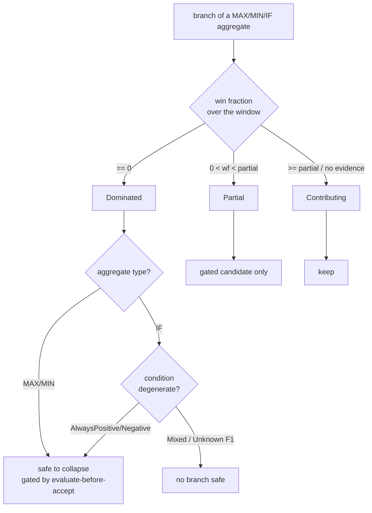

## Summary

Implements gap **G2** from `docs/DOMINATED_BRANCH_COLLAPSE_EXTENT.md` — the
partially-dominated ("not so clean") aggregate shapes the parent milestone
(#1704) asked to catalogue and, where provably safe, collapse. Closes #1712.

The #1706 characterisation only pinned the *cleanly, fully* dominated fixtures.
This PR adds the **safety-verdict** half of G2: a new analyser,
`src/focus/partial_dominance.rs`, that classifies every MAX/MIN/IF branch over
the recorded observation window and decides where a collapse is **provably
safe**. It reuses the already-sound `compute_selection_stats` win-fraction seam
(path 2 in the extent report) and performs **no** creature mutation — it is the
gate input the #1623 evaluate-before-accept check and the #1711/G1 collapse
transform consume.

The three catalogued shapes are each handled:

- **IF conditional dominance (F1).** IF selection is condition-driven, not a
  magnitude property. A dominated IF branch is reported safe **only** when the
  condition is provably degenerate over the window (`AlwaysPositive` /
  `AlwaysNegative`). A `Mixed` condition — the condition crosses zero, so both
  branches run — holds every branch regardless of branch magnitude. Flip the
  condition sign and the previously-dominated branch becomes the *only* selected
  branch, proving the dominance is not global.
- **Multi-branch combination dominance.** With more than two branches feeding one
  aggregate, a branch can be dominated by the *combination* of the others without
  being pairwise-dominated by any single one. This falls straight out of the
  empirical win fraction — the branch never wins the true multi-way selection, so
  it scores `0`.
- **Small-but-non-zero win fraction.** A branch that wins occasionally is
  classified `Partial` and surfaced only as a *gated candidate* — never
  auto-collapsed on the empirical signal alone. A `DominanceThresholds` policy
  governs the partial band.

Missing evidence is never reported safe (fail loud, Issue #3234): a branch with
no win-fraction record defaults to `Contributing`/unsafe.

### Why the collapse transform itself is not in this PR

The issue depends on the analytical-dominance detector (#1711/G1) landing first;
that is the transform that *removes* a branch and folds the single-branch
aggregate to a pass-through. #1711 is still open, so this PR delivers the
per-branch safety proof G2 owns — the decision gate — and leaves the mutation to
#1711, which consumes these verdicts.

## Evidence

Backend/analysis change — no web interface to screenshot. Verified by the new
unit/integration tests below (all pass) and the full `./quality.sh` gate (`fmt`,
`clippy -D warnings`, `check`, `cargo doc -D warnings`, `test`, release build).

Decision flow the analyser implements:

## Test Plan

New `tests/issue_1712_partial_dominance.rs` (8 tests, drive the real
`analyse_partial_dominance` / `safe_collapse_branches` API):

- `if_negative_branch_safe_only_when_condition_degenerate_positive` — degenerate
  condition (>0 ∀ obs) ⇒ negative branch `Dominated` + safe; condition synapse
  never safe.
- `if_mixed_condition_makes_no_branch_safe` — condition crosses zero ⇒ `Mixed`
  regime, no branch safe (F1).
- `if_condition_sign_flip_reverses_the_dominated_branch` — condition <0 ∀ obs ⇒
  positive branch becomes the safe one, negative branch is the only selected.
- `multi_branch_combination_dominated_is_safe_though_not_pairwise` — 3-way MAX
  where `neuron-c` never wins yet is not pairwise-dominated ⇒ safe.
- `small_win_fraction_is_partial_not_safe` — 2/64 win fraction ⇒ `Partial`,
  gated candidate, not safe.
- `threshold_policy_reclassifies_partial_band` — stricter `partial_win_fraction`
  reclassifies the same 0.031 fraction to `Contributing`.
- `fully_dominated_branch_is_safe_to_collapse` — baseline clean dominance ⇒ safe.
- `missing_evidence_is_never_reported_safe` — no records ⇒ `Contributing`/unsafe.

New fixture `tests/fixtures/dominated_branch_collapse/networks/multi_branch_maximum.json`
(three RELU branches feeding one MAXIMUM).

No existing tests were modified or removed; the #1706 and
contribution-propagation characterisation suites still pass.
