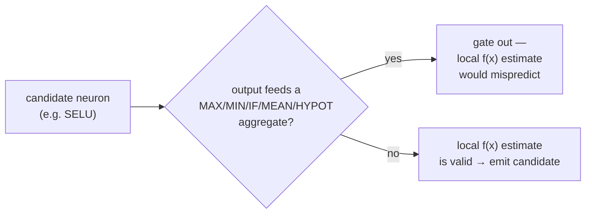

## Summary

Fixed the contribution-propagation break (gap **G3** from the #1704 extent
report) where the squash + weight rescale estimator produced misleading
`expectedErrorReduction` values for branches feeding a downstream aggregate
selection. Closes #1713.

`detect_squash_weight_rescale_candidates` simulates each candidate neuron in
isolation as `f(x)` and compares MAE against that neuron's **own** target. That
is only meaningful when the neuron's activation reaches the output through pure
`f(x)` neurons. When the branch instead feeds a MAX/MIN/IF (or MEAN/HYPOT)
selection aggregate, the aggregate — not the neuron — decides whether the
branch's value reaches the output, so a change that flips the branch's activation
sign/range changes which branch is selected. The local estimate cannot see that
effect and systematically mispredicts the gain (the committed
`v2_change-squash_selu-to-absolute` fixture: SELU→ABSOLUTE predicted `+4.2e-10`
but measured `−8.7e-4`).

Per the issue scope, until a proper propagation model exists we **gate out** any
candidate whose branch feeds a downstream aggregate, rather than emit a
misleading local estimate. The module already skipped candidate neurons that are
*themselves* aggregates; this adds the missing check for neurons whose **output
feeds** an aggregate. The gate is deliberately narrow — a neuron feeding only
pure `f(x)` neurons is unaffected.

### Change

- New `feeds_downstream_aggregate(creature, uuid)` helper: true if any outgoing
  synapse from the candidate targets a neuron whose squash is an aggregate
  (`is_aggregate_squash`).
- `detect_squash_weight_rescale_candidates` now `continue`s past any candidate
  for which `feeds_downstream_aggregate` is true.

## Evidence

Backend/CLI change — no web interface to screenshot. Verified via new unit
tests calling the real `detect_squash_weight_rescale_candidates` function:

- `test_branch_feeding_aggregate_is_gated_out` — reproduces the fixture shape
  (SELU branch → MAXIMUM aggregate); without the fix the local estimate emits a
  candidate, with the fix none is emitted.
- `test_branch_feeding_pure_neuron_still_produces_candidates` — identical branch
  feeding a pure IDENTITY neuron still produces candidates (gate is narrow, no
  regression).
- `test_all_aggregate_targets_trigger_gate` — MAXIMUM/MINIMUM/IF/MEAN/HYPOT/HYPOTV2
  all trigger the gate.
- `test_mixed_fanout_with_aggregate_is_gated_out` — a branch feeding both a pure
  neuron and an aggregate is still gated out (the aggregate path poisons the
  whole-creature estimate).

The existing #548 suite (7 tests) continues to pass, confirming the pure-`f(x)`
path is unchanged. `./quality.sh` passes cleanly.

## Test Plan

- Added `tests/recommendation/issue_1713_aggregate_gate.rs` (4 tests), registered
  in `tests/recommendation/main.rs`.
- Ran `cargo test --test recommendation issue_1713` → 4 passed.
- Ran `cargo test --test recommendation issue_548` → 7 passed (regression check).
- Ran `./quality.sh` → all checks passed.
