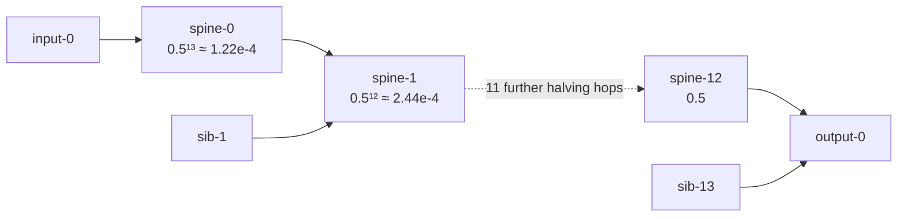

## Summary

Deleted the four test fixtures captured from private `stSoftwareAU` repositories
and re-based every consuming test onto hand-authored synthetic fixtures of
equivalent shape, so this public repository is fully self-contained. Closes #1722.

Removed (private-derived data):

| File | What it was |
|------|-------------|
| `tests/fixtures/remove_neuron_propagation/network.json` | ~3.2 MB production creature topology (1,666 neurons / 21,532 synapses) copied from a private repository |
| `tests/fixtures/remove_neuron_propagation/v2_remove-neuron_neuron-1802938338.json` | recorded remove-neuron failure copied from a private discovery cache |
| `tests/fixtures/change_squash_propagation/v2_change-squash_neuron-1481550544.json` | recorded change-squash failure copied from a private discovery cache |
| `tests/fixtures/dominated_branch_collapse/candidate_cache/v2_change-squash_selu-to-absolute.json` | candidate-cache record whose predicted/measured values were captured from a private record |

Replaced with hand-authored synthetic fixtures:

- **`network.json`** — a 13-hop deep-chain creature (27 neurons / 40 synapses).
  An IDENTITY spine `spine-0 … spine-12` reaches `output-0`; at every hop the
  spine merges with a sibling branch fed from its own input, so each hop halves
  the spine's share of the downstream weight budget. The propagation-aware
  influence of `spine-k` is therefore **exactly `0.5^(13−k)`**.
- **`v2_remove-neuron_spine-0.json`** — placeholder gain `+0.18` (what the retired
  public `#2483` formula `0.1 + (log10(err) − 10)/10 × 0.4` emits at
  `errorMagnitude = 1e12`) versus the closed-form propagated effect
  `analyticErrorReduction = −0.5¹³ = −1.220703125e-4`.
- **`v2_change-squash_spine-1.json`** — near-zero placeholder gain `+5e-10` versus
  `−(0.5¹² × 2.0) = −4.8828125e-4`, where `2.0` is the swap's local-error
  reduction (`currentError 3.0 − improvedError 1.0`).
- **`candidate_cache/v2_change-squash_selu-to-absolute.json`** — re-authored with
  hand-picked values (`+3.0e-10` predicted versus `−6.0e-4` outcome) that preserve
  the sign flip and >1e5 magnitude gap the contribution suite grades against.

Because every weight is `1` and every squash is `IDENTITY`, both reference values
are exact in `f32` and **derivable by hand**. The tests therefore assert equality
against an independent analytic oracle rather than a recording of whatever the
implementation happened to emit — the empirical grading that genuinely needed the
private measurements is the one thing that could not be reproduced publicly, and
the analytic reference replaces it without fabricating "measured" data. Fields
were renamed `actualErrorReduction` → `analyticErrorReduction` in the two
propagation records so nothing in the public repository claims to be an empirical
measurement it is not.

All three fixture READMEs now name no source repository; every provenance row
reads `Synthetic`.

### Attenuation the fixture encodes



## Evidence

Backend/library change with no web interface, so no screenshot applies. The
evidence is the test suite: `cargo test` passes in full, including the re-based
propagation, accuracy, dispatch and collapse suites.

```
running 3 tests
test remove_neuron_effect_at_depth ... ok
test propagation_estimate_beats_placeholder_at_depth ... ok
test placeholder_gain_is_wrong_at_depth ... ok

running 5 tests
test change_squash_effect_at_depth ... ok
test change_squash_placeholder_is_wrong_at_depth ... ok
test change_squash_gain_is_non_positive ... ok
test change_squash_gain_is_none_for_non_candidates ... ok
test change_squash_non_improving_swap_yields_zero_gain ... ok

running 3 tests
test estimate_sign_matches_reference ... ok
test estimate_within_10x_of_reference ... ok
test estimate_ranking_orders_candidates ... ok

running 3 tests
test no_fixture_names_a_private_source_repository ... ok
test every_fixture_is_small_enough_to_be_hand_authored ... ok
test fixture_walk_finds_the_committed_fixtures ... ok
```

The new guard was written first and confirmed to **fail** against the pre-fix
tree before the fixtures were cleaned:

```
committed fixtures must be hand-authored and self-contained, but 1 reference a
source repository:
  tests/fixtures/dominated_branch_collapse/candidate_cache/d1ac1f41.json names `<private repo>`
```

## Test Plan

**Added** — `tests/fixtures_self_contained.rs`, the regression gate that keeps
this fix from silently rotting:

- `no_fixture_names_a_private_source_repository` — walks every file under
  `tests/fixtures/` (data files *and* provenance READMEs) and fails if any names
  a source repository. The needles are assembled from fragments at runtime so the
  guard does not itself commit the names it excludes.
- `every_fixture_is_small_enough_to_be_hand_authored` — caps every committed
  fixture at 64 KB, far below the ~3.2 MB bulk capture that was deleted, so a
  renamed re-import still trips.
- `fixture_walk_finds_the_committed_fixtures` — harness-integrity guard so an
  empty walk cannot make the two guards above pass vacuously.

**Modified** (re-based onto the synthetic fixtures; no test was deleted, disabled
or weakened — every assertion has an equivalent against the analytic oracle):

- `tests/remove_neuron_propagation.rs` — `remove_neuron_effect_at_production_depth`
  → `remove_neuron_effect_at_depth` and
  `propagation_estimate_beats_placeholder_at_production_scale` →
  `propagation_estimate_beats_placeholder_at_depth`. The
  "within 10× of the measured actual" assertion is now the strictly stronger
  "equals the analytic reference exactly", and the placeholder still has to fail
  the same #1529 criterion the estimator passes.
- `tests/change_squash_propagation.rs` — `change_squash_effect_at_production_depth`
  → `change_squash_effect_at_depth`, same substitution.
- `tests/estimate_accuracy.rs` — the three #1529 criteria now grade against the
  analytic references (`estimate_sign_matches_reference`,
  `estimate_within_10x_of_reference`, `estimate_ranking_orders_candidates`). The
  ranking criterion still catches the retired placeholders: `0.18` dwarfs `5e-10`
  while the references rank the other way.
- `tests/ffi/issue_1530_dispatch_honest_remove_neuron_gain.rs` —
  `dispatch_tracks_measured_actual_at_production_depth` →
  `dispatch_tracks_analytic_reference_at_depth`.
- `tests/collapse_fixtures.rs`, `tests/contribution_propagation_characterisation.rs`
  — pinned values updated to the re-authored candidate-cache record.

**Documentation** — the three fixture READMEs, `.github/gitleaks.toml`'s example
key, and the `docs/DOMINATED_BRANCH_COLLAPSE_EXTENT.md` rows citing the
re-authored record.

## Security Self-Check

- [x] **Input validation** — no new external-input surface; fixture loaders keep
      their fail-loud `expect`/`panic`-with-path behaviour (Issue #3234).
- [x] **Secrets** — no `.env`, token or `.config*.json` file staged; the only
      hidden path touched is `.github/gitleaks.toml` (allowlisted workflow config).
- [x] **Injection surface** — no new SQL, shell, filesystem or HTTP calls.
- [x] **Output encoding** — no new rendering sink.
- [x] **Authentication/authorisation** — unchanged.
- [x] **Error handling** — no stack traces or internal paths leak to users; the
      new guard reports offending fixture paths in test output only.
- [x] **Dependencies** — no new third-party dependency.
- [x] **Private data** — the point of the change: ~3.2 MB of private production
      topology and three private-derived records are removed from a public
      repository, and a regression gate prevents their return.
