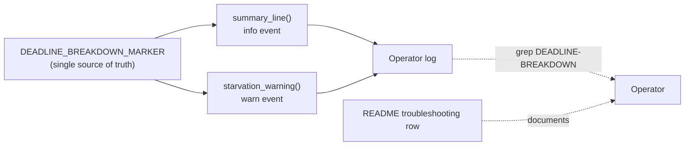

# Reword private-repo references in active documentation to concept level

## Summary

Active (non-archived) documentation named private repositories and deployments
as the evidence behind tuning decisions. Every such mention points a public
reader at a repository they cannot open — dead weight for them, and a standing
advertisement of private infrastructure names for everyone else. The evidence is
not the problem; the names are. Each mention now describes the same evidence at
concept level ("the production discovery cache", "the production creature", "a
large production creature"). Closes #1723.

All 15 offending lines called out in the audit are cleared:

| File | Lines | Change |
| --- | --- | --- |
| `docs/analysis/snapshot-mining-1631.md` | 13–15, 25 | Sources table rows and the cache analysis reworded; a note now states which rows are publicly reproducible. |
| `docs/FOCUS_SELECTION.md` | 121, 194, 237 | Production creature described by scale, not by deployment name. |
| `docs/CANDIDATE_PIPELINE_MCMC_AUDIT.md` | 19, 90, 162 | Cache citations reworded to "the production discovery cache". |
| `CHANGELOG.md` | 37, 51, 57, 102 | Historical entries reworded; facts, commits, and numbers unchanged. |
| `README.md` | 298 | Troubleshooting row now points at the renamed `DEADLINE-BREAKDOWN` log marker. |

The public `stSoftwareAU/NEAT-AI-Snapshot` citation is deliberately kept — that
repository is public and is what makes the snapshot numbers independently
checkable.

### Why the log marker was renamed here

`README.md` line 298 tells operators to grep logs for a marker literal. That
literal cannot be reworded in documentation alone: it is emitted by
`src/analysis/deadline_breakdown.rs` and asserted in
`tests/deadline_breakdown_test.rs`, so the docs and the code had to move
together. The issue's suggested fix anticipated this ("coordinate with the
source-side rename"), and neither companion finding (#1724 source/bench/example
*comments*, #1725 test *comments*) covers a log-contract literal — so it would
otherwise have been left behind by all three.

The marker is now the deployment-neutral `DEADLINE-BREAKDOWN`, exported once as
`analysis::deadline_breakdown::DEADLINE_BREAKDOWN_MARKER` so the string has a
single source of truth (DRY). Nothing else about the event changed — same
fields, same values, same emission points — and it is recorded under
`### Changed` in `CHANGELOG.md` because operator log greps must be updated.



## Scope

Out of scope, tracked separately and deliberately untouched:

- `docs/archive/` PR summaries — historical record, cleaned by #1726.
- Source, bench, and example comments — #1724.
- Test comments and a private-named test filename — #1725.
- Private CI-workflow policy citations — #1727.

## Evidence

This is a documentation change plus a log-marker rename; there is no web
interface to screenshot. The evidence is the new regression gate, which fails on
the pre-fix tree and passes after the fix.

Before the change (run against the unfixed docs), the guard reproduced the
audit's finding list exactly:

```text
active documentation must describe production evidence at concept level, but 15 line(s) name a private repository:
  CHANGELOG.md:37
  CHANGELOG.md:51
  CHANGELOG.md:57
  CHANGELOG.md:102
  README.md:298
  docs/CANDIDATE_PIPELINE_MCMC_AUDIT.md:19
  docs/CANDIDATE_PIPELINE_MCMC_AUDIT.md:90
  docs/CANDIDATE_PIPELINE_MCMC_AUDIT.md:162
  docs/FOCUS_SELECTION.md:121
  docs/FOCUS_SELECTION.md:194
  docs/FOCUS_SELECTION.md:237
  docs/analysis/snapshot-mining-1631.md:13
  docs/analysis/snapshot-mining-1631.md:14
  docs/analysis/snapshot-mining-1631.md:15
  docs/analysis/snapshot-mining-1631.md:25
```

After:

```text
running 2 tests
test active_doc_walk_covers_the_front_line_pages_only ... ok
test no_active_doc_names_a_private_repository ... ok

test result: ok. 2 passed; 0 failed; 0 ignored; 0 measured; 0 filtered out
```

`./quality.sh` passes end to end (build, `cargo deny`, clippy with `-D warnings`,
the full test suite, rustdoc, release build), and `markdownlint-cli2` reports 0
errors across the 67 linted Markdown files.

## Test Plan

Added `tests/issue_1723_active_docs_no_private_repo_names.rs` — the regression
gate, following the precedent set by `tests/fixtures_self_contained.rs` (#1722).
It reads the real files from disk and asserts on their contents, so it keeps
working regardless of how the docs are later restructured:

- `no_active_doc_names_a_private_repository` — walks every root-level Markdown
  page plus `docs/**` (excluding `docs/archive/`) and fails loudly (#3234) with
  a `file:line` list if any page names a private repository. The needle is
  assembled from fragments at runtime so the guard does not itself commit the
  name it exists to keep out.
- `active_doc_walk_covers_the_front_line_pages_only` — harness-integrity guard.
  Asserts the walk actually reaches the five pages the audit named and never
  descends into `docs/archive/`, so the guard above cannot pass vacuously on an
  empty or mis-scoped file set.

Modified `tests/deadline_breakdown_test.rs` — no test was removed or disabled.
`summary_line_attributes_all_phases` still pins the marker as a published log
contract; the asserted literal moves from the old deployment-named token to
`DEADLINE-BREAKDOWN`, and a doc comment records why the literal (rather than the
exported constant) is asserted: a silent rename must fail the build.

## Security Self-Check

- **Input validation** — no new function takes external input; both tests read
  paths derived from `CARGO_MANIFEST_DIR`.
- **Secrets** — no `.env`, credential, or `.config*.json` file staged; the diff
  is documentation, one exported constant, and one test file.
- **Injection surface** — no new SQL, shell, filesystem-write, or HTTP calls.
  The test performs read-only filesystem traversal within the repository.
- **Output encoding / auth / error handling** — unchanged; no user-facing
  response, endpoint, or privileged operation is touched, and no internal state
  is newly exposed. Both tests panic with the offending path on I/O failure
  rather than skipping silently.
- **Dependencies** — none added.
