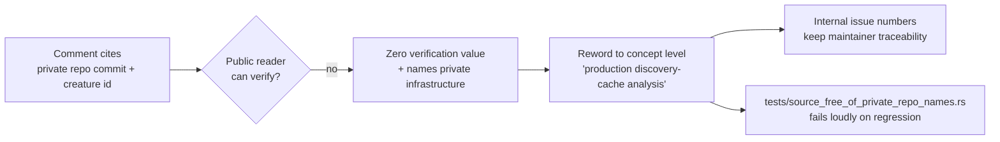

# Reword private-repo citations in source, bench, and example comments

## Summary

Comments across 43 `src/` files, all four `benches/` files, and
`examples/generate_snapshot.rs` cited private downstream repositories by name —
commit hashes and creature ids as the derivation evidence for scoring constants,
and local checkout paths in a private sibling repo as the example's documented
invocation. No public reader can inspect any of that evidence, so the citations
carried zero verification value while continuously naming private
infrastructure; the example's usage text documented an invocation the public
cannot reproduce at all.

Every citation is now at concept level — "production discovery-cache analysis",
"production scale", "the calling host layer" — with the internal issue numbers
already carried in most comments preserving traceability for maintainers. The
example describes its inputs generically (a discovery-data parquet plus the
creature JSON it analysed). **No constant, threshold, log field, or behaviour
changed** — this is a comment- and usage-text-only change plus one new
regression gate.

The deployment-named log marker called out in the issue was already renamed to
`DEADLINE-BREAKDOWN` by Issue #1723, so only the surrounding prose in
`src/analysis/deadline_breakdown.rs` needed rewording here. Test comments are
covered separately by Issue #1725, so `tests/` is deliberately out of scope.

Closes #1724.

## Evidence

This is a backend/library change with no web interface to screenshot. The
evidence is the new regression gate, which fails loudly (Issue #3234) rather
than silently allowing a private name back in.

Before the rewording, the gate listed every offending line:

```text
running 3 tests
test source_walk_finds_the_scanned_directories ... ok
test snapshot_example_documents_public_reproducible_inputs ... FAILED
test no_shipped_source_names_a_private_repository ... FAILED

  src/analysis/constants/candidate_scoring.rs:29 names a private repository
  ... (89 more lines across src/, benches/, examples/)

test result: FAILED. 1 passed; 2 failed
```

After:

```text
running 3 tests
test snapshot_example_documents_public_reproducible_inputs ... ok
test source_walk_finds_the_scanned_directories ... ok
test no_shipped_source_names_a_private_repository ... ok

test result: ok. 3 passed; 0 failed
```

`./quality.sh` passes cleanly (fmt, clippy `-D warnings`, `cargo check`, full
test suite, `cargo doc -D warnings`, release build).



## Test Plan

New — `tests/source_free_of_private_repo_names.rs`:

- `no_shipped_source_names_a_private_repository` — walks every `.rs` file under
  `src/`, `benches/`, and `examples/` and asserts none names a private
  repository, reporting every offending `file:line` in one run. Failed against
  the unreworded tree (90 lines), passes after.
- `snapshot_example_documents_public_reproducible_inputs` — asserts
  `examples/generate_snapshot.rs` no longer documents a private checkout path,
  and still documents the parquet input it expects (so the usage text is not
  simply emptied).
- `source_walk_finds_the_scanned_directories` — harness-integrity guard: an
  empty walk would make the guard above pass vacuously, so it asserts the walk
  finds ≥ 100 files and at least one under each scanned directory.

The guard's needles are assembled from fragments at runtime (same pattern as
`tests/fixtures_self_contained.rs`, Issue #1722) so the gate does not itself
commit the names it exists to keep out.

Existing suites are unchanged and all pass — the rewording touches only comment
text and the example's `eprintln!` usage lines, never assertions or values.
