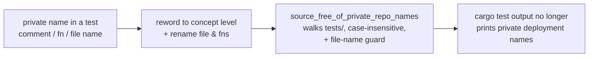

# PR Summary — Issue #1725

## Summary

Test doc comments, helper/test-function names, and one test **file** name across
`tests/` (outside `tests/fixtures/`) cited private `stSoftwareAU` deployments —
production sampler-cache commits, production corruption-log names, and several
numbered production deployments — as
their motivating evidence. `cargo test` prints those file and test names on every
run, so each mention pointed public contributors at private evidence they cannot
see or reproduce. This is check 3 of the private-repo reference audit (textual
private-repo name mentions in the test reading surface).

This PR rewords every such reference to concept level ("production failure-cache
evidence", "a large production creature") and renames the offending test file.
No test behaviour changed — only comments, identifiers, and a file name.

**Closes #1725.**

### What changed

- **Comments reworded to concept level** across 24 test files (e.g. a private
  sampler-cache mention became `Production discovery-cache analysis shows`; a
  numbered production deployment became `a large production creature`; a
  low-memory production regression became `mid-sized-projection regression`).
  Internal issue numbers are preserved for maintainer traceability.
- **Renamed** the FFI strip-pattern test file that carried a private-deployment
  name to `tests/ffi/issue_1188_strip_pattern_rejection.rs` (behaviour-describing
  name), updated the `tests/ffi/main.rs` harness `mod` reference, and renamed the
  private-named strip-pattern test functions to behaviour-describing `*_rejects_*`
  names.
- **Renamed private-named identifiers** the case-sensitive #1724 gate missed:
  the private-named CPU-pre-reject bench input in `benches/cpu_pre_reject.rs`
  became `production_shaped_batch`, and the private-named preload memory test in
  `src/analysis/utils/memory_tests.rs` became
  `test_preload_fits_mid_sized_projection_numbers`.
- **Extended the regression gate** `tests/source_free_of_private_repo_names.rs`
  to also walk `tests/`, match **case-insensitively** (so lower-case Rust
  identifiers are caught too), and add a **file-name** guard so a private name
  baked into a file name — which `cargo test` prints — fails loudly.

The production deadline-marker mentioned in the issue lives in `src/`, is
covered by the companion source-comments finding, and was **not** present in any
`tests/` file (verified by grep); no test in this repo asserts that literal
marker. `docs/archive/` PR summaries that still name the old file are the
historical record and are cleaned separately under Issue #1726 (explicit scope
note in the #1723 active-docs gate).

## Evidence

Backend/CLI change — no web interface to screenshot. Verified by the extended
regression gate plus the renamed FFI suite:



Gate run (fails before the reword — 48 comment lines + the private-named file name —
passes after):

```text
test snapshot_example_documents_public_reproducible_inputs ... ok
test no_source_file_name_embeds_a_private_repository ... ok
test source_walk_finds_the_scanned_directories ... ok
test no_shipped_source_names_a_private_repository ... ok
test result: ok. 4 passed; 0 failed
```

Renamed FFI suite (behaviour unchanged, all 18 pass):

```text
running 18 tests
test issue_1188_strip_pattern_rejection::validator_rejects_depth0_self_loop_pattern ... ok
...
test result: ok. 18 passed; 0 failed; 0 ignored; 99 filtered out
```

## Test Plan

- Extended `tests/source_free_of_private_repo_names.rs`:
  - `no_shipped_source_names_a_private_repository` now walks `tests/` and matches
    case-insensitively — reproduces the 48 offending comment lines against the
    unfixed tree and passes after the reword.
  - New `no_source_file_name_embeds_a_private_repository` fails against the old
    private-named strip-pattern test file name and passes after the
    rename.
- Ran `cargo test --test ffi issue_1188` — all 18 renamed strip-pattern tests
  pass, confirming the file rename and function renames did not change behaviour.
- `tests/fixtures_self_contained.rs` marker assembly adjusted so the gate source
  itself never commits the literal private names it excludes.
- Full `./quality.sh` gate run clean.
