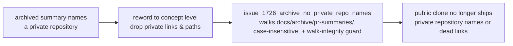

# PR Summary — Issue #1726

## Summary

The archived PR summaries under `docs/archive/pr-summaries/` named private
`stSoftwareAU` repositories — and in several places linked directly to private
issues, commits, and checkout paths. Archived or not, every file here ships in
every public clone and is indexed by search engines: the direct links pointed
the public at resources that 404 for them, and the sheer volume of name-level
mentions made the private repository names a pervasive fixture of a public repo.

This PR sweeps the archive once, rewording every private-repo reference to
concept-level phrasing ("the production discovery cache", "a large production
creature", "production-cluster fixture"), dropping the direct private
issue/commit links and the private checkout-path references, and adds a
regression gate that fails loudly if a private name is ever reintroduced. The
evidence itself is unchanged — commit hashes, creature ids, metrics, issue
numbers, and code identifiers are all preserved. **Closes #1726.**

### What changed

- **65 archived PR summaries** reworded to concept level. The sharpest instances
  the issue called out:
  - `pr-summary-432.md` — the four direct Markdown links to private issues
    became a plain-text list ("Four follow-up issues were raised in the private
    production observation-layer repository").
  - `pr-summary-465.md` — the direct link to the private sampler repository
    became "the production discovery cache".
  - `pr-summary-1109.md` — the private commit link collapsed to a bare commit
    hash (`50a2909`).
  - `pr-summary-1547.md` / `pr-summary-1548.md` — the `../` private checkout-path
    references were dropped in favour of "the production training-data binary".
  - `pr-summary-1156.md` — the private CI-workflow issue citations became "the
    Vibe Coder dependency-bump policy".
  - The remaining name-level mentions across ~55 files reduced to "production
    discovery cache / production deployment / production-cluster".
- **`CHANGELOG.md`** — the `[Unreleased]` entry describing the previous
  test-comment cleanup itself named the private deployments (a pre-existing
  active-docs-gate violation on the milestone branch); reworded to concept
  level, and a new entry added for this change.
- **New regression gate** `tests/issue_1726_archive_no_private_repo_names.rs` —
  the archive counterpart to the #1723 active-docs gate. It walks the whole
  archive and fails loudly (Issue #3234) the moment any archived summary names a
  private repository. Marker needles are assembled from fragments at runtime so
  the gate never commits the very names it excludes.

### Approach



## Evidence

Documentation change plus a new regression test — no web interface to
screenshot. Verified by the new gate and the existing doc/hygiene gates:

```text
test no_archived_summary_names_a_private_repository ... ok
test archive_walk_covers_the_pr_summaries ... ok

issue_1723_active_docs_no_private_repo_names ... ok (2 passed)
source_free_of_private_repo_names ............ ok (4 passed)
issue_1685_doc_link_integrity ................ ok (8 passed)
issue_1681_doc_staleness ..................... ok (8 passed)
```

A whole-tree case-insensitive sweep of `docs/`, `CHANGELOG.md`, and `README.md`
for the private repository markers returns no matches.

## Test Plan

- **Added** `tests/issue_1726_archive_no_private_repo_names.rs`:
  - `no_archived_summary_names_a_private_repository` — reproduces the finding
    (fails against the unfixed archive listing 120 offending lines across 65
    files) and passes after the sweep.
  - `archive_walk_covers_the_pr_summaries` — harness-integrity guard asserting
    the walk finds the full historical set (>50 files) and stays within
    `docs/archive/pr-summaries/`, so the guard above cannot pass vacuously.
- **Re-ran** the neighbouring doc/hygiene gates
  (`issue_1723_active_docs_no_private_repo_names`,
  `source_free_of_private_repo_names`, `issue_1685_doc_link_integrity`,
  `issue_1681_doc_staleness`) — all green, confirming the reworded links and
  paths did not break link-integrity or staleness checks.
- `cargo fmt --all --check` and `cargo clippy` on the new test are clean.
