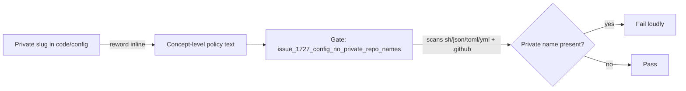

# Reword private policy-repo citations to concept level (Issue #1727)

## Summary

Three code/config files cited a **private** repository under the `stSoftwareAU`
organisation by issue slug. The cited issue is unreadable to the public, so the
pointer explained nothing to public readers while naming private infrastructure
— and the `renovate.json` one surfaces in dependency-dashboard UIs. This is
check 3 of the private-repo reference audit (textual private-repo name mentions
in code/config), completing the family already covered for shipped Rust source
(#1724/#1725), active docs (#1723), and archived PR summaries (#1726).

Each citation is now stated inline at concept level, dropping the private
pointer while preserving the traceable public `Issue #1234` reference:

- `bump-deps.sh:6` — `# Policy (per <private-repo>#1614):` →
  `# Supply-chain quarantine policy:`
- `renovate.json:8` — dropped the trailing
  "(the Vibe Coder worker policy in <private-repo>#1614)" and states the
  internal-exempt rule inline instead.
- `.github/workflows/semgrep.yml:41` — `(Issue #1234; <private-repo>#1614)` →
  `(Issue #1234)`.

Patch version bumped `0.74.156` → `0.74.157` per the repo version-bump
invariant.

Closes #1727.

## Evidence

Backend/config-only change — no web interface to screenshot.

New regression gate `tests/issue_1727_config_no_private_repo_names.rs` scans the
code/config surface (repo-root `*.sh`/`*.json`/`*.toml`/`*.yml`/`*.yaml` plus
everything under `.github/`) and fails loudly the moment the private name
reappears. The needle is assembled from fragments at runtime so the guard does
not itself commit the private name, matching the sibling gates' convention. It
matches on the private repo token alone, leaving the legitimate
`stSoftwareAU/NEAT-AI-Discovery` and `stSoftwareAU/*` internal-dep references
untouched.

Before the fix the gate reported exactly the three cited lines:

```
code and config must state policy at concept level, not by private repository
name, but 3 line(s) still do:
  .github/workflows/semgrep.yml:41 names the private policy repository
  bump-deps.sh:6 names the private policy repository
  renovate.json:8 names the private policy repository
```

After the reword all audit suites pass:

```
issue_1727_config_no_private_repo_names ... ok (2 tests)
source_free_of_private_repo_names        ... ok (4 tests)
issue_1723_active_docs_no_private_repo_names ... ok
issue_1726_archive_no_private_repo_names ... ok
issue_1234_quarantine_enforcement        ... ok (3 tests)
tests/bump_deps_test.sh                  ... ok (48 tests)
```



## Test Plan

- Added `tests/issue_1727_config_no_private_repo_names.rs`:
  - `no_code_or_config_names_the_private_policy_repository` — reproduces #1727
    (failed against the unfixed tree on all three lines, passes after the
    reword).
  - `config_walk_covers_the_expected_files` — harness-integrity guard that the
    walk actually reaches `bump-deps.sh`, `renovate.json`, and
    `.github/workflows/semgrep.yml`.
- Re-ran sibling audit gates (#1723, #1726, #1724/#1725) and
  `issue_1234_quarantine_enforcement` / `bump_deps_test.sh` to confirm the
  reword did not regress the quarantine policy — all pass.
- `shellcheck`, `bash -n`, `cargo fmt --check`, and `cargo clippy` clean on the
  changed files.
