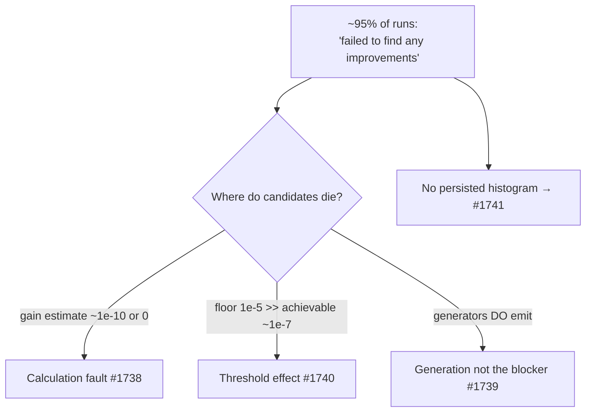

## Summary

Diagnoses **why** discovery runs against the large production cluster network
reject nearly every candidate, using the existing `RejectionBreakdown`
instrumentation (Issue #1129) cross-referenced against the production discovery
cache and commit history. Deliverable is a committed analysis doc —
`docs/analysis/rejection-diagnosis-1737.md`. **No production behaviour is
changed** (documentation only), as the issue mandates. Closes #1737.

### What the evidence shows

- Over the last 45 production discovery commits, **38 reported "failed to find
  any improvements"** and only **2** synced an accepted candidate (~95% empty
  runs), matching parent #1736.
- The persisted per-candidate records give the reason directly: rejected
  `change-squash` candidates carry `expectedCreatureScoreGain ≈ 4e-10`; every
  `remove-neuron` candidate carries `expectedCreatureScoreGain == 0`. Realised
  `scoreDelta`s for the same change types are `~1e-4`–`1e-3` in magnitude, and
  the only accepted change achieved `~1e-7`.
- The expected-gain estimate has therefore **collapsed to (near) zero before the
  acceptance floor sees it** — 5+ orders of magnitude too small, often the wrong
  sign. The `1e-5` `COORDINATED_MIN_EXPECTED_GAIN` floor then converts that
  collapse into `below_expected_gain_floor` / `below_multi_op_floor` /
  `non_positive_gain` rejections.

### Ranked dominant rejection reasons (reconstructed)

| Rank | Reason | Increment site |
| --- | --- | --- |
| 1 | `below_expected_gain_floor` | `discovery_dispatch.rs:431/797`, `candidate_aggregation.rs:145` |
| 2 | `below_multi_op_floor` | `candidate_aggregation.rs:258` |
| 3 | `non_positive_gain` | `candidate_aggregation.rs:228` |

### Where it points the siblings

- **#1738 (audit calc) — primary.** Root-cause the expected-gain estimator
  collapse. The MAX/MIN/IF dominated-branch path is one special case (only **12**
  aggregate neurons of 1660), not the whole story — the collapse also hits
  ordinary `change-squash` on non-aggregate neurons.
- **#1740 (thresholds) — secondary.** The `1e-5` floors sit two orders above the
  `~1e-7` deltas achievable on this converged creature; recalibrate *after*
  #1738 makes estimates trustworthy.
- **#1739 (generation) — narrowed.** Generators are emitting candidates; they
  die at the gain gate, so generation is not the blocker for this profile.
- **#1741 (harness) — enabling.** The live `RejectionBreakdown` histogram is not
  persisted by the consuming harness — capturing it is the top observability
  fix and would automate this issue's stale-diagnosis check.

## Evidence

Backend/CLI diagnostic change — no web interface to screenshot. Validation
performed instead:

- **Doc guards green** — `cargo test --test issue_1723_active_docs_no_private_repo_names --test issue_1726_archive_no_private_repo_names --test issue_1727_config_no_private_repo_names` (6 passed). The new doc describes production evidence at concept level and never names a private repository.
- **Instrumentation base green** (the evidence base this diagnosis rests on, per the issue's Failure Detection section) — `tests/issue_1129_rejection_breakdown.rs` (3 passed), `tests/issue_1446_zero_candidate_summary.rs` (4 passed), and the `rejection_reasons.rs` unit tests including `dominant_reason_picks_highest_count`, `top_level_summary_mentions_floor`, `top_level_summary_none_on_empty`, `all_reasons_list_contains_every_constant` (7 passed).
- **Markdown lint clean** — `markdownlint-cli2`, 0 errors.

The `quality.sh` dependency-bump step (`cargo upgrade --incompatible`) was
deliberately not run: this is a documentation-only change touching no Rust
source, and bumping dependencies would be unrelated churn (and risks the
documented wgpu/naga major-bump trap). No `Cargo.toml`/`Cargo.lock` changes are
part of this PR.

## Test Plan

No code changed, so no new automated tests are added — the diagnosis is
sufficient to localise the cause from the existing breakdown, so no new counter
was introduced (which would otherwise have required coverage in
`ALL_REJECTION_REASONS` / `all_reasons_list_contains_every_constant`). The doc is
guarded by the existing active-docs private-repo-name suites listed above, and
its evidence base is guarded by the rejection-breakdown suites listed above; all
pass on this branch.
