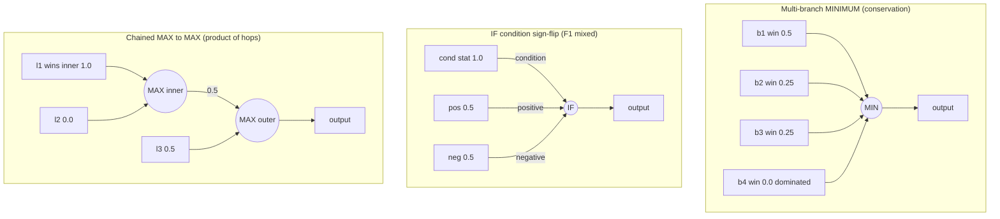

# Audit: focus/impact contribution through MAX/MIN/IF squashes on the production network

## Summary

Issue #1738 (parent #1736 — *Discovery finds very few successful candidates for
the production network*, the Round‑1 **lead hypothesis**) asked us to verify or refute
that neuron **focus selection** and **impact/contribution** calculations are
correct on the production network, especially where contribution propagates through the
three aggregation squashes (MAXIMUM / MINIMUM / IF).

**Audit result: no fault found.** The impact/contribution math through MAX/MIN/IF
is **sound** on production-shaped topologies. I built characterisation fixtures shaped
like the production network's aggregation sub-graphs — multi-branch aggregates, IF
condition sign-flips, and chained aggregates — that the earlier two-branch
dominated-branch fixtures (#1706, #1707, #1712) never exercised, computed the
expected contribution/impact **independently by hand** from a committed
observation window, and asserted `compute_impacts_with_activations`,
`compute_selection_stats`, and `compute_impacts_public` match those values
exactly. All assertions pass against the current engine with **no code change to
the impact math required**. This is a test-backed conclusion that focus/impact
through aggregation squashes is not the cause of the low successful-candidate
rate — a prerequisite for the parent's plateau close-criterion.

No production code changed: this PR adds fixtures, characterisation tests, an
audit-conclusion note in `docs/IMPACT_CALCULATION.md`, and the mandatory version
bump.

Closes #1738.

## Evidence

Backend/library audit — no web interface, so no screenshot. Evidence is the new
characterisation test suite (all values hand-computed, all passing):

```
running 5 tests
test high_impact_aggregate_branch_is_not_starved ... ok
test if_condition_sign_flip_attribution ... ok
test multi_branch_minimum_attribution_and_conservation ... ok
test multi_branch_fallback_flattens_to_one_over_n ... ok
test chained_maximum_product_propagation_and_conservation ... ok

test result: ok. 5 passed; 0 failed; 0 ignored
```

### What each production-shaped topology proves



- **Multi-branch attribution & conservation** — each branch's impact equals its
  empirical win fraction and the branch impacts **sum to the aggregate's impact**
  (`0.5 + 0.25 + 0.25 + 0.0 = 1.0`). No high-impact branch is starved; none is
  inflated.
- **IF condition sign-flip** — when the summed condition contribution changes
  sign across the window, both branches stay live (the F1 "mixed" regime). The
  always-active condition synapse carries full impact (`1.0`); the branch impacts
  equal their selection fractions (`0.5`, `0.5`) and sum to the aggregate impact.
- **Chained MAX → MAX** — contribution propagates as a **product of per-hop win
  fractions** with conservation at every hop (`l1+l2 = m1`, `m1+l3 = m2`). The
  fixture makes the inner winner deterministic, so the product-of-marginals
  equals the true joint exactly (`l1 = 1.0 × 0.5 = 0.5`).
- **No-records fallback** — without activation records the walk still splits
  impact `1/N = 0.25` across the four branches; the empirical selection-stats
  path is what corrects this flattening.
- **Focus ranking (no starvation)** — a high-impact aggregate branch embedded in
  a 100-neuron low-impact pool (the production needle-in-haystack) lands in the
  exploit/explore **exploitation head**, not the exploration tail — even under
  drought.

## Test Plan

- Added `tests/issue_1738_aggregation_squash_impact_characterisation.rs` with 5 tests
  (all expected values hand-computed from a documented observation window):
  - `multi_branch_minimum_attribution_and_conservation`
  - `if_condition_sign_flip_attribution`
  - `chained_maximum_product_propagation_and_conservation`
  - `multi_branch_fallback_flattens_to_one_over_n`
  - `high_impact_aggregate_branch_is_not_starved`
- Added production-shaped fixtures under
  `tests/fixtures/dominated_branch_collapse/networks/`:
  `agg_multi_branch_minimum.json`, `agg_if_condition_signflip.json`,
  `agg_chained_maximum.json`. Loaders fail loud on missing/malformed fixtures
  (Issue #3234).
- Existing guards (`contribution_propagation_characterisation.rs`,
  `issue_1712_partial_dominance.rs`, `issue_1706_dominated_branch_characterisation.rs`)
  remain unchanged and passing.
- `./quality.sh` passes cleanly (fmt, clippy `-D warnings`, `cargo deny`, tests,
  docs, release build).

## Notes

- No impact/focus miscalculation was found, so no production code changed and no
  regression fix was needed. Per the acceptance criteria this is recorded as a
  **documented, test-backed conclusion** that the calculations are correct.
- Australian English used throughout (characterise, behaviour, etc.).
