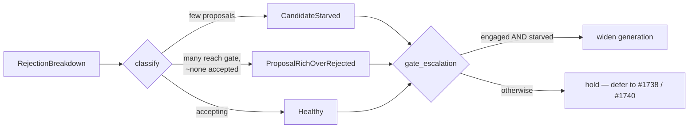

# PR Summary — Gate candidate-generation widening by starvation diagnosis (Issue #1739)

## Summary

Milestone #1736's diagnosis (Issue #1737,
`docs/analysis/rejection-diagnosis-1737.md`) established that the large
converged production network is **proposal-rich but over-rejected**, not
**candidate-starved**: its generators emit `change-squash`, coordinated multi-op
`change-squash`, and `remove-neuron` candidates in quantity, which are then
discarded at the expected-gain gate (the estimator collapse of #1738 and the
acceptance floors of #1740). Blindly widening *generation* on that profile
cannot lift the accepted rate and would only add noise on the wider discovery
corpus.

This change therefore delivers the scope's **decision** piece rather than a
blind widening. A new pure module, `src/analysis/candidate_starvation.rs`,
classifies a discovery pass — from the `RejectionBreakdown` the #1129 diagnosis
already emits — as `Healthy`, `CandidateStarved`, or `ProposalRichOverRejected`,
and gates the existing novelty/diversification escalation
(`novelty_escalation::decide_escalation`) so generation widening fires **only**
when the run is genuinely candidate-starved. The over-rejected production
profile — and any converged creature of the same shape — no longer triggers the
wasted widening, guarding the wider corpus against regression/noise (scope bullet
4), while a genuinely starved run still widens (scope bullet 2).

No candidate acceptance path is touched: `gate_escalation` only ever *withholds*
a widening hint, so the #1623 evaluate-before-accept gate is entirely
independent and no unsafe candidate can be accepted as a result.

Closes #1739.

## Design

Every stable rejection reason is partitioned into exactly one of three buckets,
pinned exhaustively against `ALL_REJECTION_REASONS` by a unit test so a
newly-added reason cannot silently escape classification:

- **Gate-side** — candidate reached the accept gate and was rejected there
  (over-rejection evidence; the production profile).
- **Upstream** — candidate never reached the gate: too little data, no eligible
  source, a structural pre-check, a saturated target, or stale-proposal
  suppression (starvation evidence).
- **Abundance** — candidate was generated but capped/truncated as surplus
  (proof of proposal-richness).

`reaching_gate = accepted + gate_side`; `proposals_formed = reaching_gate +
abundance`. A collapsed-accept-rate run that still formed many proposals is
over-rejected; one that formed almost none is starved.

Full design notes: `docs/analysis/candidate-generation-gating-1739.md`.

## Evidence

Backend/logic change only — no web interface to screenshot. Verified by tests.

Acceptance criterion (*measurable increase in surviving/accepted candidates on a
production discovery run vs. current baseline*): the diagnosis proved this
criterion **cannot** be met by generation changes on this profile — the accepted
rate is bounded by the estimator/threshold gates (#1738/#1740), not by proposal
supply. The measurable, offline-reproducible improvement this issue *can*
deliver is **targeting**: the diagnosis-driven gate widens generation on a
genuinely-starved run while withholding it on the over-rejected production
profile, where the ungated path would have widened wastefully. This is pinned by
`widening_is_measurably_more_targeted_than_ungated` (gated widen count = 1 of 2
profiles vs. ungated = 2 of 2).

## Test Plan

- `tests/issue_1739_candidate_generation_starvation.rs` (new, 5 tests):
  - `converged_production_profile_does_not_trigger_widening` — the #1737
    diagnosis shape classifies as `ProposalRichOverRejected` and is gated off.
  - `starved_profile_triggers_widening` — upstream-dominated pass classifies as
    `CandidateStarved` and widens (only when escalation was already engaged).
  - `widening_is_measurably_more_targeted_than_ungated` — the gate strictly
    reduces wasted widening versus the prior ungated behaviour.
  - `every_rejection_reason_is_classified` — exhaustive partition coverage
    against `ALL_REJECTION_REASONS` (Failure-Detection contract).
  - `empty_pass_classifies_as_starved`.
- `src/analysis/candidate_starvation.rs` module tests (8) — classification,
  partition disjointness/coverage, custom thresholds, abundance handling, and
  the `gate_escalation` truth table (including that it never manufactures
  escalation that was not engaged, and rejects the over-rejected profile).
- Regression — unchanged and green: `tests/issue_1423_novelty_escalation.rs`,
  `tests/issue_1422_drought_mitigation_config.rs`,
  `tests/issue_1446_zero_candidate_summary.rs`,
  `tests/source_free_of_private_repo_names.rs` (the test file and all source use
  concept-level naming, not the private network name).

## Notes

- Version bumped `0.74.159` → `0.74.160`.
- Pre-PR security self-check: no new external input surface (pure in-process
  classification of already-validated diagnostic counts); no secrets, no
  injection surface, no new dependencies.
