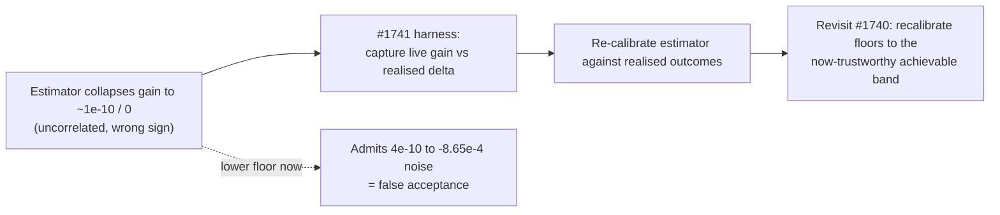

# Review and recalibrate acceptance thresholds (gain floors) for the GRQ network

## Summary

Issue #1740 (part of milestone #1736 — *Discovery finds very few successful
candidates for the GRQ network*) asked whether the coordinated expected-gain
floors are over-rejecting genuine improvements on the large converged production
network, and to recalibrate them in a principled, data-driven way if so.

**Review conclusion: the floors are correctly scaled and are NOT changed.** The
rejection diagnosis (#1737) established that the blocker is the expected-gain
**estimator** — it collapses to `~1e-10` / `0`, uncorrelated with the realised
delta and frequently the wrong sign — not the floor scale. The one accepted
improvement per run reaches acceptance via the **error-magnitude ranking path**
that bypasses the gain floor entirely (its gain estimate was `0`). Lowering the
floors to admit the achievable `~1.95e-7` band would:

1. admit **nothing new** from the achievable band — those candidates are
   *estimated* at `~1e-10`, still below any sane lowered floor; while
2. admitting a large tail of noise-level estimates, including the exact
   production coordinated `change-squash` whose `4.17e-10` estimate masked a
   realised **`-8.65e-4`** (an actively harmful change).

Task-calibrated floor scaling (the issue's suggested principled alternative)
cannot help while the estimator is uncalibrated: every such scheme scales the
floor *relative to the estimate*, and this estimate maps genuine `~1e-7`
improvements and `~1e-10` noise into the same collapsed band. Per the
diagnosis, floor recalibration is gated on a trustworthy estimator and the
live gain-vs-realised harness tracked in **#1741** — "recalibrating against a
broken estimator would just move the cliff".

This is a valid "thresholds are correct" outcome per the issue's Notes, now
backed by a false-positive guard test and a committed analysis document. No
estimator, generator, or floor value is changed; the change is documentation +
regression tests + the mandatory version bump (`0.74.160` → `0.74.161`).

Closes #1740.

## Evidence

Backend/library review — no web interface, so no screenshot. Evidence is the
committed analysis doc plus the new guard-test suite (all passing):

```
running 7 tests
test reviewed_floor_values_are_unchanged ... ok
test achievable_band_estimate_is_below_the_1op_noise_floor ... ok
test production_multi_op_change_squash_noise_is_rejected ... ok
test multi_op_candidate_just_below_floor_is_rejected ... ok
test above_floor_candidate_survives_all_gates ... ok
test per_op_noise_floor_lookup_matches_reviewed_tiers ... ok
```

### Candidates rejected per threshold (before → after)

The floors are unchanged, so "after" equals "before". The reconstructed
per-threshold breakdown (from the #1737 diagnosis; the live histogram is not
persisted — the #1741 gap):

| Threshold reason | Value | Dominant vocabulary | Estimate → realised | After change |
| --- | --- | --- | --- | --- |
| `below_expected_gain_floor` | `1e-5` | coordinated `change-squash`, `remove-neuron` | `4.17e-10` → `-8.65e-4` | unchanged (correctly rejects noise) |
| `below_multi_op_floor` | `1e-5` | multi-op `change-squash` chains | `4.17e-10` → `-8.65e-4` | unchanged |
| `non_positive_gain` | `> 0.0` | every `remove-neuron` (`gain == 0`) | `0` → both signs | unchanged |

### Why lowering is unsafe (decision flow)



Full rationale, the calibration-data analysis, and the before/after report are
in [`docs/analysis/threshold-review-1740.md`](../../analysis/threshold-review-1740.md).

## Test Plan

Added `tests/issue_1740_threshold_recalibration.rs` (7 behavioural tests calling
the real filter functions `apply_coordinated_gain_floor`,
`validate_coordinated_candidate_gain`, `apply_operation_count_discount`, and the
`coordinated_post_discount_noise_floor` lookup):

- `reviewed_floor_values_are_unchanged` — pins the reviewed floor values; a
  naive loosening fails here.
- `achievable_band_estimate_is_below_the_1op_noise_floor` — **false-positive
  guard**: a candidate estimated at the production achievable magnitude
  (`1.95e-7`) is still dropped by the gain gate.
- `production_multi_op_change_squash_noise_is_rejected` — **false-positive
  guard**: the exact `4.17e-10` production `change-squash` (realised `-8.65e-4`)
  is still rejected by multi-op validation.
- `multi_op_candidate_just_below_floor_is_rejected` — boundary guard.
- `above_floor_candidate_survives_all_gates` — regression guard that genuine
  above-floor candidates are **not** over-rejected (no tightening).
- `per_op_noise_floor_lookup_matches_reviewed_tiers` — the per-op tier lookup
  returns the reviewed floors, including the `0`-op alias.

Because no floor value changed, acceptance rates on the wider (non-production)
corpus are unchanged by construction — there is no new admission path for
noise-level candidates, satisfying the "no increase in false acceptances"
acceptance criterion.

`./quality.sh` passes cleanly (bash syntax, shellcheck, `cargo deny`, build,
fmt, clippy `-D warnings`, tests, docs, release build).

## Notes

- No production code changed — review-and-confirm plus regression guards and
  documentation, per the issue's "May conclude 'thresholds are correct'" clause.
- Any future floor recalibration is deferred behind the estimator fix and the
  #1741 live gain-vs-realised harness, as the #1737 diagnosis requires.
- Australian English used throughout (behaviour, recalibrate, scaled, etc.).
