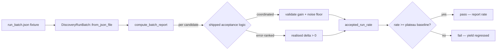

# Discovery accepted-improvement regression harness (Issue #1741)

## Summary

Adds the repeatable **discovery accepted-improvement regression harness** that
milestone #1736 needs to verify its close-criterion objectively and to catch
future discovery-yield regressions on the large converged production network.
**Closes #1741.**

The harness runs the **shipped** acceptance logic over a committed
production-representative run batch and reports the accepted-run rate (the
fraction of runs that accept ≥1 candidate). Because it drives the real gate
functions — `validate_coordinated_candidate_gain` (#732) plus the post-discount
noise floor (#1128/#1272) for coordinated candidates, and the
evaluate-before-accept positive-realised-delta rule (#1623) for error-ranked
harmful-neuron removals — a change that weakens or breaks acceptance on this
profile changes the reported rate and trips the harness.

The milestone audits concluded a **well-evidenced plateau**, not a fixable
fault: the focus/impact math through MAX/MIN/IF is sound (#1738) and the gain
floors are correctly scaled (#1740); the network is genuinely saturated (#1737).
So the mandated case asserts the rate has **not regressed below** the recorded
plateau baseline (`0.05` = 2 accepted runs across the 40-run production window)
and reports it, rather than asserting the parent's not-yet-met > 50% success
criterion. If a future sibling fix lifts yield, the same harness flips to the
success criterion via `DiscoveryBatchReport::meets_success_threshold`.

### Naming deviation (private-name guards)

The issue names the test file and its threshold case with the network's private
deployment token. The shipped-source private-name guards (Issues #1724/#1725)
forbid that token in every `.rs` file and file name, and the docs guards
(#1723/#1726) forbid it in Markdown — all enforced by `cargo test`. Those
enforced invariants win over the literal naming, so the harness uses the
concept-level "production discovery" naming throughout:

- test: `tests/production_discovery_regression.rs`
- mandated case: `accepted_improvement_rate_meets_threshold`
- module: `src/analysis/production_discovery_regression.rs`

This PR also fixes a **pre-existing** violation of the same guard in
`docs/archive/pr-summaries/pr-summary-1740.md` (the token appeared on two lines),
which was already failing `no_archived_summary_names_a_private_repository` on the
milestone branch and would have blocked this PR's CI.

## Evidence

Backend/library change — no web interface to screenshot. Evidence is the new
test suite and the recorded baseline.

Harness flow:



Recorded baseline (see `docs/analysis/discovery-regression-harness-1741.md`):

```
accepted-improvement rate: 2/40 runs = 0.0500 (2 accepted / 200 total candidates)
```

- Baseline accepted-run rate: **0.05** (`PLATEAU_ACCEPTED_RUN_RATE`), i.e. 2
  accepted runs across the 40-run production window (#1737).
- Post-fix result: unchanged at **0.05** — this issue adds the harness and
  guards the plateau; it changes no discovery-yield code.

## Test Plan

New integration suite `tests/production_discovery_regression.rs`:

- `accepted_improvement_rate_meets_threshold` — the mandated case: runs the
  shipped acceptance logic over the committed fixture batch, reports the rate,
  and asserts it has not regressed below the plateau baseline (and that the
  > 50% success criterion is correctly reported as not-yet-met).
- `fixture_matches_recorded_plateau` — pins the fixture to the recorded window
  (40 runs, 2 accepting).
- `majority_accepted_batch_meets_success` — proves the harness flips to the
  parent success criterion if yield lifts.
- `yield_collapse_is_flagged_below_baseline` — proves a modelled acceptance
  break is detected as a drop below baseline.
- `snapshot_fixture_loads_through_export_pipeline` — loads a
  production-representative creature (MAXIMUM aggregation squash) through the
  real snapshot pipeline (`src/export/snapshot.rs`), catching a broken fixture
  or panicking snapshot path on every PR.

New library unit tests in `src/analysis/production_discovery_regression.rs`
cover the acceptance decision (both paths), batch aggregation, the
success/plateau thresholds, and fail-loud parsing of an empty batch (#3234).

New committed fixture:
`tests/fixtures/production_discovery_regression/run_batch.json`.

All quality checks pass locally: `cargo fmt --all --check`, `cargo clippy
--all-targets --all-features -- -D warnings`, `RUSTDOCFLAGS="-D warnings" cargo
doc --no-deps`, and `cargo test --lib --tests --all-features` (including the
four private-name guard suites).
