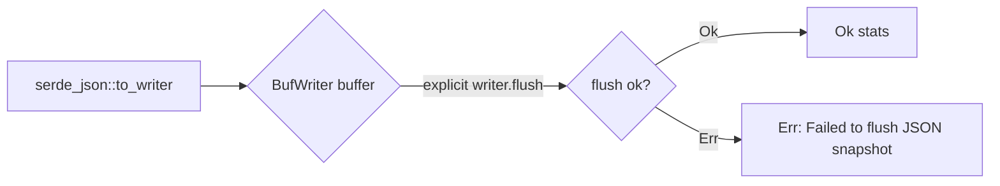

## Summary

`export_visualisation_snapshot` in `src/export/snapshot.rs` serialised the
snapshot through a `BufWriter` that was moved into `serde_json::to_writer` and
dropped on return. `BufWriter`'s `Drop` flushes buffered bytes but **discards**
any I/O error, so a flush failure (disk full, quota exceeded, underlying I/O
error) after `to_writer` returned `Ok` silently lost the buffered tail — and
because the default buffer is 8 KiB, a small snapshot could be lost in its
entirety while the function still reported `Ok(stats)`. The Deno host then read
a truncated or empty `.json` snapshot with no error anywhere in the chain.

The write path now flushes explicitly and propagates the error, so a failed
flush fails loud instead of masquerading as success. The write logic was
extracted into a small `write_snapshot_json<W: Write>` helper so the flush-error
path is directly unit-testable with a mock writer.

Closes #1750.

## Evidence

Backend/CLI change — no web interface to screenshot. Verified via unit tests
(below) and the full `./quality.sh` gate, which passes cleanly (fmt, clippy
`-D warnings`, `cargo deny`, full test suite, docs, release build).

Before this fix the buffer was flushed only by `Drop`, whose error was discarded
— the `Err` edge did not exist and a failed flush returned `Ok`.

## Test Plan

Added to `src/export/snapshot.rs` (`mod tests`):

- `write_snapshot_json_propagates_flush_error` — a `FlushFailsWriter` that
  accepts writes but errors on `flush` proves the error now surfaces as `Err`
  naming the target file. This is the regression test: against the unfixed
  drop-flush code it returned `Ok` (error swallowed) and would fail this
  assertion.
- `write_snapshot_json_succeeds_on_healthy_writer` — a healthy in-memory writer
  serialises and flushes successfully, and the bytes round-trip back into a
  `VisualisationSnapshot` (happy path).

The existing `snapshot_fixture_loads_through_export_pipeline` regression test in
`tests/production_discovery_regression.rs` continues to pass, confirming the
end-to-end export is unchanged.
