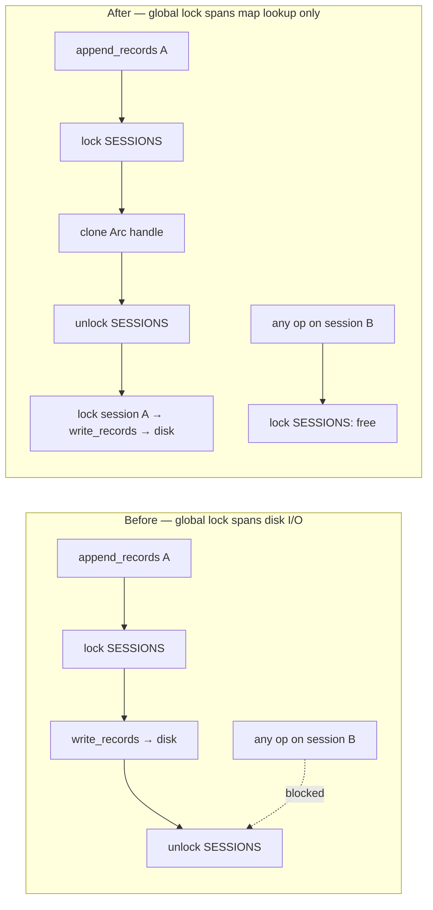

## Summary

`append_records` held the process-global `SESSIONS` mutex for an entire batch —
including every `write_records` call, which serialises rows to the session's
Parquet file on disk. With one lock for *all* recording sessions, a slow disk
write on session A stalled `start_session`, `append_records`, `finish_session`,
`cancel_session`, `active_session_count`, and the TTL sweep on *every* other
session.

Sessions are now stored as `Arc<Mutex<RecordingSession>>`. The global lock is
held only long enough to look up, insert, or remove a handle; all Parquet I/O
runs under the per-session lock with the global lock already released. Behaviour
is unchanged — same errors, same record counts, same temp-file cleanup — only
contention is confined to the session actually being written. Closes #1751.

Two follow-on I/O paths were moved out from under the global lock in the same
change:

- `cancel_session` / `cleanup_stale_sessions` return the removed handle and drop
  it *after* releasing the global lock, because `RecordingSession::drop` deletes
  the incomplete `.parquet.tmp` file (disk I/O).
- The TTL sweep uses `try_lock` per session: a session whose lock is held is
  mid-write and therefore active by definition, so it is skipped rather than
  blocking the sweep, and is reclaimed on the next sweep.

## Evidence

Backend/library change — no web interface to screenshot. Verified by the tests
below plus the full `./quality.sh` gate (fmt, clippy `-D warnings`, `cargo deny`,
check, test, release build).

**Lock scope before and after:**



**TDD red proof.** A scratch test emulating the pre-fix design (holding the
global `SESSIONS` lock for the duration of session A's write, then appending to
session B on another thread) fails against the old locking:

```
thread 'streaming::tests::scratch_old_behaviour_blocks_other_sessions' panicked at src/streaming.rs:874:9:
PRE-FIX: session B blocked behind the global lock: Err(Timeout)
test result: FAILED. 0 passed; 1 failed
```

The committed equivalent, `test_other_sessions_proceed_while_one_session_is_locked`,
passes against the new design in 0.06s. The scratch test itself was not
committed — it can only express the old, removed locking model.

## Test Plan

New tests in `src/streaming.rs` (unit, exercise the internal handle):

- `test_other_sessions_proceed_while_one_session_is_locked` — with session A's
  per-session lock held (standing in for an in-progress Parquet write),
  `active_session_count`, `append_records` on session B, and `start_session` all
  complete on another thread within a 10s bound. This is the regression test for
  #1751; it times out against the old locking (see Evidence).
- `test_cleanup_skips_locked_session_then_reclaims_it` — the TTL sweep returns
  promptly while a stale session is mid-write, skips it, and reclaims it on the
  next sweep once the write completes.
- `test_concurrent_appends_to_same_session_are_serialised` — four threads
  appending to one session lose no records; `finish_session` reports the full
  total.

New integration tests in `tests/issue_1751_streaming_session_locks.rs` (public
API only):

- `concurrent_sessions_each_record_their_own_batches` — four sessions appending
  concurrently each finalise with exactly their own record count and file.
- `cancelling_one_session_leaves_another_usable` — cancelling A removes A's
  partial file and leaves B fully usable.
- `appending_to_a_finished_session_fails_loudly` — appending after finish returns
  a `Session not found` error rather than silently succeeding.

Modified existing tests (structural only, no assertions weakened or removed):

- The three tests that backdated `created_at` through `sessions.get_mut()` now
  use a `backdate_session()` helper, since map values are handles rather than
  sessions.
- `test_drop_without_finish_cleans_up_file` removes the session via
  `remove_session_handle()` instead of locking the map inline.

`Cargo.toml` version bumped `0.74.162` → `0.74.163` per AGENTS.md.
