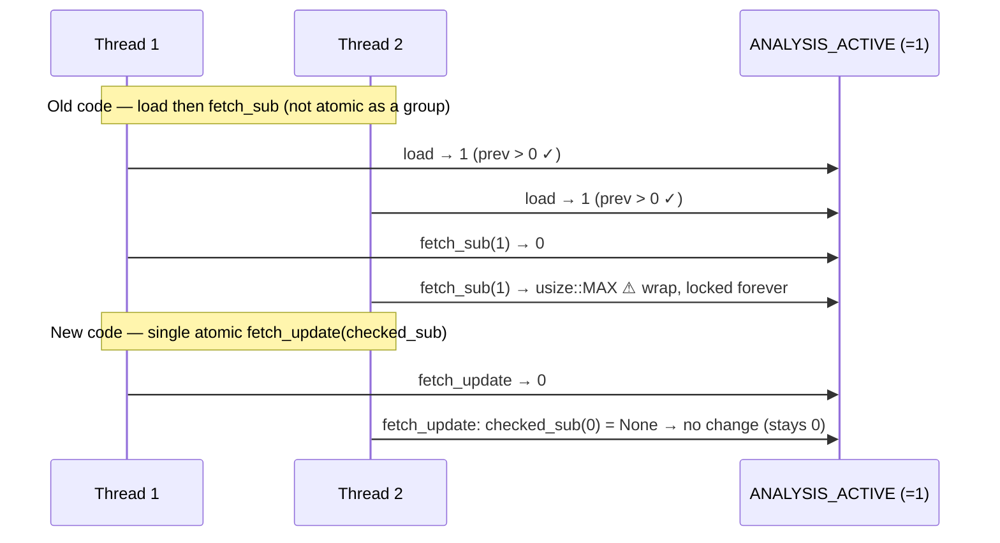

## Summary

Made `mark_analysis_finished()` in `src/cancellation.rs` perform its saturating
decrement as a single atomic read-modify-write. Previously the "only decrement
if greater than zero" guard was a separate `load` followed by `fetch_sub` — two
individually atomic operations that were not atomic as a group. Two concurrent
unbalanced callers could both observe `prev == 1`, both pass the guard, and both
decrement, wrapping the `usize` counter to `usize::MAX`. From then on
`is_analysis_active()` would return `true` forever, so the TypeScript host would
never delete the Parquet temp directory — the "discovery locked up" symptom the
guard exists to prevent.

The fix replaces the split check-then-decrement with `AtomicUsize::fetch_update`,
whose closure returns `v.checked_sub(1)` — `None` when the value is already `0`,
which leaves the counter untouched. The check and the decrement are now one
atomic step, so the saturation the doc comment promises is actually delivered.

Under the crate's own RAII usage (`AnalysisActiveGuard`) calls are balanced and
the race was unreachable, hence the low severity — but `mark_analysis_finished`
is `pub`, so nothing confines callers to the guard.

Closes #1752.

## Evidence

Backend/library change only — no web interface to screenshot.

Behaviour is verified by two new unit tests (see Test Plan). The concurrency
test reproduces the wrap bug: it seeds the counter to `1` and fires two threads
that both call `mark_analysis_finished()` after a `Barrier`, repeated 1,000
times. Against the old `load` + `fetch_sub` implementation this wraps the counter
to `usize::MAX`; with the atomic `fetch_update` the counter always saturates at
`0`.



Test run:

```
running 8 tests
test cancellation::tests::test_mark_analysis_finished_saturates_at_zero ... ok
test cancellation::tests::test_mark_analysis_finished_concurrent_does_not_wrap ... ok
...
test result: ok. 8 passed; 0 failed
```

## Test Plan

- Added `src/cancellation.rs::tests::test_mark_analysis_finished_saturates_at_zero`
  — an unbalanced call on a zero counter must leave it at `0`, not wrap to
  `usize::MAX`.
- Added `src/cancellation.rs::tests::test_mark_analysis_finished_concurrent_does_not_wrap`
  — regression test: two concurrent finishes on a counter of `1` must saturate
  at `0`, exercised 1,000 times to surface the race if reintroduced.
- Existing cancellation tests continue to pass unchanged.
