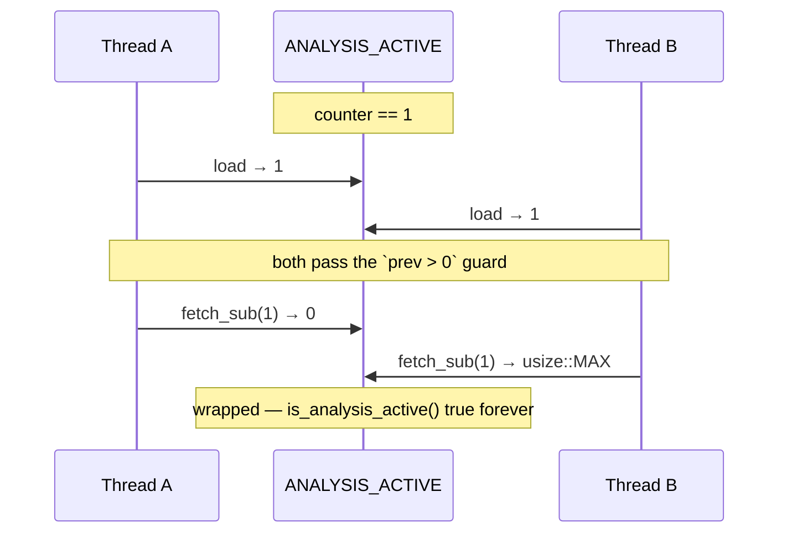

## Summary

`mark_analysis_finished()` in `src/cancellation.rs` implemented its "saturating
decrement" as a separate `load` followed by `fetch_sub` — two individually
atomic operations that are not atomic as a group, so the saturation guard could
be defeated by concurrent callers. Replaced the pair with a single
`fetch_update(Release, Acquire, |v| v.checked_sub(1))`, making the check and the
decrement one atomic step. Closes #1752.

### Why it matters

`mark_analysis_finished` is `pub`, so nothing confines callers to
`AnalysisActiveGuard`. If the counter is `1` and two threads call it
concurrently, both observe `prev == 1`, both pass the guard, and both decrement
— wrapping `ANALYSIS_ACTIVE` to `usize::MAX`. From then on `is_analysis_active()`
returns `true` forever, so the TypeScript host never deletes the Parquet temp
directory: exactly the "discovery locked up" symptom the Issue #1077 guard was
built to prevent.



After the fix the read-modify-write is a single atomic operation, so the losing
thread re-reads `0`, `checked_sub` yields `None`, and the update is abandoned.

## Evidence

Backend-only change with no web interface, so no screenshot applies. Evidence is
the regression test, which was written first and demonstrably fails against the
unfixed implementation:

**Before the fix** (`cargo test --lib cancellation:: -- --test-threads=1`):

```
test cancellation::tests::test_concurrent_unbalanced_finish_never_underflows ... FAILED

assertion `left == right` failed: concurrent unbalanced finishes must saturate at zero, not wrap
  left: 18446744073709551609
 right: 0

test result: FAILED. 7 passed; 1 failed
```

The observed `18446744073709551609` is `usize::MAX - 6` — seven of the eight
threads decremented past zero.

**After the fix:**

```
test cancellation::tests::test_concurrent_unbalanced_finish_never_underflows ... ok
test cancellation::tests::test_mark_analysis_finished_saturates_at_zero ... ok

test result: ok. 8 passed; 0 failed; 0 ignored; 0 measured; finished in 0.23s
```

`./quality.sh` passes cleanly (fmt, clippy with `-D warnings`, `cargo deny`,
full test suite, docs, release build).

## Test Plan

Two tests added to the existing `src/cancellation.rs` test module (both
`#[serial]`, since the counter is global state):

- `test_mark_analysis_finished_saturates_at_zero` — deterministic single-threaded
  check that an unbalanced finish on a zero counter saturates rather than
  underflowing, and that `is_analysis_active()` stays `false`.
- `test_concurrent_unbalanced_finish_never_underflows` — the regression test for
  this issue. Over 2,000 rounds it primes the counter to `1`, then releases 8
  barrier-synchronised threads that each call `mark_analysis_finished()`, and
  asserts the counter lands on `0`. This reproduces the wrap against the old
  code and passes with the fix; it runs in 0.23s, well inside the unit-test
  speed budget.

No existing tests were modified or removed. The prior `AnalysisActiveGuard`
tests (`test_analysis_active_guard_lifecycle`,
`test_analysis_active_guard_decrements_on_panic`,
`test_analysis_active_guard_multiple_guards`) continue to pass, confirming the
balanced RAII path is unchanged.

The tests assert on the observable counter value, not on the implementation, so
they remain valid if the decrement is refactored again.
