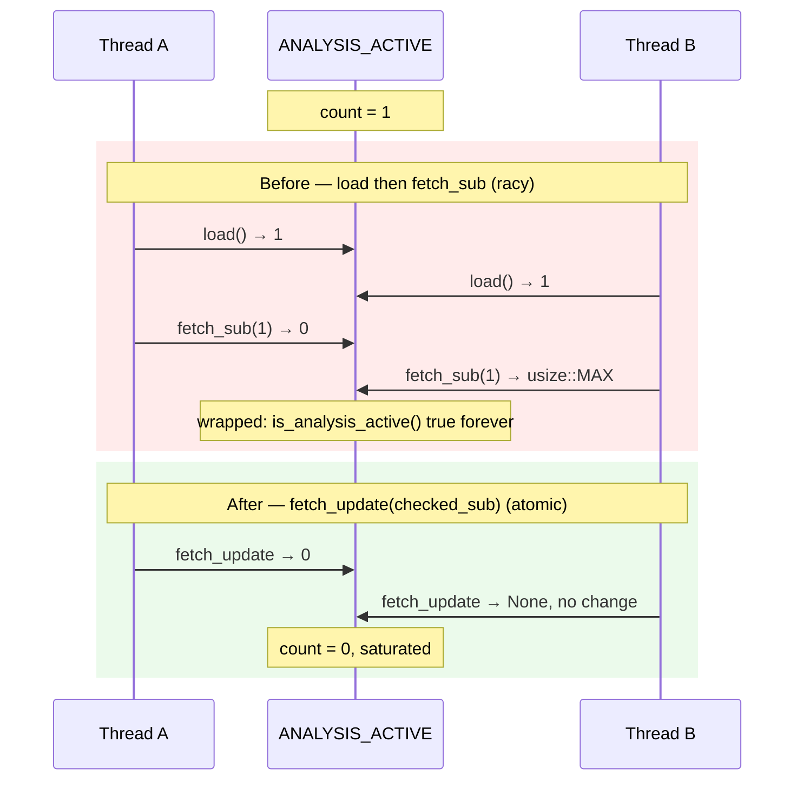

# Make `mark_analysis_finished` decrement atomic (Issue #1752)

## Summary

`mark_analysis_finished()` in `src/cancellation.rs` implemented its "saturating
decrement" as a separate `load` followed by `fetch_sub` — two individually
atomic operations that were not atomic as a group, so the saturation guard could
be defeated by concurrent callers. The decrement is now a single atomic
read-modify-write via `fetch_update(…, |count| count.checked_sub(1))`:
`checked_sub` returns `None` at zero, which makes `fetch_update` leave the
counter untouched instead of underflowing.

Without the fix, two threads calling `mark_analysis_finished()` on a counter of
`1` could both observe `prev == 1`, both pass the guard, and both decrement,
wrapping `ANALYSIS_ACTIVE` to `usize::MAX`. `is_analysis_active()` would then
return `true` forever, so the TypeScript host never deletes the Parquet temp
directory — the "discovery locked up" symptom Issue #1077's guard exists to
prevent. Closes #1752.



## Evidence

Backend-only change with no web interface, so no screenshot applies. Evidence is
the regression test plus the full quality gate.

The new stress test reproduces the defect against the **unfixed**
implementation:

```
test issue_1752_atomic_finished_decrement::concurrent_unbalanced_finishes_saturate_at_zero ... FAILED
panicked at tests/infrastructure/issue_1752_atomic_finished_decrement.rs:71:5:
counter underflowed: a concurrent finish decremented past zero
test result: FAILED. 2 passed; 1 failed
```

After the fix, all three pass (re-run three times to confirm they are not
flaky):

```
test issue_1752_atomic_finished_decrement::balanced_concurrent_start_finish_returns_to_zero ... ok
test issue_1752_atomic_finished_decrement::concurrent_unbalanced_finishes_saturate_at_zero ... ok
test issue_1752_atomic_finished_decrement::unbalanced_finish_on_idle_counter_stays_zero ... ok
test result: ok. 3 passed; 0 failed
```

`./quality.sh < /dev/null` passes cleanly (fmt, clippy, check, full test suite,
docs, release build): `✅ All quality checks passed!`

## Test Plan

Added `tests/infrastructure/issue_1752_atomic_finished_decrement.rs` (registered
in `tests/infrastructure/main.rs`), which calls the real cancellation API and
asserts on the observable counter value:

- `concurrent_unbalanced_finishes_saturate_at_zero` — the regression test. One
  thread issues 200,000 starts while 8 threads spam unmatched finishes; the
  counter must stay within a sane bound at all times. It fails against the
  unfixed code with an underflow and passes after the fix.
- `unbalanced_finish_on_idle_counter_stays_zero` — a finish on an idle counter
  is a no-op, confirming the saturating behaviour the doc comment promises.
- `balanced_concurrent_start_finish_returns_to_zero` — 8 threads × 500 balanced
  start/finish pairs leave the counter at 0, guarding against a fix that
  over-saturates and drops legitimate decrements.

No existing tests were modified or removed. `Cargo.toml`/`Cargo.lock` carry the
mandatory patch version bump (`0.74.164` → `0.74.165`) per AGENTS.md.
