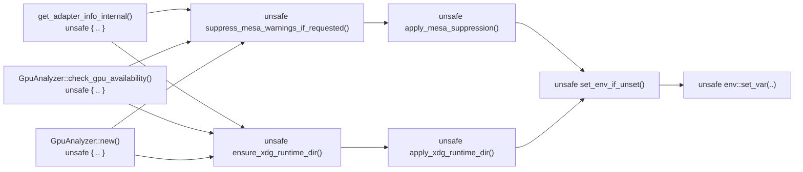

## Summary

Mark the environment-mutating platform setup functions in
`src/analysis/utils/platform.rs` as `unsafe fn`, propagating the "no other
thread may access the process environment concurrently" precondition to the type
level instead of relying on documentation alone. Closes #1753.

Previously the public entry points `suppress_mesa_warnings_if_requested()` and
`ensure_xdg_runtime_dir()` were ordinary safe `fn`s that funnelled into the
private helper `set_env_if_unset`, which performs `unsafe { env::set_var(..) }`.
`env::set_var` is `unsafe` in Rust 2024 because a concurrent `getenv` from any
other thread is a data race on the global `environ` table — undefined
behaviour. Because the wrappers were safe, a safe caller could invoke them late
(after GPU/host threads exist) and trigger UB without ever writing an `unsafe`
block. This is the "safe API reaching unsafe code with a documentation-only
invariant" anti-pattern the Rust API Guidelines steer away from.

### What changed

- `set_env_if_unset`, `apply_mesa_suppression`, `apply_xdg_runtime_dir` (private
  helpers) and the public `suppress_mesa_warnings_if_requested` /
  `ensure_xdg_runtime_dir` entry points are now `unsafe fn` with a `# Safety`
  section restating the early-init precondition.
- The non-Linux no-op stubs are also `unsafe fn` so call sites are uniform
  across platforms.
- Inner calls between these functions are wrapped in `unsafe { .. }` blocks with
  `// SAFETY:` comments (required under edition 2024's
  `unsafe_op_in_unsafe_fn`).
- Call sites in `src/analysis/gpu/device.rs` and `src/analysis/gpu/analyzer.rs`
  now wrap the calls in `unsafe { .. }` blocks whose `// SAFETY:` comments state
  why the early-init precondition holds there (they run before any GPU-init
  thread that reads the environment is spawned).
- Existing tests (unit + the `issue_713` integration test) updated to call the
  now-`unsafe` functions inside `unsafe { .. }` blocks with `// SAFETY:`
  comments. No test behaviour was changed or removed.

### Call flow

## Evidence

Backend/CLI change with no web interface — no screenshot applicable.

- `cargo build` succeeds.
- `./quality.sh` passes cleanly (clippy `-D warnings`, `cargo check
  --all-targets`, full test suite, docs, release build).
- The type-level obligation is now enforced by the compiler: a safe caller can
  no longer reach `env::set_var` without an acknowledging `unsafe` block.

## Test Plan

The existing behaviour tests are retained and now exercise the `unsafe` API:

- `src/analysis/utils/platform.rs`:
  - `tests::test_suppress_mesa_warnings_does_not_panic`
  - `tests::test_ensure_xdg_runtime_dir_does_not_panic`
  - `tests::test_set_env_if_unset_sets_when_absent` (Linux)
  - `tests::test_set_env_if_unset_preserves_existing` (Linux)
  - `tests::test_apply_xdg_runtime_dir_sets_when_unset` (Linux)
- `tests/gpu/issue_713_deduplicate_gpu_env_setup.rs`:
  - `platform_suppress_mesa_warnings_does_not_panic`
  - `platform_ensure_xdg_runtime_dir_does_not_panic`
  - `utils_reexports_resolve_to_platform`

These continue to assert on behaviour (writes when unset, preserves existing
values, no panic on repeated calls) and now require an `unsafe` block to call
the functions, verifying the new API shape compiles and behaves identically.
