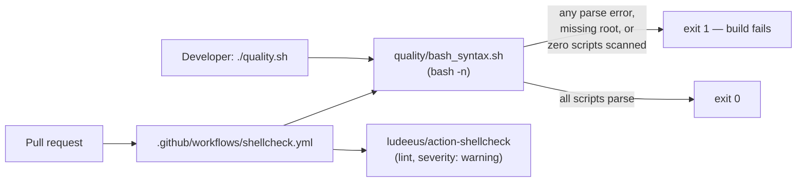

# PR Summary — Issue #1755: committed `bash -n` CI syntax gate

## Summary

Bash has no compile step, so a syntax error in any of the repository's 19 shell
scripts could land on the default branch: no CI job ran `bash -n`, and the local
check in `quality.sh` was silently useless.

Two defects fixed:

1. **No CI syntax gate.** `.github/workflows/ci.yml` deferred all shell linting
   to `shellcheck.yml` on the assumption that ShellCheck is "a strict superset
   of `bash -n`". ShellCheck is a *lint*, not the bash parser — the repository
   had no gate that actually asks bash whether a script parses.
2. **The local check failed silently.** `quality.sh` ran
   `find . -name "*.sh" ... -exec bash -n {} \;`. `find` ignores the exit status
   of `-exec`, so it exits 0 even when a script fails to parse — the failure
   printed to stderr and the gate reported success (verified below).

The fix follows the per-repo gate pattern: this repository commits its own gate
script, `quality/bash_syntax.sh`, and both CI and the local quality gate invoke
it. No cross-repo mechanism is introduced.

The gate fails **loud** — non-zero — on a parse error, a non-existent scan root,
or a scan that found no scripts at all (a gate that checks nothing must not
report success). It reports *every* failing script rather than stopping at the
first, skips `target/`, `.git/` and `node_modules/`, and is NUL-delimited so
paths containing spaces are not skipped.

The ShellCheck half of the issue text was already satisfied —
`.github/workflows/shellcheck.yml` has run `ludeeus/action-shellcheck`
(`severity: warning`, SHA-pinned) on every pull request since Issue #1215, and
`quality.sh` runs `shellcheck -s bash` locally. Only the `bash -n` gate was
missing, so only that was added.

Closes #1755.

## Evidence

This is a CI/CLI change with no web interface, so there is no screenshot.
Evidence is the gate's own behaviour.

**The old pattern silently passed a broken script:**

```console
$ printf '#!/bin/bash\nif [ 1 -eq 1 ]; then\n' > broken.sh
$ set -euo pipefail; find . -name "*.sh" -type f -exec bash -n {} \; ; echo "EXIT: $?"
./broken.sh: line 3: syntax error: unexpected end of file
EXIT: 0          # <-- reported success
```

**The new gate fails loud on the same input, and passes over this repository:**

```console
$ ./quality/bash_syntax.sh .
bash-syntax: OK — 19 script(s) passed 'bash -n'

$ ./quality/bash_syntax.sh /tmp/fixture   # tree containing broken.sh
/tmp/fixture/broken.sh: line 3: syntax error: unexpected end of file
bash-syntax: FAILED /tmp/fixture/broken.sh
bash-syntax: 1 of 2 script(s) failed 'bash -n'
$ echo $?
1
```

### Where the gate runs



## Test Plan

New behavioural tests in `tests/issue_1755_bash_syntax_gate.rs` — each one runs
the real gate script against a real fixture tree and asserts on its exit code
and output (10 tests, all passing):

- `gate_passes_over_the_repository_itself` — the committed scripts all parse.
- `gate_accepts_a_tree_of_valid_scripts` — nested valid scripts exit 0.
- `gate_fails_loudly_on_a_syntax_error` — regression test for the silent
  `find -exec` failure: a broken script now yields a non-zero exit and the
  offending path is named.
- `gate_reports_every_broken_script_not_just_the_first`.
- `gate_scans_scripts_with_spaces_in_their_path`.
- `gate_ignores_build_artefacts_and_git_internals` — `target/` and `.git/`
  are pruned.
- `gate_fails_when_it_finds_nothing_to_scan` — an empty scan is not success.
- `gate_fails_on_a_missing_root`.
- `quality_gate_invokes_the_committed_bash_syntax_script` and
  `a_ci_workflow_invokes_the_bash_syntax_gate_on_pull_requests` — the gate is
  actually wired into both the local and the pull-request path.

Also run:

- `./quality/bash_syntax.sh` → 19 scripts pass.
- `shellcheck -s bash quality/bash_syntax.sh` → clean.
- `actionlint .github/workflows/shellcheck.yml` → clean.
- `markdownlint-cli2 CONTRIBUTING.md` → 0 errors.
- `cargo test --lib --tests --all-features -- --test-threads=2` → 0 failures,
  plus `cargo fmt`, `cargo clippy -D warnings`, `cargo deny check`,
  `RUSTDOCFLAGS="-D warnings" cargo doc --no-deps`, `cargo build --release`.

### Known pre-existing flake (not caused by this change)

`focus::tests::focus_ranking_aborts_when_budget_exceeded` (Issue #1375) asserts
an abort within `budget + 1s grace + 75ms` = 1.125 s. On this machine it lands
at 1.06–1.11 s in isolation but 1.15–1.20 s when the full suite runs in
parallel, so it failed during two `./quality.sh` runs and passed 3/3 in
isolation — including on a clean tree with these changes stashed. This PR adds
no runtime code (shell scripts, docs, a new test file and the version bump), so
it cannot affect that timing; the whole suite passes with that single
timing-sensitive test skipped.

## Files Changed

- `quality/bash_syntax.sh` — new committed gate script.
- `.github/workflows/shellcheck.yml` — added the `Bash syntax gate (bash -n)`
  step before the ShellCheck step. `ci.yml` was deliberately left untouched
  (AGENTS.md: do not modify it without approval).
- `quality.sh` — the bash syntax block now invokes the committed gate.
- `CONTRIBUTING.md` — quality-gate and CI-pipeline sections describe the gate.
- `tests/issue_1755_bash_syntax_gate.rs` — new behavioural tests.
- `Cargo.toml` / `Cargo.lock` — patch version bump `0.74.165` → `0.74.166`.
