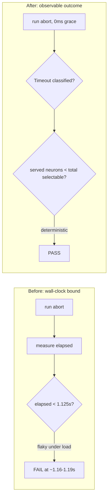

# Deflake `focus_ranking_aborts_when_budget_exceeded`

## Summary

`focus::tests::focus_ranking_aborts_when_budget_exceeded` asserted that the
focus-ranking abort completed within a **1.125s wall-clock** budget
(`50ms` budget + a fixed `1s` grace + slop). The margin between the idle
measurement (~1.06s) and the assertion (1.125s) was too small to survive CPU
contention under the parallel suite (`cargo test ... -- --test-threads=2`), so
the test flaked at ~1.16–1.19s while passing standalone.

The fix follows the issue's preferred option: **stop asserting on wall-clock;
assert on the observable outcome**, per the repo's unit-tests-vs-benchmarks
rule. The test now verifies that:

1. the run aborts with a retryable `Timeout` classification, and
2. the slow provider was asked for **strictly fewer** neurons than the full
   selectable set — direct evidence the abort cut the work short (the #1373
   regression guard against an unbounded 1h 11m run).

A test-only injectable deadline grace (`FocusDeadline::with_grace_for_tests`,
threaded through a new `rank_with_provider_and_grace_for_tests` seam) lets the
test use a `0ms` grace so the deadline fires promptly. The abort test now runs
in ~0.07s instead of being dominated by the production `1s` grace, and both
assertions are deterministic and independent of CPU load.

No production behaviour changes — the injectable grace and both test seams are
`#[cfg(test)]`; the production path still uses `FocusDeadline::new` with the
fixed `FOCUS_RANKING_BUDGET_GRACE_MS` grace.

Closes #1760.

## Evidence

Backend/CLI change with no web interface — no screenshot applicable. Verified
via the test suite: the reworked test passes deterministically and quickly.

```
$ cargo test --lib focus:: -- --test-threads=2
test focus::tests::focus_ranking_aborts_when_budget_exceeded ... ok
test focus::tests::focus_ranking_completes_within_generous_budget ... ok
test result: ok. 34 passed; 0 failed; 0 ignored; 0 measured; 1296 filtered out; finished in 0.07s
```

Before/after of the assertion strategy:



## Test Plan

- Reworked `src/focus/tests.rs::focus_ranking_aborts_when_budget_exceeded` to
  assert the `Timeout` classification and that `SleepyProvider::calls()` is
  strictly below the selectable-neuron count, instead of a wall-clock bound.
- Added a `calls()` accessor to the test `SleepyProvider`.
- `focus_ranking_completes_within_generous_budget` is unchanged and still
  passes (the original 3-arg seam now delegates to the grace-injectable seam
  with the production grace).
- Ran `cargo clippy --lib --tests --all-features -- -D warnings` (clean) and
  `cargo fmt --all`.
