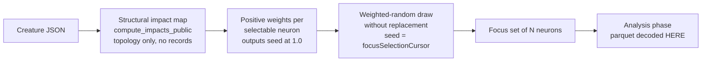

# PR Summary — Issue #1766

## Summary

Focus selection is now a **structure-only weighted-random draw by structural
impact** that **never opens or decodes the discovery parquet**. This removes the
root cause of the ~2h focus-stall incident, where choosing the focus set for a trivial
16-hidden creature was coupled to a multi-GB parquet decode
(`build_lazy_provider` → `read_all_records_grouped_by_neuron`) and burned the
whole analysis budget before any focus neuron was picked.

The default FFI focus path (`rank_focus_neurons_internal`) now:

1. Computes the structural impact map from creature topology alone
   (`compute_impacts_public` — path weights, output neurons seeded at `1.0`).
2. Draws `min(N, pool)` selectable neurons **without replacement** by roulette
   over those impacts (`select_focus_by_structural_impact`). Output neurons
   dominate the weight mass naturally, so they are almost always selected without
   a hard-coded "only output-0" policy; the draw is seeded by the monotonic
   `focusSelectionCursor` for reproducibility and per-pass exploration.
3. Returns instantly (`O(neurons + synapses)`), well under the **seconds bar**,
   whether multi-GB parquet is present or absent.

Parquet stays for the **analysis** phase (`analyze_parallel`) that runs *after*
the focus set is chosen. Record-derived removal-candidate / constant-neuron
detection moves off the focus path (companion issue), so the focus response omits
`removalCandidates`, `constantNeuronRemovals`, and the `loadingMode` /
`projectedMb` fields (no parquet is loaded).

Closes #1766.

## Acceptance criteria

- [x] Default focus path does **not** open/decode discovery parquet — proven by a
  regression test that passes a **non-existent** parquet path and still succeeds.
- [x] A reference-stall-shaped creature (~17 selectable) selects in **< 5s**
  (milliseconds in practice) with parquet present **or** absent.
- [x] Selection is **weighted-random by structural impact** (roulette without
  replacement), not error × gradient × frequency over records.
- [x] Output neurons (impact seed `1.0`) dominate weight mass naturally.
- [x] `docs/FOCUS_SELECTION.md` rewritten: structure-weighted random, parquet for
  analysis only, seconds bar as an invariant.
- [x] Regression test proves the focus path does not touch parquet I/O and
  completes under the seconds bar.

## Evidence

Backend/FFI change — no web interface. Verified by tests and the quality gate.

Focus-choosing data flow (parquet decode moved *after* the focus set is chosen):

## Test Plan

New / changed tests:

- `tests/ffi/issue_1766_structural_focus_selection.rs` (new):
  - `focus_selection_never_opens_parquet_and_stays_under_the_seconds_bar` — a
    reference-stall-shaped creature (17 selectable) with a **missing** parquet path still
    succeeds, draws a 6-neuron focus set, finishes < 5s, and omits
    `loadingMode` / `removalCandidates`.
  - `output_neuron_seeds_at_impact_one_and_leads_the_ranked_pool` — output-0 has
    impact `1.0`, leads the ranked pool, and is drawn into the focus set.
  - `structural_selection_is_reproducible_for_a_fixed_cursor`.
- `src/focus/selection.rs` inline `structural_tests` (new): output dominance,
  input/constant exclusion, seed determinism, draw-size cap, all-zero-impact
  uniform fallback, and relative-weight dominance of the roulette helper.
- `tests/ffi/issue_1445_focus_selection_diversity.rs` (updated, documented):
  the two behavioural tests now assert the #1766 structure-only weighted-random
  contract instead of the superseded #1662 exploit/explore semantics; the input
  deserialisation tests are unchanged.
- `tests/ffi/issue_574_ffi_json_fuzz_edge_cases.rs` (updated, documented):
  `rank_focus_neurons_nonexistent_file_does_not_panic` now asserts **success**
  (structure-only focus does not open the parquet), not an error.

Notes on business-logic changes (per TDD guidance — not deletions):

- The FFI focus path no longer produces record-derived `removalCandidates` /
  `constantNeuronRemovals`; the record-derived `rank_focus_neurons*` Rust API and
  its removal tests (issue_414/306/132) are **unchanged** and still pass.
- `select_focus_neurons` (the #1662 exploit/explore allocator) and its unit tests
  are retained; it is simply no longer the FFI default.

## Quality

`cargo fmt`, `cargo clippy --all-targets --all-features -D warnings`,
`cargo doc -D warnings`, and `markdownlint-cli2` on the rewritten doc all pass.
`Cargo.toml` version bumped `0.74.169 → 0.74.170`.
