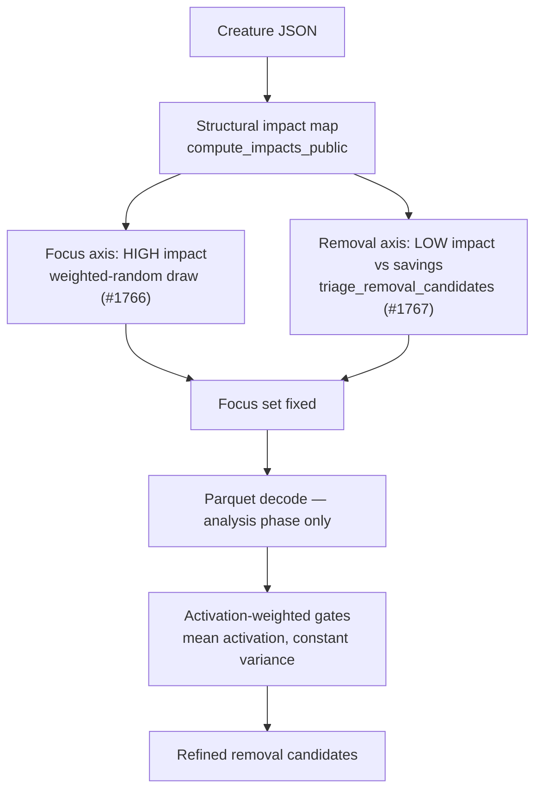

# Removal triage on the opposite axis to focus — no focus-time parquet (Issue #1767)

## Summary

Removal candidate triage was welded to the parquet-backed focus-ranking
pipeline: `identify_removal_candidates` consumes `RankedNeuron`s whose
`mean_activation` comes from recorded discovery data, so triaging removals
forced a full discovery-file warm before any focus neuron could be picked. On
a production deployment that warm ran ~2 h against a 12.5 GB file before work
started.

This adds `focus::triage_removal_candidates` — a **structure-only** removal
triage in the new `src/focus/ranking/removal_triage.rs`. It takes a
`CreatureJson` and nothing else (there is no file path to pass), derives
structural impact from path weights via `compute_impacts_public`, and compares
it against the complexity savings from pruning. No parquet file is opened,
decoded, or named, so the seconds bar from #1766 holds whether or not multi-GB
discovery data exists.

The criteria are now documented as **opposite axes** over the same impact map:
focus prefers **high** structural impact (weighted-random, outputs seed at 1.0);
removal prefers **low** contribution versus savings. Activation-weighted gates
that still need records (`activation_weighted_impact`, the #892
mean-activation threshold, the #306 constant-variance bias fold) are documented
as **analysis-phase** gates that run after the focus set is fixed — never as a
prerequisite of picking it.

Closes #1767.

## Evidence

This is a backend/library change with no web interface to screenshot. The
evidence is the test suite below plus the phase split it enforces.



The decisive test is behavioural, not structural:
`triage_needs_no_parquet_while_the_ranker_does` points both paths at a
non-existent discovery file. `rank_focus_neurons` fails (asserted, so the test
cannot pass vacuously) while `triage_removal_candidates` returns candidates for
the same creature.

Triage rule:

```text
impact          = |structural impact|
savings         = costOfGrowth × (1 + (incoming + outgoing) / 10)
boostedSavings  = savings × REMOVAL_CANDIDATE_BOOST
candidate  ⟺  boostedSavings > impact  and  boostedSavings − impact ≥ noiseFloor
```

Fail-loud behaviour is preserved: noise-floor drops are counted in
`noiseFloorRejections` rather than silently discarded, and a non-finite or
non-positive `costOfGrowth` is logged at WARN before the default is
substituted.

### Acceptance criteria

| Criterion | Where |
|-----------|-------|
| Triage does not open/decode parquet during focus selection | `triage_needs_no_parquet_while_the_ranker_does` |
| Criteria documented as opposite axes | `docs/FOCUS_SELECTION.md` § 9, `docs/IMPACT_CALCULATION.md` § phase split |
| Activation-weighted gates run in the analysis phase | Phase-split tables in both docs; `identify_removal_candidates` left in the records-backed pipeline |
| Compatible with #1766 | Triage consumes the same `compute_impacts_public` map #1766 uses; no records dependency to reintroduce |

## Test Plan

New: `tests/focus/issue_1767_structural_removal_triage.rs` (7 tests, all
passing).

- `triage_needs_no_parquet_while_the_ranker_does` — the parquet-backed ranker
  errors on a missing discovery file; the structural triage succeeds.
- `removal_axis_is_opposite_to_the_focus_axis` — over the same impact map, the
  highest-impact neuron (focus's pick) is never a removal candidate, and every
  candidate sits strictly below it on the impact axis.
- `inputs_and_outputs_are_never_triaged_for_removal` — hidden-only gate holds
  even at a cost-of-growth that dwarfs every impact value.
- `noise_floor_rejections_are_reported_not_silently_dropped` — at the
  production default cost-of-growth the sub-noise candidates are dropped **and
  counted**.
- `candidates_are_sorted_by_net_improvement_descending` — best net improvement
  leads; ordering is non-increasing and deterministic.
- `invalid_cost_of_growth_falls_back_to_the_default` — NaN, ∞, negative, and
  zero all fall back to the crate default.
- `triage_meets_the_seconds_bar_on_a_production_shaped_creature` — 17-selectable
  production shape completes inside the bar with the expected candidate set.

No existing tests were modified, commented out, or removed: the
activation-weighted pipeline is untouched, so `identify_removal_candidates` and
its #892 / #1142 coverage behave exactly as before.

## Security self-check

- **Input validation** — `triage_removal_candidates` validates `cost_of_growth`
  (finite and positive) and treats a non-finite impact as maximally
  contributing so a bad number can never cause a prune.
- **Secrets / injection / output encoding / authn** — not applicable: pure
  in-memory computation over an already-validated `CreatureJson`, no I/O, no
  new dependency.
- **Error handling** — no faults are swallowed; the noise-floor drop count and
  the invalid-`costOfGrowth` WARN are both surfaced.
