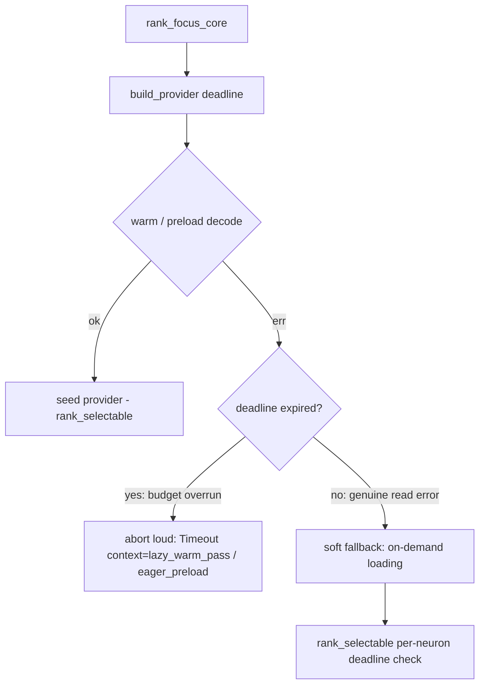

# Focus-ranking lazy warm pass aborts loudly on deadline overrun (Issue #1768)

## Summary

The lazy focus-ranking warm pass (`build_lazy_provider`) was made
*deadline-bound* in #1769, but on an overrun it **silently degraded to on-demand
loading** — masking the timeout as a clean provider. The observable abort then
surfaced hours-equivalent later in the unrelated `verify_selectable_records`
per-neuron loop, giving a misleading abort context (the ~2 h field failure where
a large decode on a memory-constrained host ran hours past a ~14-minute budget).

This change makes the remaining focus-time warm/decode path **fail loud**: a warm
pass that fails **because the wall-clock budget overran** now aborts with a
distinct `lazy_warm_pass` context — a structured `DiscoveryError::Timeout` — so
the run stops within budget (+ small grace) at an unambiguous point. Only a
**genuine read error within budget** still earns the soft on-demand fallback,
where the caller's own per-neuron deadline check decides the run's fate. The
eager pre-load path gained the equivalent distinct `eager_preload` timeout
context for consistency.

This closes the deadline hole flagged in the acceptance criteria: "If any
focus-time warm/decode path remains: deadline is checked around/during that work;
overrun aborts with a distinct context (e.g. `lazy_warm_pass`) within ~budget,
not hours later." The parquet path still exists behind focus ranking, so the
warm/decode branch is hardened rather than deleted.

Closes #1768.

### Incidental build unblock

The milestone branch did not compile before this change: `focus/mod.rs`
re-exported `ranking::identify_structural_removal_candidates` (a #1767 helper),
but `ranking/mod.rs` never re-exported it from its `removal_candidates`
sub-module. A one-line `pub(crate) use` re-export restores the green build so the
quality gate can run.

### Deno regression avoided

N/A — this is a Rust repository.

## Evidence

Backend/library change with no web interface to screenshot. Verified by the unit
tests below and the full `./quality.sh` gate (fmt, clippy `-D warnings`, `cargo
check`, `cargo deny`, the whole test suite, docs, release build) passing cleanly.

Abort-path behaviour after the fix:

## Test Plan

Inline tests in `src/focus/ranking/mod.rs` (`warm_pass_deadline_tests`), which
call the real `build_lazy_provider`:

- `expired_budget_aborts_the_warm_pass_loudly` — an expired `FocusDeadline` makes
  the warm pass abort with a structured `DiscoveryError::Timeout` (distinct
  `lazy_warm_pass` context), instead of degrading silently. **This replaces the
  previous `expired_budget_abandons_the_warm_pass` test**, which asserted the
  #1769 soft on-demand fallback that #1768 deliberately overturns for the overrun
  case (documented business-logic change).
- `genuine_read_error_within_budget_degrades_softly` — a non-timeout read failure
  (missing parquet file) within budget still returns a usable provider that seeds
  nothing, preserving the soft fallback for genuine errors.
- `warm_pass_seeds_the_cache_within_budget` — unchanged intent; updated to the new
  `Option<FocusDeadline>` signature and `Result` return.
- `focus_deadline_projects_onto_the_wall_clock` — unchanged.

All `focus::ranking` tests (23) pass; full `./quality.sh` passes.
