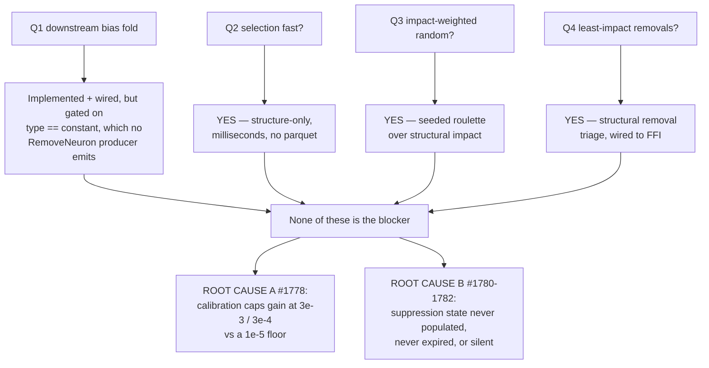

# Diagnose the very low successful-candidate rate on latest Develop

## Summary

Issue #1777 asked four behaviour questions about discovery and why the
successful-candidate rate has stayed near zero on both GRQ and GRQ-teams — the
latter explicitly ruling out the plateau explanation. This PR delivers the
diagnostic report those questions were asked for, plus a characterisation suite
that measures the fault it found. **Closes #1777.**

**Three of the four behaviours are already correct** — milestone #1774 landed
them hours before the issue was filed, so the failing runs almost certainly
pre-date it. The fourth is implemented but sits behind an unreachable gate.

| Question | Answer |
| --- | --- |
| Downstream biases folded on removal? | **Partly** — fold is correct and on the wire, but gated on `neuron_type == "constant"` while every `RemoveNeuron` producer emits hidden neurons only (#1779) |
| Focus selection fast? | **Yes** — structure-only since #1766; no parquet, no GPU, milliseconds |
| Focus neurons impact-weighted random? | **Yes** — seeded roulette over structural impact, not top-N |
| Opposite least-impact removal selection? | **Yes** — structural removal triage, wired to the same FFI call |

**None of those is the blocker.** The rate is low because of a scale mismatch
between the expected-gain discount stack and the acceptance floor. Every factor
in the stack is `<= 1.0`, so the calibration constants cap the multiplier at
`3e-3` (neuron) / `3e-4` (synapse) before a fixed `1e-5` floor is applied:

| Candidate | Conditions | Break-even raw gain |
| --- | --- | --- |
| add-neuron | perfect | **0.35 %** |
| add-neuron | typical | **~1 %** |
| add-synapse | perfect | **3.5 %** |
| add-neuron | failure-cache correction at its `0.001` clamp | **350 %** |

Realised deltas in the production cache are `~1e-7` accepted and up to `~1e-3`
rejected, so a perfect single change must beat the entire observed band by an
order of magnitude just to reach the floor. This reproduces the `~1e-10`
persisted gains #1737 observed, and because it is a fixed property of the
scoring pipeline rather than of convergence, it suppresses **non-plateaued
networks identically** — which is exactly the GRQ-teams observation the issue
raised.

Earlier audits missed it by looking at each half alone: #1738 audited
impact/contribution through MAX/MIN/IF (12 of 1660 neurons — the narrowing #1737
warned against), and #1740 reviewed the floor while considering only the
calibration *correction*, not the fixed `0.003` / `0.0003` constants in front of
it.

**No production behaviour is changed.** Per the issue's agreed scope, every
fault is handed to a follow-up: #1778 (gain floor scale — the one that will move
the rate), #1779 (bias-fold gate), #1780 (dead suppression trackers make the
drought reset a no-op), #1781 (failure-cache entries never expire), #1782
(silent drops invisible to `RejectionBreakdown`), #1783 (removal-triage
divergence).

## Evidence

Backend library diagnosis — no web interface, so no screenshot. Evidence is the
new characterisation suite driving the **shipped** discount functions:

```
running 6 tests
test no_input_combination_lifts_the_multiplier_above_the_calibration_constant ... ok
test failure_cache_correction_at_its_floor_makes_the_gain_floor_unreachable ... ok
test perfect_add_neuron_candidate_needs_a_third_of_a_percent_raw_gain ... ok
test perfect_add_synapse_candidate_needs_over_three_percent_raw_gain ... ok
test typical_add_neuron_candidate_break_even_is_above_the_realised_band ... ok
test saturated_target_break_even_is_another_order_of_magnitude_worse ... ok

test result: ok. 6 passed; 0 failed; 0 ignored
```

### Where candidates actually die



The full report — with file:line evidence for every claim — is committed at
`docs/analysis/candidate-rate-diagnosis-1777.md`.

## Test Plan

Added `tests/issue_1777_gain_floor_reachability.rs`, six characterisation tests
calling the real shipped scoring functions (`apply_neuron_pessimism_discount`,
`apply_synapse_pessimism_discount`, `apply_saturation_prediction_discount`,
`apply_logistic_prediction_calibration`) in the same order as
`neuron/post_processing.rs`:

- `perfect_add_neuron_candidate_needs_a_third_of_a_percent_raw_gain` — pins the
  best-case multiplier at the calibration cap and the break-even at `3.5e-3`.
- `perfect_add_synapse_candidate_needs_over_three_percent_raw_gain` — same for
  the synapse constant, break-even `3.5e-2`.
- `typical_add_neuron_candidate_break_even_is_above_the_realised_band` — a
  plainly good candidate still needs ~1 % raw gain.
- `saturated_target_break_even_is_another_order_of_magnitude_worse` — pins the
  `0.15` saturation floor.
- `failure_cache_correction_at_its_floor_makes_the_gain_floor_unreachable` —
  shows the `0.001` clamp pushes break-even above 100 %.
- `no_input_combination_lifts_the_multiplier_above_the_calibration_constant` —
  proves no input combination recovers the lost orders of magnitude.

These are characterisation tests: they pin today's measured numbers so a later
change to either the calibration constants or the floor shows up as a test diff.
They deliberately assert no fix — remediation belongs to #1778.

No existing tests were modified or removed.
