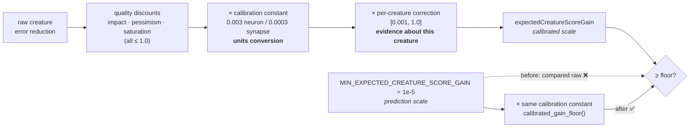

# Rescale the expected-gain floor to the post-calibration scale (Issue #1778)

## Summary

The add-neuron / add-synapse acceptance floor was unreachable by construction.
`MIN_EXPECTED_CREATURE_SCORE_GAIN` (`1e-5`) is denominated in the
**pre-calibration prediction** scale — that is where the round-off argument
motivating it (#1191) holds — but the filters compared it against an
`expected_creature_score_gain` that the fixed per-type calibration constant had
already rescaled into the **realised** scale. Comparing across scales silently
multiplied the screen's strictness by `1 / calibration`: 333× for add-neuron,
3333× for add-synapse. A *perfect* single structural change had to beat the
entire observed realised band by an order of magnitude just to reach the floor.

The fix converts the screen into the calibrated scale at the comparison site
rather than lowering it. Only the **fixed, type-level** calibration constant is
divided out; the per-creature calibration correction stays on the candidate side
because it is evidence that *this creature's* predictions over-shoot, so
tightening acceptance in response is #1131's intended behaviour. Closes #1778.

No calibration constant, no `MIN_EXPECTED_CREATURE_SCORE_GAIN` value, no
estimator, and no coordinated-structural floor changes value — what changes is
the scale at which the screen is applied.



## Changes

| File | Change |
| --- | --- |
| `src/analysis/constants/candidate_scoring.rs` | Added `GAIN_FLOOR_NOISE_BACKSTOP` (`1e-9`), `calibrated_gain_floor()`, `min_expected_gain_floor_for_neurons()`, `min_expected_gain_floor_for_synapses()`; documented `MIN_EXPECTED_CREATURE_SCORE_GAIN` as pre-calibration. |
| `src/analysis/neuron/post_processing.rs` | `apply_min_expected_gain_floor_for_neurons` reads the neuron-calibrated floor. |
| `src/analysis/synapse/post_processing.rs` | `apply_min_expected_gain_floor_for_synapses` reads the synapse-calibrated floor. |
| `docs/analysis/gain-floor-rescale-1778.md` | The re-derivation, its evidence, and the units-conversion vs evidence boundary. |
| `docs/CONFIGURATION.md` | `NEAT_AI_DISCOVERY_MIN_EXPECTED_GAIN` documented as a pre-calibration screen with its effective floors. |

### Re-derived floors

```text
effective_floor(type) = max(MIN_EXPECTED_CREATURE_SCORE_GAIN × calibration(type),
                            GAIN_FLOOR_NOISE_BACKSTOP)
```

| | Screen | Calibration | Effective floor |
| --- | --- | --- | --- |
| add-neuron | `1e-5` | `3e-3` | **`3e-8`** |
| add-synapse | `1e-5` | `3e-4` | **`3e-9`** |

`GAIN_FLOOR_NOISE_BACKSTOP = 1e-9` is derived from the same evidence #1740 used:
the production coordinated `change-squash` that estimated `4.17e-10` and
realised `-8.65e-4`. It sits above that collapsed band and two orders below the
smallest realised *accepted* delta (`1.95e-7`), so it rejects noise without
touching the achievable band. Both effective floors sit below `1.95e-7` — the
property the old floor lacked.

## Evidence

Backend library change with no web interface, so no screenshot applies. The
evidence is measured: `tests/issue_1778_gain_floor_reachability_fix.rs` drives
the **shipped** discount functions and the **shipped** filters, exactly as the
#1777 characterisation suite did, and reports the break-even raw creature error
reduction a candidate must carry to survive the floor.

| Candidate | Conditions | Break-even before | Break-even after |
| --- | --- | --- | --- |
| add-neuron | perfect | `3.5e-3` (0.35 %) | **`1.0e-5`** (0.001 %) |
| add-neuron | typical (70 % improved, 0.33 magnitude, impact 0.8) | `~1.0e-2` (1 %) | **`3.1e-5`** |
| add-synapse | perfect | `3.5e-2` (3.5 %) | **`1.0e-5`** |
| add-neuron | correction at its `0.001` clamp | `3.5` (350 %) | **`1.0e-2`** (1 %) |

Every "after" figure sits below the `1e-3` realised-delta ceiling observed in
production (#1737), so a genuinely good single structural change can now clear
the floor. The type bias is gone: a perfect add-neuron and a perfect add-synapse
now demand the same `~1e-5` raw gain.

**The #1740 false-positive contract is preserved.** The issue is explicit that
the fix must not simply lower the floor, because lowering it against the broken
scale admits noise. `tests/issue_1740_threshold_recalibration.rs` is unchanged
and still passing, and the rescale is guarded from the same direction by
`production_noise_estimate_is_still_rejected_by_the_synapse_floor`, which drives
the shipped filter with the exact `4.17e-10` estimate that realised `-8.65e-4`
and asserts it is still dropped while a candidate at the achievable `1.95e-7`
survives.

Quality gate: `./quality.sh` passes cleanly (fmt, clippy `-D warnings`,
`cargo deny`, full test suite, docs, release build).

## Test Plan

### Added — `tests/issue_1778_gain_floor_reachability_fix.rs` (10 tests)

- `effective_floors_are_the_screen_converted_into_the_calibrated_scale`
- `effective_floors_sit_below_the_smallest_realised_accepted_delta`
- `perfect_add_neuron_break_even_is_below_the_realised_band`
- `typical_add_neuron_break_even_is_below_the_realised_band`
- `perfect_add_synapse_break_even_is_below_the_realised_band`
- `neuron_and_synapse_floors_impose_the_same_raw_selectivity` — the type bias is gone
- `calibration_correction_at_its_floor_leaves_the_gain_floor_reachable` — the ratchet no longer demands a > 100 % error reduction, but still tightens acceptance
- `production_noise_estimate_is_still_rejected_by_the_synapse_floor` — the #1740 false-positive guard
- `floor_never_opens_below_the_noise_backstop`
- `non_conversion_calibration_falls_back_to_the_unconverted_screen` — a calibration outside `(0.0, 1.0]` fails safe rather than silently widening the screen

### Modified — documented business-logic changes

Two existing suites were re-pinned to the new scale. **No test was removed or
commented out**, and no assertion was weakened.

- `src/analysis/implementation_tests/gain_floor_tests.rs` (#1191) — the fixtures
  in `neuron_floor_drops_only_below_threshold_candidates`,
  `synapse_floor_drops_only_below_threshold_candidates` and
  `counter_increments_on_floor_drops` were re-expressed against the *effective*
  floor instead of the raw constant. The behaviour under test (below-floor
  drops, at-floor keeps, counter increments by the dropped count) is unchanged;
  only the magnitudes that count as "below floor" moved with the scale.
- `tests/issue_1777_gain_floor_reachability.rs` — this suite pinned both the
  discount-stack multiplier cap *and* the break-even figures that made the floor
  unreachable. The multiplier-cap measurements are unchanged behaviour and stay
  here. The break-even assertions asserted the bug, so they moved to the #1778
  suite above where they now pin the *reachable* figures; leaving a green test
  named `..._makes_the_gain_floor_unreachable` after fixing exactly that would
  have been a false-green. The affected tests were renamed to describe what they
  still measure.

### Regression linkage

`tests/issue_1778_gain_floor_reachability_fix.rs::perfect_add_neuron_break_even_is_below_the_realised_band`
reproduces #1778 against the unfixed code (break-even `3.5e-3`, above the
`1e-3` realised ceiling) and passes after the fix (`1.0e-5`).

## Security self-check

- **Input validation** — `calibrated_gain_floor` validates its argument is a
  finite units conversion in `(0.0, 1.0]` and fails safe to the unconverted
  screen otherwise; the env override retains its existing parse/clamp guard.
- **Secrets** — none staged; no hidden files beyond the repository allowlist.
- **Injection / output encoding / auth** — no new SQL, shell, filesystem, HTTP,
  endpoint, or rendering surface.
- **Error handling** — no error is swallowed; a non-conversion calibration
  narrows to the stricter unconverted screen rather than silently widening the
  filter.
- **Dependencies** — none added or changed.
