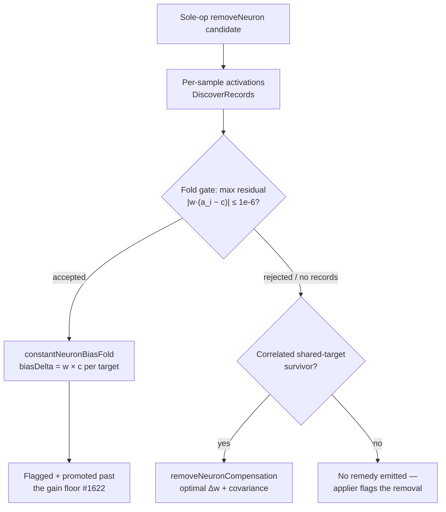

# Constant-neuron bias fold now fires for hidden neurons (Issue #1779)

## Summary

The downstream bias fold (#1623, wired in #1690) was gated on the **declared**
neuron class — `neuron_type == "constant"`, the NEAT-AI input-side bias type —
but every producer of a sole-op `RemoveNeuron` candidate restricts itself to
**hidden** neurons. The gate was therefore unreachable in production: a
functionally-constant *hidden* neuron (the realistic case) was proposed for
removal carrying no fold, fell through to `apply_remove_neuron_compensation`, and
picked up a `delta_weight: 0.0, fully_compensable: true` remedy carrying **zero
bias information** — on the assumption the bias lever had handled it. It had not.

The gate is now **measured** constancy: the fold already derives the constant `c`
from the recorded activations and rejects anything whose per-sample residual
`|w·(a_i − c)|` exceeds `BIAS_FOLD_GATE_TOLERANCE`, so its own acceptance is the
honest predicate. Both remedies read that one seam
(`accepted_constant_bias_fold`), so they stay mutually exclusive by construction.

Fixing the gate alone would have changed nothing observable: the honest
remove-neuron gain (#1530) is non-positive (−0.75 on the fixture below), so every
such candidate was then dropped by the final coordinated gain floor and never
reached the consumer at all. The #1622 promotion exists precisely to lift a
verified-constant removal past that floor, but its flag source
(`functionally_constant_neuron_uuids`) returns an empty set unconditionally. This
PR supplies the missing flag source from the same measurement —
`bias_folded_constant_neuron_uuids`, the candidates that just received an
**accepted** fold — which is exactly the evaluate-before-accept verification
#1622's own safety argument rests on. The structural detector seam is left
untouched and still flags nothing.

Closes #1779.

## Evidence

Backend/FFI change — no web interface to screenshot. The verification is the
end-to-end test below, which drives the real pipeline
(`write_records_to_parquet` → `analyze_parallel_internal`) and asserts on the
serialised FFI JSON. Against the pre-fix code it fails with the candidate absent
from the response; against the fix it passes.



Observed on the fixture (hidden neuron `quiet`, constant activation `0.02`,
outgoing weight `3.0`) before the promotion was wired — the fold was correctly
attached but the candidate was discarded immediately afterwards:

```text
DROPPED gain=-0.75 floor=0.0000005 ops=[RemoveNeuron { neuron_uuid: "quiet" }]
        fold=Some(ConstantNeuronBiasFoldJson { constant_activation: 0.02, …
             folded_targets: [FoldedBiasDeltaJson { target_neuron_uuid: "out-0",
                                                    bias_delta: 0.06 }] })
```

With the fix the same candidate reaches the FFI response carrying
`constantNeuronBiasFold.foldedTargets[0].biasDelta = 0.06` (`w × c`).

## Test Plan

**Added — `tests/ffi/issue_1779_bias_fold_wire_contract.rs`** (closes the stated
test gap: no test drove the pipeline end-to-end, so a serde rename would have
passed CI):

- `hidden_constant_neuron_removal_carries_bias_fold_in_ffi_json` — full parquet →
  `analyze_parallel_internal` → JSON, pinning `constantNeuronBiasFold`,
  `constantActivation`, `foldedTargets`, `targetNeuronUuid`, `biasDelta = w × c`,
  and the absence of a redistribution remedy. Fails against the unfixed code.
- `variance_carrying_neuron_never_carries_a_bias_fold_in_ffi_json` — the varying
  neuron is never handed a fold.

**Added — `tests/analysis/issue_1779_hidden_constant_bias_fold.rs`** (dispatch
routing):

- `hidden_functionally_constant_neuron_carries_bias_fold` — the core regression;
  fails against the unfixed code.
- `hidden_constant_neuron_is_not_given_a_redistribution_remedy` — mutual
  exclusivity; fails against the unfixed code.
- `variance_carrying_hidden_neuron_still_routes_to_redistribution` — the #1559
  path is not swallowed.
- `declared_constant_class_with_varying_records_is_still_rejected` — measurement
  beats declaration in both directions; fails against the unfixed code.
- `neuron_without_outgoing_synapses_gets_no_empty_fold` — an empty fold is not a
  remedy.

**Added — `src/analysis/remove_neuron_constant_promotion.rs` unit tests**:
`bias_folded_candidate_is_flagged`, `unfolded_candidates_flag_nothing`,
`multi_op_folded_candidate_is_not_flagged`.

**Modified — `src/analysis/discovery_dispatch_tests.rs::constant_neuron_candidate_is_not_given_redistribution`**
(documented business-logic change): its fixture recorded *varying* activations for
a neuron declared `"constant"`, which only passed because routing read the
declaration. The contract under test is unchanged — a constant neuron takes the
fold, not redistribution — so the fixture now records genuinely constant
activations. The old fixture's new destination (redistribution, because it really
does carry variance) is pinned by
`declared_constant_class_with_varying_records_is_still_rejected`. No test was
removed or disabled.

Full gate: `./quality.sh` (fmt, clippy `-D warnings`, `cargo deny`, 1348+ tests,
release build).

## Scope Notes

Two items the issue lists as *related* suppressors on this path are deliberately
out of scope: the three overlapping variance thresholds (`VARIANCE_EPSILON`,
`BIAS_FOLD_GATE_TOLERANCE`, `CONSTANT_VARIANCE_THRESHOLD`) belong to the
threshold review (`docs/analysis/threshold-review-1740.md`), and the structural
constant-neuron detector remains owned by its #1620 sibling sub-issue — this PR
does not implement it, only supplies the measured flag source the promotion
needed.
