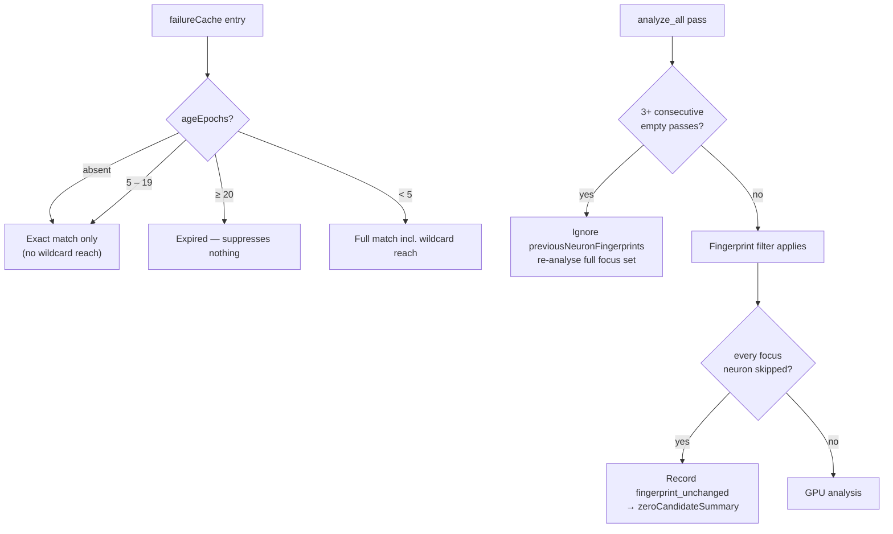

# Failure-cache expiry, wildcard tightening, and a fingerprint-skip escape hatch (Issue #1781)

## Summary

Persisted suppression state could hold a creature in drought indefinitely — the
root cause B2 named in `docs/analysis/candidate-rate-diagnosis-1777.md`. Three
faults are fixed. Closes #1781.

1. **No expiry.** `FailureCacheEntry` carried no age, so Rust could not tell a
   failure recorded moments ago from one recorded hundreds of passes back. It
   now accepts an optional `ageEpochs` (alias `epochsSinceRecorded`), and an
   entry at or beyond `FAILURE_CACHE_MAX_AGE_EPOCHS` (20 passes) suppresses
   nothing.
2. **Wildcard over-suppression.** A target-agnostic entry stood in for every
   target of its change type forever, so one `coordinated-structural` failure
   suppressed every coordinated candidate. Wildcard reach now lasts only
   `WILDCARD_FAILURE_CACHE_MAX_AGE_EPOCHS` (5 passes); past that the entry
   matches exactly. An entry with **no** reported age cannot demonstrate
   freshness, so it matches exactly and never acts as a wildcard.
3. **Silent fingerprint skip.** `previousNeuronFingerprints` covers structure
   only, and topology by definition does not change during a drought, so the
   cache skipped every focus neuron pass after pass regardless of newly recorded
   data — returning no candidates, no breakdown, no diagnostic. The cache is now
   released after 3 consecutive empty passes, and a whole-pass drop records one
   `fingerprint_unchanged` rejection per skipped neuron.

### Documented behaviour change

Rust's `failureCacheSuppressedCount` is now deliberately **narrower** than an
unbounded host-side filter would drop: an aged or age-less coarse entry no longer
counts as suppressing specific candidates. Hosts should send `ageEpochs` (or
prune their own cache) to keep the two stacks aligned. The in-module test
`absent_entry_target_acts_as_wildcard` still passes — its helper now builds
freshly-recorded entries, which is where wildcard reach still applies.

## Evidence

Backend library change — no web interface to screenshot. Verified by the tests
below and a full `./quality.sh` run (fmt, clippy `-D warnings`, `cargo deny`,
full test suite, rustdoc, release build): **all quality checks passed**.

## Test Plan

New — `tests/analysis/issue_1781_failure_cache_expiry.rs` (11 tests):

- `ageEpochs` / legacy-absent deserialisation from the wire JSON.
- Fresh specific entry still suppresses; expired one does not; the pass one
  epoch before expiry still does (boundary).
- Fresh wildcard entry suppresses specific candidates; an aged one stops, while
  still suppressing an equally target-agnostic candidate; an expired one
  suppresses nothing at all.
- Unknown-age wildcard entry no longer suppresses specific candidates.
- `evaluate` does not engage novelty escalation off an expired cache.

New — `tests/analysis/issue_1781_fingerprint_skip_escape.rs` (8 tests):

- `should_bypass_fingerprint_cache` across absent log, healthy creature, streak
  below threshold, streak at threshold, and a disabling `0` threshold.
- `fingerprint_unchanged` is a documented rejection reason.
- A whole-pass drop reaches the operator as the dominant reason of
  `zeroCandidateSummary` with the skipped-neuron count intact.

New unit tests in `src/analysis/fingerprint_skip_escape.rs` (3).

Modified (call-signature only, no assertions weakened):

- `tests/issue_1446_zero_candidate_summary.rs` — `build_zero_candidate_summary`
  takes the new pass-level breakdown argument.
- Failure-cache fixtures across `src/` and `tests/` gained `age_epochs: None`.
- `src/analysis/candidate_starvation.rs` — `fingerprint_unchanged` added to the
  upstream (starvation) partition, keeping the exhaustive-partition test green.
