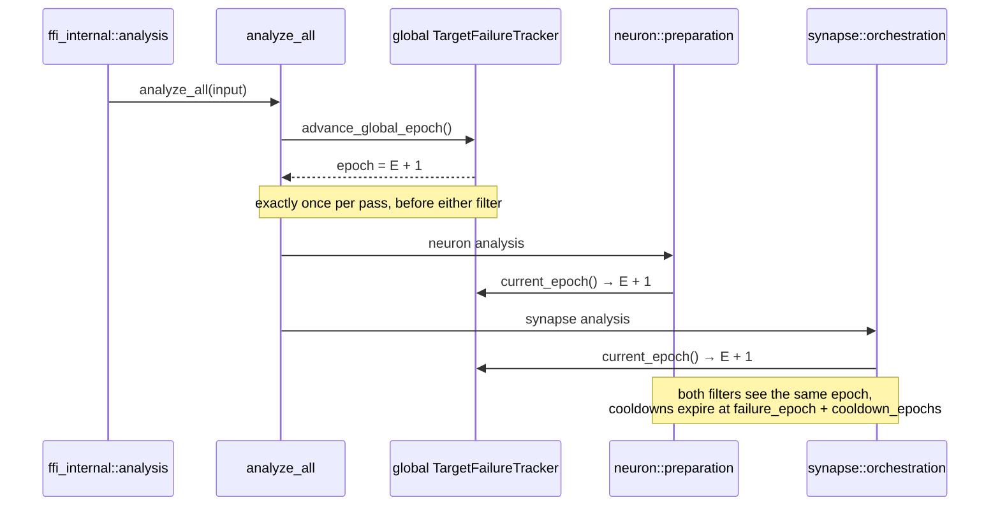

# Advance the target-cooldown epoch once per discovery pass (Issue #1790)

## Summary

`TargetFailureTracker::advance_epoch` had no production caller, so the global
tracker's epoch was frozen at `0`. `is_in_cooldown` ends with
`current_epoch < failure_epoch + cooldown_epochs`, and with both epochs stuck at
`0` that comparison was permanently true for any `cooldown_epochs >= 1` — a
target that ever entered cooldown would have stayed suppressed for the life of
the process. The same dead counter reached the drought reset, stamping every
tombstone with epoch `0`.

This PR adds the missing caller:

- New `target_failure_tracker::advance_global_epoch()` — advances the
  process-global tracker by one and returns the new epoch, recovering a poisoned
  lock rather than propagating it (refusing to advance is exactly the failure
  being fixed).
- `analysis::analyze_all` calls it once, at the head of every discovery pass.
  That is the single pass entry point, and it runs before either
  `apply_target_cooldown` site (`neuron/preparation.rs`,
  `synapse/orchestration.rs`) reads the epoch — so the neuron and synapse paths
  observe one consistent value and a pass running both advances the counter by
  exactly one, not two.

Populating the tracker with real outcomes remains out of scope — that is the
follow-up sub-issue of #1780 and must land after this one.

Closes #1790.

## Evidence

Backend-only change — no web interface to screenshot. Verified by the tests
listed below (`cargo test`) and by the quality gate (`./quality.sh`).

Epoch flow through one discovery pass:

TDD proof: with the `advance_global_epoch()` call replaced by a constant `0`,
both wiring guards in `tests/issue_1790_epoch_advance.rs` fail
(`left: 0, right: 1`); with the call restored, both pass.

## Test Plan

Added:

- `tests/issue_1790_epoch_advance.rs::full_discovery_pass_advances_global_epoch_by_exactly_one`
  — drives `analyze_all` with both the neuron and synapse paths enabled and
  asserts the global epoch moves `E → E+1`, then `E+1 → E+2` on a second pass.
  Fails if the caller is deleted (0) or duplicated per-path (2).
- `tests/issue_1790_epoch_advance.rs::pass_with_both_analyses_disabled_still_advances_epoch_once`
  — same guard on the GPU-less path, so the wiring stays covered on runners
  without a GPU. Both tests are `#[serial]` (shared process-global state).
- `src/analysis/target_failure_tracker.rs::advance_epoch_increments_by_exactly_one`
  — the counter moves by one and returns the new value.
- `src/analysis/target_failure_tracker.rs::internal_epoch_expires_cooldown_at_exact_boundary`
  — exercises the internal-counter path (`record_failure_now` /
  `is_in_cooldown_now` / `advance_epoch`): a cooldown entered at epoch `N` holds
  while `current_epoch < N + cooldown_epochs` and expires exactly at
  `N + cooldown_epochs`.
- `src/analysis/target_failure_tracker.rs::record_success_now_clears_cooldown_from_internal_epoch`
  — `record_success_now` clears an active cooldown after the epoch advanced, and
  stamps `last_improvement_epoch` with the advanced epoch.
- `src/analysis/target_failure_tracker.rs::clear_cooldown_entries_at_non_zero_epoch`
  — at a non-zero epoch only still-active cooldowns are dropped; an already
  expired entry is retained and the tombstone carries the non-zero epoch.
- `src/analysis/drought_reset.rs::reset_at_advanced_internal_epoch_stamps_non_zero_tombstone`
  — mirrors the orchestrator's `epoch_for_reset = guard.current_epoch()` with an
  advanced counter, asserting the reset fires at that epoch and the tombstone is
  stamped non-zero rather than `0`.

No existing tests were modified or removed.

## Security Self-Check

- No new external input, endpoints, dependencies, or secrets. The change is a
  process-internal counter advance; the only new public function takes no
  arguments and returns a `u64`.
