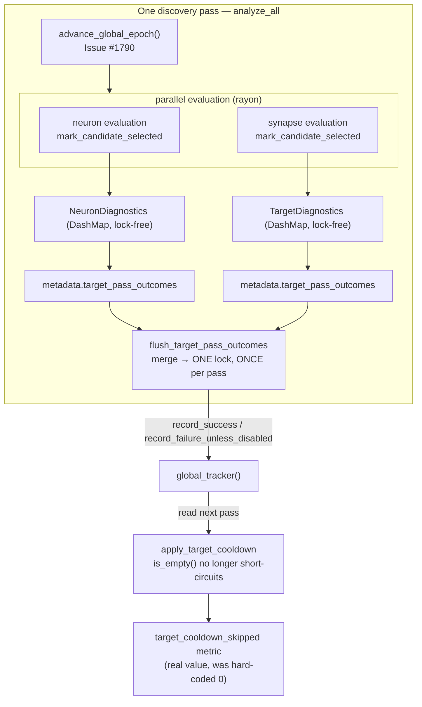

# Populate `TargetFailureTracker` from real per-target outcomes (Issue #1791)

## Summary

The process-global `TargetFailureTracker` was **read** by both preparation
layers (`neuron/preparation.rs::apply_target_cooldown`,
`synapse/orchestration.rs::apply_target_cooldown`) but **never written** by
anything in `src/`. Both filters short-circuit on `tracker.is_empty()`, so
`filter_cooldown_targets` was never reached and the whole per-target cooldown
mechanism had been inert since it was written. `record_success` had no caller
either, so the drought-reset tombstone could never be re-armed from a real
success.

This PR wires the tracker to real per-target outcomes and makes the effect
observable. Closes #1791.

- New `analysis::target_pass_outcomes` module owns the aggregation contract:
  `TargetPassOutcome` (one verdict per target per module) plus
  `flush_target_pass_outcomes`, which merges the verdicts and writes them to the
  global tracker under a **single** lock.
- `NeuronDiagnostics::pass_outcomes()` / `TargetDiagnostics::pass_outcomes()`
  snapshot the per-target verdicts that already exist in the `DashMap`-backed
  diagnostics (`had_candidate` is set by `mark_candidate_selected`).
- `analyze_all` flushes the **merged** neuron + synapse lists exactly once per
  pass, with the pass's `AnalysisOutcome`.
- `target_cooldown_skipped` in the drought diagnostic
  (`orchestration.rs`) is now fed the real `apply_target_cooldown` return value
  from both phases instead of a hard-coded `0`.
- `reset_global_tracker()` added as an explicit clean-slate helper — the tracker
  now genuinely outlives a single creature within a process.

### Decisions, made explicit

| Question | Decision |
| --- | --- |
| Aggregation point | Per-**target**, per-**pass**. Ten rejected candidates for one target in one pass are **one** failure, matching `WithinBatchFailureTracker` semantics. |
| Where | The per-target diagnostics entry, snapshotted at result finalisation — the place that already holds the verdict. |
| Failure API | `record_failure_unless_disabled`, never bare `record_failure`, so a memory/GPU-gated pass cannot extend a streak (Issue #1421). |
| Merge across modules | One flush per pass over the merged neuron + synapse lists. Flushing per module would grow a target's streak twice per pass against a counter that only advances one epoch per pass (Issue #1790). |
| Unevaluated targets | A target filtered before evaluation (input/hidden/constant, deadline, cooldown) is neither success nor failure and does not move its streak. |

Blocked-by #1790 is merged (PR #1809), so the epoch counter advances and the
cooldowns this creates can expire.

## Evidence

This is a library/CLI change with no web interface — no screenshot applies. The
evidence is the test suite plus `./quality.sh` (fmt, clippy `-D warnings`,
`cargo deny`, doc build, full test run, release build) passing cleanly.

### Lock contention

The evaluation loops write only to the `DashMap`-backed diagnostics, which are
already lock-free. The global mutex is taken exactly **once per pass**, after
the parallel work has finished — not per candidate, and not per target. The hot
path is unchanged, so no pass wall-clock regression is expected; the full
GPU-backed `tests/analysis` suite (645 tests) runs in the same time as before
(~38s).

## Test Plan

New integration tests — `tests/target_cooldown_population.rs`, one per
acceptance criterion:

- `rejected_only_pass_increments_global_tracker` — a pass where target `T`
  produced only rejected candidates leaves `consecutive_failures >= 1`. This is
  the canary for the original defect class (tracker read but never written).
- `accepted_candidate_resets_counter_and_tombstone` — an accepted candidate
  resets the counter to `0` and clears the drought-reset tombstone; fails if the
  `record_success` wiring is lost, which would make cooldowns permanent again.
- `env_disabled_pass_does_not_extend_streak` — a gated pass records nothing;
  fails if a future change swaps in bare `record_failure` (Issue #1421).
- `many_rejections_for_one_target_count_as_one_pass_failure` — encodes the
  per-target-per-pass aggregation decision.
- `unevaluated_target_does_not_extend_streak` — a target the pass never reached
  carries no evidence.
- `cooldown_filter_removes_target_after_threshold` — production-populated state
  makes `filter_cooldown_targets` actually drop the target, proving the
  `is_empty()` short-circuit is no longer the permanent path.

New unit tests:

- `src/analysis/neuron/preparation.rs::apply_target_cooldown_drops_target_past_threshold`
  — the real production filter function removes a target past the threshold.
- `src/analysis/diagnostics/mod.rs::test_target_diagnostics_pass_outcomes` /
  `test_neuron_diagnostics_pass_outcomes` — the per-target verdict snapshots,
  including that three rejected candidates yield one verdict and that a
  pre-analysis filtered target is not marked evaluated.
- `src/analysis/target_pass_outcomes.rs` — merge semantics (dedup, success wins,
  deterministic ordering) and flush accounting.

Modified test:

- `tests/analysis/split_error_fallback_candidates.rs::regression_split_error_must_return_fallback_candidates`
  now calls `reset_global_tracker()` first. The tracker is genuinely populated
  now, and this shared test binary reuses the synthetic `output-0` UUID across
  many tests, so an earlier test's failed passes could otherwise push this
  test's focus target into cooldown. No assertion was weakened or removed.

## Security Self-Check

- No new external input surface; no new SQL/shell/filesystem/HTTP calls.
- No secrets or `.config*.json` files staged.
- No new dependencies.
- No user-facing error paths changed.
