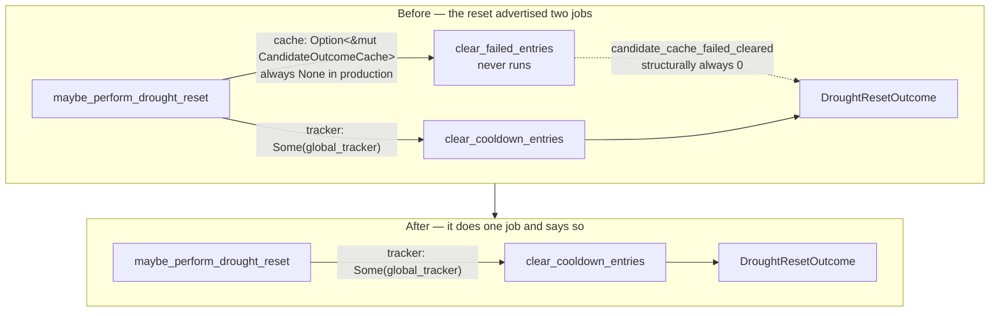

# Delete the never-constructed `CandidateOutcomeCache` (Issue #1792)

## Summary

`CandidateOutcomeCache` was never constructed outside tests. Every production
reference passed `None`, so `clear_failed_entries` — half of what the drought
reset advertises — never ran, `candidateCacheSize` / `candidateCacheSuppressedCount`
were structurally always `0`, and the two `novelty_escalation` entry points that
took a `&CandidateOutcomeCache` were unreachable from production.

The issue required a decision recorded with reasoning before code changes. That
decision is **(B) delete**, [posted on the issue](https://github.com/stSoftwareAU/NEAT-AI-Discovery/issues/1792#issuecomment-5118618019).
Closes #1792.

### Why (B), not (A)

The tie-breaker the issue set was "pick (B) unless a concrete writer can be
named". No writer exists, and none can be added inside the library's contract:

| Inbound per-creature surface | What it carries | Why it cannot feed the cache |
|---|---|---|
| `discoveryOutcomeLog` (`discovery_mode.rs:166`) | `Vec<bool>` per **pass** | No candidate identity at all |
| `failureCache` (`calibration_correction.rs:197`) | `change_type`, optional `target_uuid`, predicted vs actual gain | No `source_uuid`; failures only, so no successes |

The cache is keyed by `(source_uuid, target_uuid, operation_type)` and needs
successes for `source_type_boost`, for `is_suppressed` to age out, and for the
drought-reset tombstone to re-arm. Neither surface supplies that.

Ownership is also unresolvable: process-global (the `global_tracker()` shape)
would leak per-creature neuron-UUID suppression between creatures; per-creature
needs an FFI field NEAT-AI cannot populate, for the reason above.

Finally, `is_suppressed` is the cache's only behavioural effect, and it is a
*suppression* layer. #1777/#1780 diagnose the pipeline as already
over-suppressing — wiring a fourth suppression surface to fix a low-candidate-rate
drought is the wrong direction. #1781 (`06403d7`) already delivered expiry on the
failure-cache path that is genuinely wired.

## Evidence

Backend/library change — no web interface to screenshot. Verified by the test
suite and the full quality gate.

### What the drought reset actually does, before and after

### Quality gate

`./quality.sh < /dev/null` passes cleanly (fmt, `cargo clippy --all-targets
--all-features -- -D warnings`, 1350 lib tests, 113 integration test binaries,
doc build, release build). **No `#[allow(dead_code)]` was added** — the
acceptance criteria forbid hiding the removal that way, and none was needed:
`decide_escalation` keeps its production caller via `failure_cache_handshake`.

## Changes

**Removed**

- `src/analysis/candidate_cache.rs` and its `pub mod` / module-doc entries.
- The `cache` parameter on `maybe_perform_drought_reset` / `rearm_drought_reset`,
  and the always-`0` `DroughtResetOutcome::candidate_cache_failed_cleared`.
- `DroughtInputs.candidate_cache` and — because they could then only ever report
  `0` — the `candidateCacheSize` / `candidateCacheSuppressedCount` fields on the
  emitted `droughtDiagnostic` payload.
- `novelty_escalation::{rank_source_types_by_novelty, seed_forced_novel_candidates,
  CandidateKey, WIDENED_OPERATORS}` and the private `select_diverse` helper.

**Retained deliberately**

- `novelty_escalation::decide_escalation` and `gain_floor_multiplier`.
  `decide_escalation` is genuinely wired: `failure_cache_handshake::evaluate` →
  `noveltyEscalationActive` on the FFI response. Its `suppressed_count` comes
  from the caller's failure cache, never from the deleted cache.

**Docs corrected**

- `src/analysis/drought_reset.rs` module doc (`:10-11`, `:17`) and
  `src/config/user_facing.rs` (`:1340-1342`), both of which promised cache
  clearing as live behaviour.
- `src/analysis/recent_failure_window.rs`, `src/analysis/drought_diagnostic.rs`.
- `docs/FFI_API.md` — dropped both fields from the `droughtDiagnostic` sample and
  the field table.
- `docs/DROUGHT_PLAYBOOK.md` — the suppression-layer diagram drops from four
  layers to three, plus the warn-log sample, JSON sample, field-triage table, the
  epoch walkthrough (which described staleness-window behaviour that never ran),
  and See Also.
- `docs/CANDIDATE_PIPELINE_MCMC_AUDIT.md` — removed the adaptive-proposal bullet
  citing the deleted module.

## Test Plan

### Added

- `tests/issue_1792_candidate_cache_removal.rs` — the regression guard:
  - `drought_reset_has_no_cache_parameter_and_still_clears_cooldowns` —
    exhaustively destructures `DroughtResetOutcome` (no `..`), so re-adding a
    cache-clearing field fails the build.
  - `rearm_takes_tracker_only`.
  - `drought_diagnostic_json_has_no_candidate_cache_keys` — a runtime assertion
    on the serialised payload that neither removed key is present, and
    exhaustive `DroughtInputs` construction so re-adding the field fails the
    build.
  - `reset_without_tracker_reports_only_cooldown_work`.

  Verified to fail against the pre-change tree (9 compile errors: `missing
  candidate_cache`, `E0027` on the exhaustive pattern, `E0061` on the arity).

- `src/analysis/drought_reset.rs::tests::fires_without_tracker_supplied` —
  replaces `fires_without_cache_supplied`; the lever still reports honestly when
  it clears nothing.

### Modified — existing tests that exercised only the removed API

Documented per the "do not silently drop tests" rule. Every removal below is a
test of deleted code, not a weakened assertion:

| File | Change |
|---|---|
| `tests/issue_1205_drought_reset_escape_hatch.rs` | Rewritten tracker-only. All three scenarios (fires once at pass 10 of 12; re-arms after success; disabled at threshold `0`) are preserved; only the cache assertions are gone. |
| `tests/issue_1202_drought_diagnostic_helpers.rs` | Dropped the four `CandidateOutcomeCache::suppressed_count` tests; all five `TargetFailureTracker::active_cooldown_count` tests retained unchanged. |
| `tests/issue_1421_environmental_disable.rs` | Dropped `n_gated_passes_do_not_suppress_candidates` (tested `record_unless_disabled`). The outcome-log, target-cooldown, module-starvation and regression-guard cases are retained. |
| `tests/issue_1423_novelty_escalation.rs` | AC1/AC2 drove the deleted `seed_forced_novel_candidates`; replaced with coverage of the surviving production path (`decide_escalation` engagement and inertness). AC3 and the gain-floor test are retained. The failure-cache-driven engagement is covered end-to-end by `tests/analysis/issue_1781_failure_cache_expiry.rs`. |
| `src/analysis/drought_diagnostic.rs` | `diagnostic_aggregates_cache_and_tracker_counts` → `diagnostic_aggregates_tracker_counts`. |
| `src/analysis/novelty_escalation.rs` | Dropped the four unit tests for the deleted seeder/ranker. |

### Deleted — files whose every test targeted the removed module

| File | Coverage lost / where it now lives |
|---|---|
| `tests/scoring/issue_465_candidate_outcome_cache.rs` | Entirely `CandidateOutcomeCache` behaviour. |
| `tests/scoring/issue_1203_adaptive_staleness_window.rs` | Entirely `effective_staleness_window`, a cache method. |
| `tests/scoring/issue_465_source_type_scoring.rs` | `SourceTypeStats` / `cache.source_type_boost`. Its one non-cache test asserted `base * INPUT_SOURCE_BOOST > base`; the real `apply_source_type_boost` behaviour is already covered by `tests/synapse/issue_522_synapse_scoring.rs`, `tests/analysis/issue_467_source_type_prioritisation.rs` and `tests/analysis/issue_910_hidden_to_hidden_synapse_candidates.rs`. |

## Follow-up

The adaptive staleness window lived on the deleted cache, so its configuration
surface (`STALENESS_WINDOW_FLOOR`, `staleness_conservative_divisor()`,
`staleness_extended_drought_divisor()`, and the two matching
`DroughtMitigationConfig` fields from #1422) is now orphaned — still read from
env vars and logged at startup, but controlling nothing. Changing it means
touching the config snapshot shape, the env-var contract, `docs/CONFIGURATION.md`
and `tests/issue_1422_drought_mitigation_config.rs`, which is outside this
issue's acceptance criteria. Filed as
[#1818](https://github.com/stSoftwareAU/NEAT-AI-Discovery/issues/1818).

## Security Self-Check

- **Input validation** — no new function accepts external input; this change only
  removes parameters and fields.
- **Secrets** — none staged; `git diff --cached --name-only` confirmed no hidden
  paths.
- **Injection surface** — no new SQL, shell, filesystem or HTTP calls.
- **Output encoding** — the `droughtDiagnostic` payload loses two `usize` fields;
  serialisation is unchanged serde.
- **Authentication/authorisation** — no endpoints or privileged operations
  touched.
- **Error handling** — no new error paths; the drought reset still reports its
  cleared count honestly rather than defaulting to a value it did not earn.
- **Dependencies** — none added or changed.
