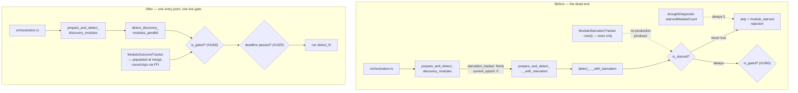

# Delete the never-populated `ModuleStarvationTracker` (Issue #1793)

## Summary

`ModuleStarvationTracker` (Issue #1273) never fired in production. The wiring
dead-ended in two places: `prepare_and_detect_discovery_modules` delegated to a
`..._with_starvation` twin with a hard-coded `starvation_tracker = None,
current_epoch = 0`, and the only production caller
(`orchestration.rs`) went through the non-starvation wrapper. `::new()` appeared
exactly once in `src/`, inside the tracker's own test module. So the starvation
skip at `discovery_dispatch.rs:578` never fired and `starvedModuleCount` in the
drought diagnostic was structurally always `0`.

**Decision: (B) delete** — [recorded on the issue with reasoning before any code
changed](https://github.com/stSoftwareAU/NEAT-AI-Discovery/issues/1793#issuecomment-5119166837).
Three reasons:

1. **No producer can exist at the documented scope.** The tracker is
   creature-scoped — "one per `analyze_all` invocation" — but detection runs
   *once* per pass, *before* the merge phase that would record module outcomes.
   A pass-scoped tracker is constructed empty, consulted (skipping nothing),
   populated, then dropped. It can never accumulate a streak. Making it work
   needs cross-pass state: either a process-global keyed by module name (which
   conflates creatures and contradicts the design) or a new FFI round-trip field
   that NEAT-AI would have to adopt before the tracker did anything.
2. **`ModuleOutcomeTracker` already covers it.** It is threaded through the same
   function, populated from real merge-phase outcomes, round-trips across passes
   via the FFI, and gates modules ten lines below the dead starvation gate
   (`is_gated(&spec.module_name, MODULE_GATE_THRESHOLD)`, Issue #1060).
3. **More suppression is the wrong direction for #1780.** Root cause B in
   `docs/analysis/candidate-rate-diagnosis-1777.md` is that the pipeline
   *over*-suppresses. Same tie-breaker applied in #1792.

Closes #1793.

## What changed



Removed:

- `src/analysis/module_starvation_tracker.rs` and its `pub mod` declaration.
- `prepare_and_detect_discovery_modules_with_starvation` — collapsed into
  `prepare_and_detect_discovery_modules`.
- `detect_discovery_modules_parallel_with_starvation` — collapsed into
  `detect_discovery_modules_parallel`. The `starvation_tracker` /
  `current_epoch` parameters are gone, so the hard-coded `None` / `0` pair
  cannot come back.
- `DiscoveryModuleDetectionEntry.starved` and the merge-phase `module_starved`
  rejection recording — nothing could set the flag once the tracker was gone.
- `DroughtInputs.starvation_tracker` and `DroughtDiagnostic.starved_module_count`
  (`starvedModuleCount` in the FFI payload) — the same treatment
  `candidateCacheSize` got in #1792, so the field cannot survive as a permanent
  zero.
- `REJECTION_MODULE_STARVED` from `ALL_REJECTION_REASONS` and from
  `candidate_starvation::UPSTREAM_REJECTION_REASONS` — with its one recorder
  deleted it could never be counted again. The `ALL_REJECTION_REASONS`
  partition test keeps the two lists in sync.
- `NEAT_AI_DISCOVERY_MODULE_STARVATION_FAILURE_STREAK` /
  `..._COOLDOWN_EPOCHS`, their constants, and the
  `DroughtMitigationConfig.module_starvation_failure_streak` lever, plus their
  rows in `docs/CONFIGURATION.md` and the `#1422` sample log line in
  `docs/DROUGHT_PLAYBOOK.md`. An operator lever that silently does nothing is
  worse than no lever.

`src/analysis/candidate_starvation.rs` is a **different, live** component — it
classifies a run as candidate-starved vs over-rejected from the rejection
breakdown and gates novelty escalation (reached via `ffi_internal/analysis.rs`).
Its status was confirmed separately, as the issue asked; it is untouched beyond
dropping the one now-unrecordable reason from its upstream partition.

## Evidence

Backend/library change with no web interface, so there is no screenshot to
capture. The evidence is the test suite and the quality gate.

Per the issue's "if (B)" branch, primary detection is **compile-time**: any code
still constructing or passing a tracker fails `cargo build`, and
`cargo clippy -- -D warnings` catches a partial deletion. That fired for real
during this change — `benches/quality_skip_dispatch.rs` and
`tests/analysis/issue_1004_overlap_compression_discovery.rs` both failed to
compile on the removed `starved` field.

New regression tests:

```text
running 6 tests
test module_starved_is_no_longer_a_rejection_reason ... ok
test drought_diagnostic_json_has_no_starved_module_count ... ok
test deadline_gate_survives_wrapper_collapse ... ok
test repeatedly_failing_module_still_runs_after_starvation_gate_removal ... ok
test module_gate_survives_wrapper_collapse ... ok
test starvation_env_vars_are_removed_from_the_canonical_reference ... ok

test result: ok. 6 passed; 0 failed
```

`./quality.sh` (fmt, clippy `-D warnings`, `cargo deny`, full test suite, doc
build, release build) passes cleanly.

## Test Plan

### Added — `tests/issue_1793_module_starvation_removal.rs`

- `repeatedly_failing_module_still_runs_after_starvation_gate_removal` — a
  module with a long failure streak that stays above `MODULE_GATE_THRESHOLD`
  (exactly the class the dead cooldown would have caught) still has its
  `detect_fn` executed.
- `module_gate_survives_wrapper_collapse` — the live Issue #1060 gate still
  skips a gated module and still runs a healthy one after the two entry points
  were merged.
- `deadline_gate_survives_wrapper_collapse` — the Issue #1029 deadline gate
  survives the same collapse.
- `module_starved_is_no_longer_a_rejection_reason` — `module_starved` is absent
  from both `ALL_REJECTION_REASONS` and `UPSTREAM_REJECTION_REASONS`.
- `drought_diagnostic_json_has_no_starved_module_count` — serialises a real
  diagnostic and asserts `starvedModuleCount` is absent while the surviving
  counters (`targetCooldownActiveCount`, `dominantRejectionReason`) remain.
- `starvation_env_vars_are_removed_from_the_canonical_reference` — neither env
  var remains in `docs/CONFIGURATION.md`.

### Retargeted / removed (documented, per the acceptance criteria)

- `src/analysis/discovery_dispatch_parallel_tests.rs` — the three Issue #1273
  cases (`starvation_tracker_skips_detect_fn_when_module_is_starved`,
  `merge_phase_records_module_starved_rejection`,
  `starvation_tracker_optional_when_none_passed`) are replaced by one retargeted
  case, `detection_applies_no_per_creature_starvation_cooldown`, which asserts
  the inverse: the `coordinated-structural` module that motivated #1273 runs,
  and no `module_starved` rejection reaches the merge phase.
- `tests/issue_1421_environmental_disable.rs` — the two module-starvation cases
  are dropped (the `record_failure_unless_disabled` guard went with the
  tracker). The `TargetFailureTracker` and outcome-log cases are untouched, so
  the #1421 environmental-disable behaviour is still covered.
- `tests/issue_1422_drought_mitigation_config.rs` — the removed lever's
  default/override assertions are dropped; every surviving lever is still
  asserted.
- `tests/issue_1611_env_var_single_source.rs` — the two removed variables are
  dropped from `CANONICAL_VARS`.
- `tests/issue_1739_candidate_generation_starvation.rs` — the starved-profile
  fixture uses `REJECTION_NO_TARGET_RECORDS` instead of the removed
  `REJECTION_MODULE_STARVED`; the same upstream partition, so classification
  behaviour is unchanged.
- `src/analysis/drought_diagnostic.rs` — `diagnostic_reports_starved_module_count`
  removed with the field it asserted on.
- `tests/analysis/issue_1004_overlap_compression_discovery.rs`,
  `tests/issue_1792_candidate_cache_removal.rs`,
  `benches/quality_skip_dispatch.rs` — struct literals updated for the removed
  fields.

## Security self-check

- No new external input, injection surface, endpoints, or dependencies — this
  is a pure deletion.
- No secrets or hidden files staged.
- The two removed env vars were read via `std::env::var` with clamped parsing;
  removing them shrinks the configuration attack surface.
