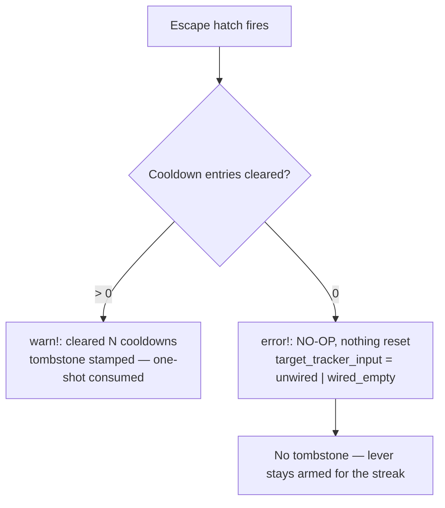

# PR Summary — Issue #1794

## Summary

The drought escape hatch logged a success line (`drought escape hatch fired —
cleared N active target cooldowns`) even when `N` was `0`, and it stamped the
one-shot tombstone either way. In production that read as "the escape hatch
worked" while nothing was flushed, and an ineffective reset at epoch N blocked
an effective one at epoch N+1.

`maybe_perform_drought_reset` now distinguishes an effective reset from a no-op:

1. **Fail loud on a no-op.** When nothing is cleared the reset logs at
   `tracing::error!` with `reset_name="drought_escape_hatch_noop"`,
   `noop=true`, and wording that names it a no-op and never claims work was
   done. An effective reset keeps the existing `warn!` success wording verbatim.
2. **Say *why* it was a no-op.** The new `target_tracker_input` field (and the
   `DroughtResetInputState` enum) reports `unwired` (no tracker supplied) versus
   `wired_empty` (tracker supplied, nothing in cooldown) versus `cleared` —
   diagnoses the old log could not tell apart.
3. **No tombstone on a no-op.** `clear_cooldown_entries` stamps the tombstone
   unconditionally, so the reset unwinds it when it cleared nothing. The lever
   stays armed and a later pass in the same streak can still do real work. The
   one-shot semantics for an *effective* reset are unchanged.
4. **Surfaced to callers.** `DroughtResetOutcome::is_noop()` plus the
   `target_tracker_input` field let callers react, not just log readers.

**Tombstone-on-no-op is not load-bearing** (the issue's Note): the orchestrator
takes the global-tracker lock before calling the reset regardless of whether it
fires, so not tombstoning costs no extra lock acquisition — only one `error!`
line per pass while a drought is genuinely unresolvable, which is the intent.

Closes #1794.

## Evidence

Backend-only change — no web interface to screenshot. Verified by the tests
below (all pass under `./quality.sh`, which runs fmt, clippy `-D warnings`,
`cargo deny`, the full test suite, and a release build).

## Test Plan

New integration tests in `tests/issue_1794_noop_reset_fail_loud.rs` (a
`tracing_subscriber` capture layer asserts on the real emitted events):

- `noop_reset_does_not_set_tombstone` — both the `None` and the
  `Some`-but-empty case leave `tombstone_reset_epoch` unset, and a later pass in
  the same streak still clears real cooldowns.
- `noop_reset_log_states_nothing_cleared` — the no-op event is `ERROR`, its
  message does not contain "cleared", it names itself a no-op, and
  `target_tracker_input` distinguishes `unwired` from `wired_empty`.
- `effective_reset_keeps_success_wording_and_one_shot` — a reset clearing 2
  entries keeps the existing success message, emits no no-op event, and
  tombstones exactly once per streak.

New inline unit tests in `src/analysis/drought_reset.rs`:

- `noop_reset_leaves_lever_armed_for_the_streak`
- `fires_without_tracker_supplied` extended to assert `is_noop()` and
  `DroughtResetInputState::Unwired`.

Modified test (documented business-logic change): the exhaustive
`DroughtResetOutcome` destructuring in
`tests/issue_1792_candidate_cache_removal.rs` gained the new
`target_tracker_input` field so the pattern stays exhaustive — it still fails to
compile if the removed candidate-cache field returns. No test was removed or
commented out.

Docs: `docs/DROUGHT_PLAYBOOK.md` documents the no-op `error!` line and how to
read `unwired` versus `wired_empty`.
