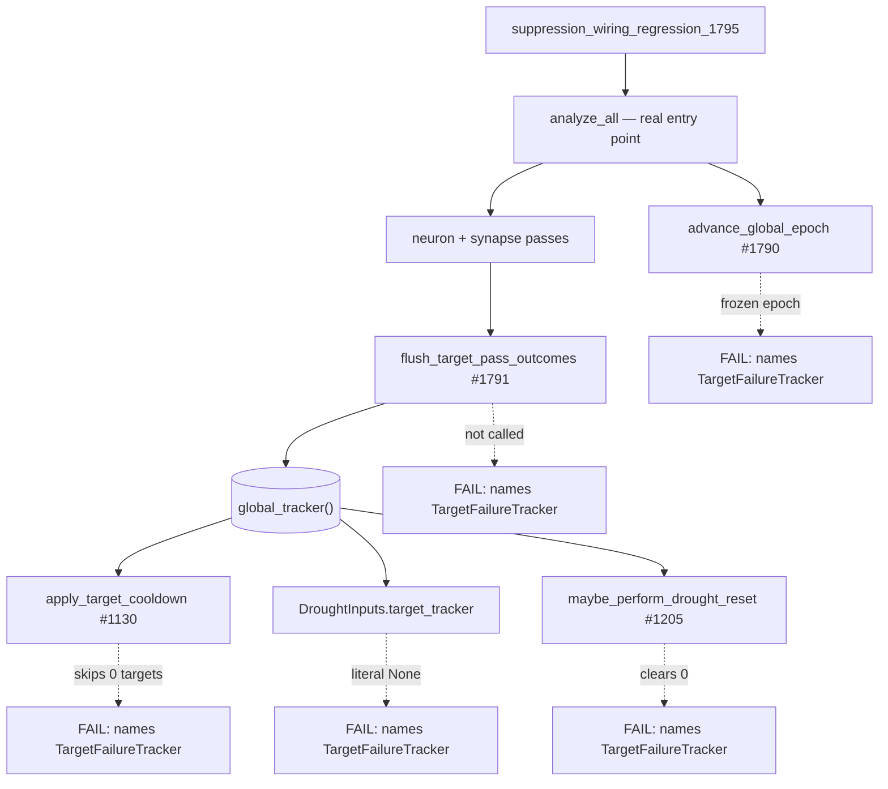

# Regression guard: prove the suppression tracker is populated through the real discovery path

## Summary

Adds `tests/suppression_wiring_regression_1795.rs`, a production-shaped guard
that drives `analyze_all` — the real discovery-pass entry point — and fails when
the suppression layer goes inert. Closes #1795.

The entire #1780 bug class (suppression state read but never written) was
invisible because every store had thorough unit tests that **constructed the
store directly**. A unit test that builds its own subject cannot detect a
missing production caller, so `TargetFailureTracker` stayed green with zero
production writers. These tests never construct a tracker: they run real
discovery passes over a converged fixture creature whose candidates are all
rejected, then assert on the process-global state that pass left behind.

**Scope:** #1792 deleted `CandidateOutcomeCache` and #1793 deleted
`ModuleStarvationTracker`, so `TargetFailureTracker` is the only surviving
suppression store and the only one guarded. The issue's "no permanently-`None`"
guard is scoped to the one surviving `Option` field,
`DroughtInputs::target_tracker`, and is implemented behaviourally rather than as
a grep: a literal `None` makes the drought diagnostic report a structurally-zero
`target_cooldown_active_count`, which the test catches.

No production code changed — this is a guard over the wiring #1790–#1793 landed.

## Evidence

Backend/CLI change, no web interface to screenshot. Evidence is the both-directions
test verification below.



### Both-directions verification (acceptance criterion 1)

Each wiring call was reverted in turn against this branch and the guard
confirmed red, then restored and confirmed green. Verified explicitly, not
assumed:

| Reverted wiring | Result |
| --- | --- |
| `flush_target_pass_outcomes` call removed from `analyze_all` (#1791) | all 4 cases **FAIL** — "a discovery pass over a rejected-only creature left the global tracker empty" |
| `advance_global_epoch()` replaced with a constant `0` (#1790) | `discovery_pass_populates_global_tracker` **FAILS** — "must advance the global epoch by exactly 1" |
| `DroughtInputs.target_tracker` set to a literal `None` | `drought_diagnostic_reports_live_tracker` **FAILS** — "reported 0 active cooldowns while the global tracker holds 2" |
| `maybe_perform_drought_reset` passed `None` instead of the live tracker (#1205) | `drought_reset_clears_nonzero` **FAILS** — "cleared 0 of 2 active cooldown entries" |
| all wiring restored (current `Develop` + #1790–#1794) | **4 passed; 0 failed** |

Every failure message names `TargetFailureTracker`, so a future regression is
diagnosable without re-deriving #1780 (acceptance criterion 4).

### Test isolation (acceptance criterion 3)

`global_tracker()` is process-global, so each case calls `reset_global_tracker()`
and runs under `#[serial]`.

## Test Plan

`tests/suppression_wiring_regression_1795.rs` — four cases, all through
`analyze_all`, none constructing a tracker (acceptance criterion 2):

- `discovery_pass_populates_global_tracker` — one pass leaves the tracker
  non-empty and advances `current_epoch()` by exactly 1.
- `cooldown_drops_target_through_real_path` — repeating the pass past
  `cooldown_consecutive_failures` makes `apply_target_cooldown` genuinely drop a
  target, observed via the production `target_cooldown_skipped` metadata counter.
- `drought_reset_clears_nonzero` — past `drought_reset_after_epochs`, the
  orchestrator's `maybe_perform_drought_reset` clears a **non-zero** number of
  live cooldown entries.
- `drought_diagnostic_reports_live_tracker` — the no-permanently-`None` guard on
  `DroughtInputs::target_tracker`.

Run with:

```bash
cargo test --test suppression_wiring_regression_1795 < /dev/null
```

The cases skip on GPU-less hosts (no candidates are evaluated there, so there is
no target verdict to record), matching the existing `issue_1790_epoch_advance`
convention.

`docs/analysis/discovery-regression-harness-1741.md` gains a short section
explaining why this guard is a companion to — not a duplicate of — the existing
fixture-replay harness: that one measures acceptance yield from a committed
batch and never calls `analyze_all`, so it cannot see dead suppression wiring.

## Security self-check

- No new external input, dependency, endpoint, or shell/SQL/HTTP call — the
  change is a test file plus a documentation section.
- No secrets or hidden files staged.
