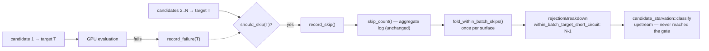

# Add a rejection reason for the within-batch same-target short-circuit

## Summary

The within-batch same-target short-circuit (Issue #1164) discarded candidates
without incrementing any `RejectionBreakdown` counter, and no reason constant
existed for it. With `WITHIN_BATCH_TARGET_FAILURE_LIMIT = 1`, **one** failing
candidate suppresses every remaining same-target candidate in the batch, so this
was the costliest silent drop in the pass — `candidate_starvation::classify`,
which reads only the breakdown, was blind to it.

The counts were never lost: `WithinBatchFailureTracker::skip_count()` was already
aggregated and logged per surface. They were simply never turned into a rejection
reason. This change folds that existing aggregate into the surfaced breakdown.
Observability only — the short-circuit itself behaves exactly as before.

Closes #1796.

Changes:

- New stable reason `within_batch_target_short_circuit`
  (`REJECTION_WITHIN_BATCH_TARGET_SHORT_CIRCUIT`) in
  `src/analysis/diagnostics/rejection_reasons.rs`, added to
  `ALL_REJECTION_REASONS` with a `friendly_reason` arm naming the
  `WITHIN_BATCH_TARGET_FAILURE_LIMIT` semantics.
- Classified into `UPSTREAM_REJECTION_REASONS` in
  `src/analysis/candidate_starvation.rs` — the suppressed candidates were never
  evaluated, so none reached the accept gate.
- New `fold_within_batch_skips(tracker, breakdown)` in
  `src/analysis/within_batch_failures.rs`, called **once per surface** from the
  existing aggregate sites (`neuron/mod.rs`, `synapse/orchestration.rs`). The
  per-candidate hot loop is untouched and stays allocation-free.
- `docs/FFI_API.md` documents the new reason.

## Evidence

Backend/CLI change with no web interface, so no screenshot applies. Evidence is
the test suite plus the gate below.

**The earliest gate was confirmed red before the fix.** Adding the constant to
`ALL_REJECTION_REASONS` without a partition entry failed the pre-existing test
immediately:

```
thread 'analysis::candidate_starvation::tests::partitions_cover_every_reason_exactly_once'
panicked at src/analysis/candidate_starvation.rs:309:13:
reason within_batch_target_short_circuit is not classified into any starvation partition
```

After classifying it into `UPSTREAM_REJECTION_REASONS`, all 12 related tests pass:

```
test analysis::diagnostics::rejection_reasons::tests::within_batch_short_circuit_is_a_documented_reason ... ok
test analysis::neuron::within_batch_rejection_tests::within_batch_skips_recorded_as_rejections ... ok
test analysis::neuron::within_batch_rejection_tests::no_within_batch_failures_records_nothing ... ok
test analysis::synapse::orchestration::within_batch_rejection_tests::within_batch_skips_recorded_as_rejections ... ok
test analysis::synapse::orchestration::within_batch_rejection_tests::per_surface_trackers_do_not_double_count ... ok
test result: ok. 12 passed; 0 failed
```

Data flow from the short-circuit to the classifier:



## Test Plan

Added:

- `src/analysis/diagnostics/rejection_reasons.rs::tests::within_batch_short_circuit_is_a_documented_reason`
  — asserts the constant is present in `ALL_REJECTION_REASONS`, pins the stable
  string, and checks it renders as prose in `top_level_summary` (catches the
  constant being removed or renamed without the list being updated).
- `src/analysis/neuron/mod.rs::within_batch_rejection_tests::within_batch_skips_recorded_as_rejections`
  — drives a batch where the first same-target candidate fails and 5 later ones
  are short-circuited (the exact tracker call sequence
  `evaluate_neuron_candidates` performs), then asserts the surfaced
  `rejection_breakdown` reports `within_batch_target_short_circuit == 5`, that it
  equals `skip_count()`, and that `signals_from_breakdown` counts them as
  upstream rejections. This is the regression test for the original B3 silent
  drop: reverting the fold-in leaves the breakdown empty and the test red.
- `src/analysis/neuron/mod.rs::within_batch_rejection_tests::no_within_batch_failures_records_nothing`
  — the reason key is absent, not present-and-zero, when nothing was skipped.
- `src/analysis/synapse/orchestration.rs::within_batch_rejection_tests::within_batch_skips_recorded_as_rejections`
  — the same guard for the synapse surface.
- `src/analysis/synapse/orchestration.rs::within_batch_rejection_tests::per_surface_trackers_do_not_double_count`
  — each surface owns a distinct tracker, so the two fold-ins cannot double count.

Existing tests kept as-is; none were modified or removed. The pre-existing
`partitions_cover_every_reason_exactly_once` continues to guard the partition
invariant.

## Security Self-Check

- Input validation: no new external input is accepted; the change reads an
  in-process `u32` counter.
- Secrets: none staged.
- Injection surface: no new SQL, shell, filesystem, or HTTP calls.
- Output encoding: the new value is a `u32` count under a fixed lowercase
  snake-case key in existing JSON metadata.
- Error handling: no new error paths; nothing is swallowed.
- Dependencies: unchanged.
