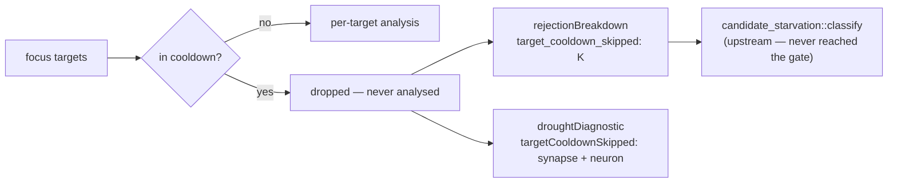

# Emit the documented `target_cooldown_skipped` reason (Issue #1797)

## Summary

The per-target cooldown filter (Issue #1130) drops whole focus targets before
any per-target analysis cost is incurred, but the drop was invisible to the
starvation classifier: `target_failure_tracker.rs` documented a
`cooldown_skipped` reason name "per Issue #1129's convention" that was never
defined and never emitted, so `candidate_starvation::classify` — which reads
only the rejection breakdown — could never see a cooldown-suppressed target.

This PR emits the documented reason. `REJECTION_TARGET_COOLDOWN_SKIPPED`
(`"target_cooldown_skipped"`) is added to `ALL_REJECTION_REASONS` and to exactly
one starvation partition — `UPSTREAM_REJECTION_REASONS`, because the target was
never analysed so no proposal could reach the accept gate. Each surface folds
its own `apply_target_cooldown` return value into that surface's
`rejection_breakdown` via the new `fold_target_cooldown_skips` helper, mirroring
the Issue #1796 `fold_within_batch_skips` pattern.

The count threading itself (metadata field, per-pass sum feeding the drought
diagnostic) landed with Issue #1791; the hard-coded `target_cooldown_skipped: 0`
in the drought inputs is already gone. What this PR adds on that path is a
testable `pass_target_cooldown_skipped` helper extracted from the inline sum in
`analyze_all`, so the synapse-only / neuron-only / both-surfaces totals are
pinned by tests and cannot silently regress to a fabricated zero.

Cooldown filtering behaviour is unchanged — observability only.

Closes #1797.

## Evidence

Backend/FFI-diagnostics change with no web interface to screenshot; the evidence
is the test suite below plus the full `./quality.sh` gate passing (fmt, clippy
`-D warnings`, `cargo deny`, unit + integration tests, docs, release build).

## Test Plan

Added:

- `src/analysis/orchestration.rs::target_cooldown_tests`
  - `cooldown_skipped_counts_synapse_only` — K skips surface as
    `target_cooldown_skipped: K` in the synapse breakdown, total K, classified
    upstream.
  - `cooldown_skipped_counts_neuron_only` — same for the neuron surface.
  - `cooldown_skipped_counts_both_no_double_count` — pass total is the sum and
    neither surface absorbs the other's skips.
  - `cooldown_skipped_absent_when_no_targets_dropped` — the reason key is absent
    rather than present-and-zero.
- `src/analysis/drought_diagnostic.rs::tests::cooldown_skipped_surfaces_in_diagnostic_and_breakdown`
  — the diagnostic payload reports K and names the documented reason as
  dominant.
- `src/analysis/diagnostics/rejection_reasons.rs::tests::target_cooldown_skipped_is_a_documented_reason`
  — pins the stable name, its presence in `ALL_REJECTION_REASONS`, and the
  friendly summary rendering.

Existing gate that now covers the new reason:

- `src/analysis/candidate_starvation.rs::tests::partitions_cover_every_reason_exactly_once`
  — fails if the reason lands in zero or more than one partition.

## Documentation

- `docs/FFI_API.md` — new "Target-Cooldown Skips (Issue #1797)" section with the
  JSON shape and a Mermaid flow diagram.
