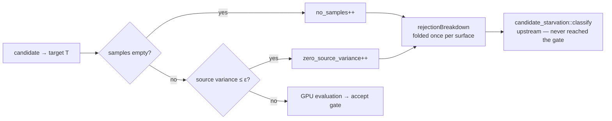

# Wire `REJECTION_NO_SAMPLES` and add a zero-source-variance reason at the evaluation drop sites

## Summary

Three per-candidate `continue` sites in the evaluation loops discarded
candidates without incrementing any counter. Those candidates never reach the
accept gate, so their absence from the rejection breakdown biased
`candidate_starvation::classify` toward `ProposalRichOverRejected` — and thus
toward suppressing the widening bypass — exactly when generation was the real
bottleneck. Closes #1798.

| Site | Condition | Reason now recorded |
| --- | --- | --- |
| `src/analysis/neuron/evaluation.rs` | no samples built for the source | `no_samples` |
| `src/analysis/neuron/evaluation.rs` | source variance discount ≤ `EPSILON` | `zero_source_variance` (new) |
| `src/analysis/synapse/target_analysis/evaluation.rs` | GPU work item had no samples | `no_samples` |

Changes:

- **New reason** `REJECTION_ZERO_SOURCE_VARIANCE` (`"zero_source_variance"`) —
  a distinct cause from `no_samples`: the source exists and *was* sampled, it
  just carries no signal. Registered in `ALL_REJECTION_REASONS` and in
  `UPSTREAM_REJECTION_REASONS` only, with a prose rendering in
  `top_level_summary`.
- **New module** `src/analysis/evaluation_drops.rs` — per-batch
  `EvaluationDropCounters` (two relaxed `AtomicU32`s) plus
  `fold_evaluation_drops`, mirroring the `WithinBatchFailureTracker` /
  `fold_within_batch_skips` pattern from #1796. The guard predicates live with
  the counters (`drop_for_empty_samples`, `drop_for_zero_source_variance`) so
  the count cannot drift from the condition it accounts for.
- **Wiring** — the neuron and synapse orchestrators each own one counter set
  for the batch, share it across rayon workers via `Arc`, and fold it into
  their own `rejection_breakdown` once per surface, so the two surfaces cannot
  double count.
- **Docs** — new "Evaluation Drop Sites (Issue #1798)" section in
  `docs/FFI_API.md` alongside the #1796 / #1797 subsections.

Drop behaviour is unchanged — the guards are exactly the conditions they
replaced. This is observability only.

## Evidence

Backend/CLI change with no web interface, so there is no screenshot; the
evidence is the test suite plus the `./quality.sh` gate.

Per-candidate cost is a relaxed atomic increment on the drop path only — no
lock, no allocation, no per-candidate `String` — so no benchmark regression is
expected (`benchmark_compare.sh` remains the gate for per-candidate cost).

## Test Plan

New integration tests — `tests/issue_1798_evaluation_drop_reasons.rs`:

- `neuron_batch_surfaces_both_drop_reasons` — a batch with E=3 empty-sample and
  V=2 constant-source candidates surfaces `no_samples: 3` and
  `zero_source_variance: 2` on the neuron metadata.
- `synapse_batch_surfaces_no_samples` — the synapse surface reports
  `no_samples: 4` and no `zero_source_variance` key.
- `drop_behaviour_is_unchanged_by_the_counters` — the accepted-candidate set is
  identical with and without the counters (acceptance criterion: observability
  only).
- `per_surface_counters_do_not_double_count`, `clean_batch_records_no_reasons`,
  `drops_count_as_upstream_starvation_evidence` (a pass that only drops
  pre-evaluation classifies as `CandidateStarved`, not
  `ProposalRichOverRejected`).

New unit tests — `src/analysis/evaluation_drops.rs`: guard predicates agree
with the real `compute_source_variance_discount` on constant and varying
sources; fold records both reasons; a clean batch records nothing.

New unit test — `src/analysis/diagnostics/rejection_reasons.rs`:
`zero_source_variance_is_a_documented_reason` pins the stable name, its
presence in `ALL_REJECTION_REASONS`, and its prose summary.

Existing guards that now cover the new reason: `all_reasons_list_contains_every_constant`
and `partitions_cover_every_reason_exactly_once` (`src/analysis/candidate_starvation.rs`)
fail if the constant is unregistered or lands in zero/both partitions.
