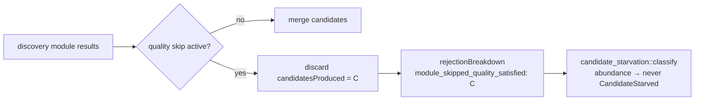

# Count candidates discarded by quality-based module skipping (Issue #1799)

## Summary

Quality-based module skipping (Issue #1074) discarded every candidate produced
by the remaining discovery modules without incrementing any rejection counter,
so the drop was invisible to `candidate_starvation::classify` — which reads the
`RejectionBreakdown` alone. This is the one silent drop that means the
**opposite** of starvation: the pass skipped those modules precisely because it
already held enough high-quality candidates, so leaving it uncounted biased the
classification towards `CandidateStarved`.

The skipped modules' candidates are now counted under a new stable reason,
`module_skipped_quality_satisfied`, classified as an **abundance** rejection
alongside `budget_truncated` and `per_target_cap`. Skipping behaviour itself,
the `modulesSkippedByQuality` metadata, and the per-module stats are unchanged —
this is observability only. Closes #1799.

**Unit: candidates, not modules.** The recorded value is the skipped module's
`candidates_produced` (the number of candidates actually discarded), documented
on the constant, so `signals_from_breakdown` totals stay comparable with every
other reason.

### Changes

- `src/analysis/diagnostics/rejection_reasons.rs` — new
  `REJECTION_MODULE_SKIPPED_QUALITY_SATISFIED` constant (unit documented on the
  doc comment), added to `ALL_REJECTION_REASONS`, plus a `friendly_reason` arm
  so it renders as prose in `top_level_summary`.
- `src/analysis/candidate_starvation.rs` — added to
  `ABUNDANCE_REJECTION_REASONS` (exactly-once membership enforced by
  `partitions_cover_every_reason_exactly_once`).
- `src/analysis/discovery_dispatch.rs` — records `candidates_produced` at the
  quality-skip branch in `merge_discovery_module_results`.
- `docs/FFI_API.md` — new "Quality-Based Module Skipping (Issue #1799)" section
  documenting the reason, its unit, and its abundance classification.

## Evidence

Backend/library change with no web interface, so no screenshot applies. The
verification is the three test layers named in the issue's Failure Detection
section, all run via `cargo test --lib`:

1. **Partition test** — `partitions_cover_every_reason_exactly_once` fails if
   the new constant is added to `ALL_REJECTION_REASONS` but not to exactly one
   starvation partition. No new test code needed; it passes with the constant in
   `ABUNDANCE_REJECTION_REASONS`.
2. **Recording-site tests** — the quality-skip cases in
   `discovery_dispatch_parallel_tests.rs` now assert the breakdown count equals
   the skipped modules' `candidates_produced` sum, and that the
   no-skip case records zero.
3. **Classification test** —
   `quality_skip_drops_count_as_abundance_not_starvation` pins that a breakdown
   whose only rejections are `module_skipped_quality_satisfied` contributes to
   `abundance_rejections` and is never classified `CandidateStarved`.

### Existing test fixtures strengthened (documented change)

The two pre-existing quality-skip tests
(`quality_skip_skips_later_modules_when_enough_high_quality_candidates` and
`quality_skip_still_records_stats_for_skipped_modules`) built their
high-quality candidates all targeting the **same** neuron. The per-final-target
coordinated cap (Issue #1271, 3 per target) therefore discarded all but 3 of
them, so `count_high_quality_candidates` never reached
`QUALITY_SKIP_MIN_CANDIDATES` and **quality skipping never actually fired** —
both tests passed vacuously (their assertions, `total <= N` and "stats are
recorded", hold whether or not skipping occurs).

No assertion was removed or weakened. The fixtures now spread candidates across
distinct targets (`make_candidate_to` / `high_quality_candidates_for_skip`) so
the skip path is genuinely exercised, which is what the new counter assertions
require. Verified by the fact that the new assertions fail against the old
fixture (`left: None, right: Some(2)`) and pass against the new one.

## Test Plan

Added:

- `src/analysis/candidate_starvation.rs::quality_skip_drops_count_as_abundance_not_starvation`
  — abundance classification, never `CandidateStarved`.
- `src/analysis/discovery_dispatch_parallel_tests.rs::quality_skip_drops_are_classified_as_abundance`
  — end-to-end: a real merge pass with skipping produces
  `abundance_rejections == 5` (the skipped module's candidate count) and does
  not classify as starved.

Modified (assertions added, none removed):

- `quality_skip_skips_later_modules_when_enough_high_quality_candidates` —
  asserts `module_skipped_quality_satisfied == 2` (the skipped module's two
  candidates, not a module count of 1).
- `quality_skip_still_records_stats_for_skipped_modules` — asserts the count is
  `1` and that the skipped module's `candidates_produced` stat is unchanged.
- `quality_skip_does_not_skip_when_insufficient_high_quality_candidates` —
  asserts the count is zero when no skipping occurs.

Unchanged and passing: `partitions_cover_every_reason_exactly_once` (the
exactly-once partition gate).
