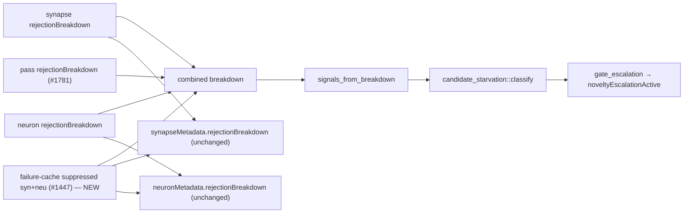

# Fold failure-cache suppression into the breakdown before the starvation classifier reads it

## Summary

The breakdown fed to `candidate_starvation::classify` was assembled from the two
surface metadata breakdowns plus the pass-level breakdown, but **not** the
cross-stack failure-cache suppression count — that was added only afterwards, to
the surfaced per-surface wire maps. `duplicate_of_failure_cache` was therefore
listed as upstream (starvation) evidence yet could never reach the classifier
that decides whether to bypass the very filter causing the drought. Combined
with `DEFAULT_MIN_FORMED_PROPOSALS = 4`, any pass with >= 4 gate-side rejections
classified as `ProposalRichOverRejected` and the bypass stayed disabled however
much suppression was occurring. Closes #1800.

Changes:

- `src/ffi_internal/analysis.rs` — new `starvation_classifier_breakdown` helper
  assembles the classifier input in one place: both surfaces' breakdowns, the
  pass-level breakdown (#1781), and `syn_suppressed + neu_suppressed` under
  `REJECTION_DUPLICATE_OF_FAILURE_CACHE`. The call site now uses it, so the
  count is present **before** `signals_from_breakdown` runs. The surfaced wire
  maps still come from `breakdown_with_failure_cache`, so the count lands in the
  classifier input exactly once.
- `src/analysis/candidate_starvation.rs` — `classify` now treats pre-gate drops
  outnumbering the proposals the generator provably formed as starvation,
  regardless of the formed-proposal floor. Without this the fold could never
  change a verdict: the floor decides on `proposals_formed()` alone, which
  ignores the upstream partition entirely. Strict majority keeps the #1737
  converged profile (thousands gate-side, ~no upstream) `ProposalRichOverRejected`.
- `src/lib.rs` — export the helper so the fold ordering is testable without
  driving a full analysis pass.
- `docs/FFI_API.md` — document the ordering and the classifier data flow.

Per-surface `rejectionBreakdown` wire maps and `failureCacheSuppressedCount` are
unchanged.

## Evidence

Backend/FFI change — no web interface to screenshot. Verified by tests and the
full `./quality.sh` gate (fmt, clippy `-D warnings`, check, tests, rustdoc,
release build), which passes cleanly.

Before the fix the `F` edge into `C` did not exist — suppression reached only
the wire maps, after classification had already happened.

## Test Plan

New — `tests/issue_1800_failure_cache_starvation_classification.rs` (the
required detection point):

- `suppression_appears_exactly_once_in_the_classifier_input` — `S` appears once
  under `duplicate_of_failure_cache`; the breakdown total proves no double count.
- `both_surfaces_and_pass_drops_fold_into_one_classifier_input` — both surfaces
  plus the pass-level breakdown merge with a single suppression fold.
- `no_suppression_leaves_the_reason_absent` — an unsuppressed pass keeps the
  reason absent, not present-and-zero.
- `suppressed_pass_with_gate_side_rejections_is_candidate_starved` — zero
  survivors, `S = 9` suppressed, 4 gate-side rejections → `CandidateStarved`,
  `recommend_widening` true, `gate_escalation(true, …)` true.
- `without_the_fold_the_same_pass_was_over_rejected` — the same pass without the
  fold classifies `ProposalRichOverRejected`, pinning the regression repaired.

New unit tests:

- `src/analysis/candidate_starvation.rs::dominant_upstream_evidence_overrides_the_formed_proposal_floor`
  and `::balanced_upstream_evidence_stays_over_rejected` (a tie is not a
  majority).
- `src/ffi_internal/analysis.rs::classifier_breakdown_folds_suppression_without_double_counting`.

Existing contracts confirmed unchanged: the #1739 classifier tests
(`converged_production_profile_does_not_trigger_widening`,
`starved_profile_triggers_widening`, `every_rejection_reason_is_classified`),
the #1447 wire-map tests, and the #1781/#1796/#1797/#1798/#1799 partition tests
all still pass. No existing test was modified or removed.
