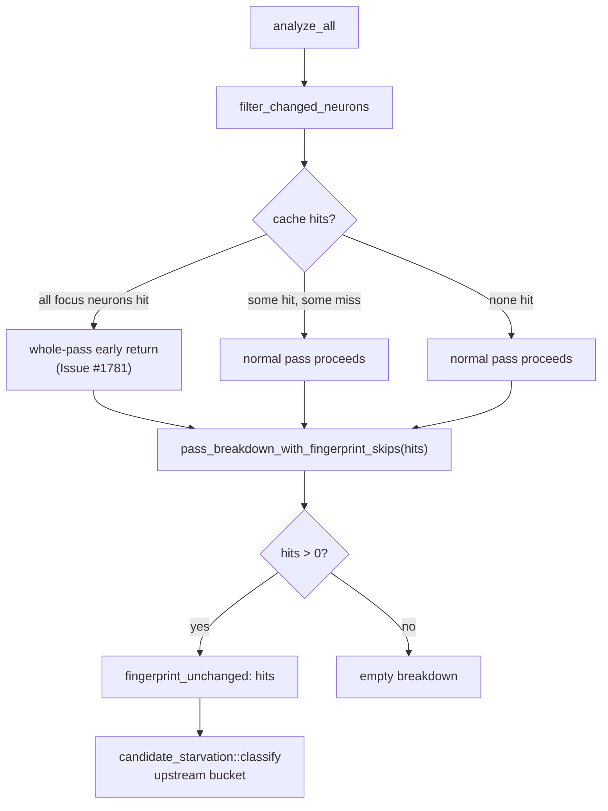

# Count partial fingerprint-cache skips on the pass breakdown (Issue #1801)

## Summary

Issue #1781 made the **whole-pass** fingerprint skip visible, but only when
*every* focus neuron was unchanged. The far more common **partial** skip — the
structural fingerprint cache drops some focus neurons and the pass proceeds with
the rest — returned a `pass_rejection_breakdown` built by
`RejectionBreakdown::new()`, so those never-analysed neurons never reached
`candidate_starvation::classify` and their absence read as a gate rejection,
inflating the gate-rejection share in the candidate-rate diagnosis.

`analyze_all` now builds every one of its return paths' pass breakdown through a
single helper, `pass_breakdown_with_fingerprint_skips(fingerprint_cache_hits)`,
which records `REJECTION_FINGERPRINT_UNCHANGED` with the pass's cache-hit count.
Because `record_many_u32` ignores a zero count, a pass with no cache hits records
no entry; because the returns are mutually exclusive, the whole-pass early return
and the normal path can never accumulate the same hits twice. Fingerprint
filtering behaviour itself is untouched — this is observability only.

`fingerprint_unchanged` is already in `UPSTREAM_REJECTION_REASONS`, so the
classifier now attributes a partial skip to generation (the neuron was never
analysed) rather than to over-rejection at the gate.

Closes #1801.

## Evidence

Backend library change — no web interface to screenshot. Verified by tests
driving the real `analyze_all` entry point (see Test Plan).



Before this change only path **D** reached the counter; **E** was silent (row 1
of the #1782 silent-drop table, root cause B3 in
`docs/analysis/candidate-rate-diagnosis-1777.md`).

TDD confirmation — with the wiring reverted, the new partial-skip test fails and
the two regression guards still pass:

```text
test partial_cache_hits_recorded_as_fingerprint_unchanged ... FAILED
test whole_pass_skip_counts_hits_exactly_once ... ok
test zero_cache_hits_yields_no_fingerprint_entry ... ok
  left: None
 right: Some(1)
```

With the fix applied, all three pass.

## Test Plan

New integration test `tests/issue_1801_partial_fingerprint_rejection.rs` — every
case drives `analyze_all` over a real Parquet fixture, never a hand-built
breakdown, so a refactor that reverts the wiring goes red:

- `partial_cache_hits_recorded_as_fingerprint_unchanged` — one focus neuron
  primed as unchanged and one changed (`cache_hits == 1`, `cache_misses == 1`);
  asserts the returned `pass_rejection_breakdown` reports
  `fingerprint_unchanged: 1`. This is the case that fails against the unfixed
  code.
- `whole_pass_skip_counts_hits_exactly_once` — both focus neurons unchanged (the
  #1781 early return); asserts exactly `fingerprint_cache_hits` (2) and a
  single-entry breakdown, so double counting is detected if the two paths ever
  stop being mutually exclusive.
- `zero_cache_hits_yields_no_fingerprint_entry` — no previous fingerprints;
  asserts the key is absent, so no spurious zero-count entry can shift the
  `candidate_starvation::classify` ratios.

New unit test in `src/analysis/candidate_starvation.rs`:

- `partial_fingerprint_skip_counts_as_upstream_not_gate_rejection` — a breakdown
  containing `fingerprint_unchanged` lands in `upstream_rejections`, not
  `gate_side_rejections`, and `classify` returns `CandidateStarved` — pinning the
  `UPSTREAM_REJECTION_REASONS` membership this fix exists for.

Documentation: `docs/FFI_API.md` gains a "Partial Skips Are Counted Too (Issue
#1801)" subsection under the fingerprint-skip escape hatch.

Full `./quality.sh` gate run clean (fmt, clippy `-D warnings`, check, tests, doc,
release build).

## Security Self-Check

- No new external input, FFI entry point, SQL/shell/filesystem call, or
  dependency. The change records an existing counter on an existing struct field;
  `u32::try_from(...).unwrap_or(u32::MAX)` keeps the count conversion saturating
  rather than panicking.
- No secrets or hidden files staged.
