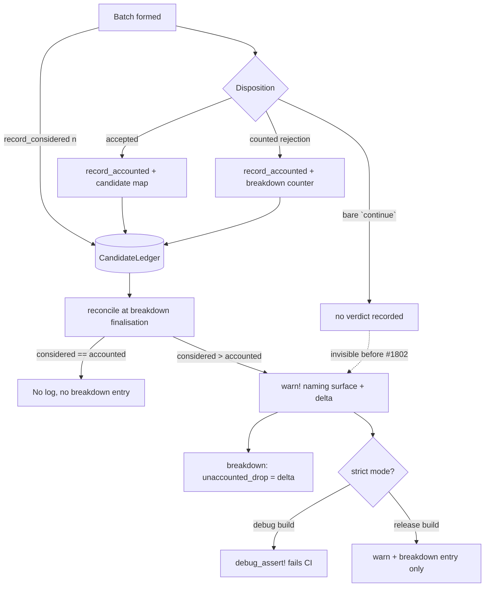

# Fail-loud invariant: every considered candidate is returned or counted (Issue #1802)

## Summary

Issues #1796–#1801 each wired one of the six silent drop paths the #1782
diagnosis found into `RejectionBreakdown`. That fixed the six, but left the class
of bug intact: nothing stopped the **seventh** being added the same way — a plain
`continue` that compiles, passes tests and ships. This PR adds the enforced
invariant that replaces that convention. Closes #1802.

Each analysis surface now owns a per-pass `CandidateLedger`
(`src/analysis/candidate_reconciliation.rs`) with two relaxed atomic counters:

| Counter      | Incremented                                                                                             |
| ------------ | ------------------------------------------------------------------------------------------------------- |
| `considered` | once where a batch of candidates is **formed** — a single site per batch, never at a drop site           |
| `accounted`  | once per candidate whose **verdict** is recorded: an accept, or a rejection that reaches the breakdown   |

At the point each surface's metadata breakdown is finalised
(`neuron/mod.rs`, `synapse/orchestration.rs`), `reconcile` asserts
`considered == accounted`. Because `accounted` is only ever incremented alongside
a breakdown-bound counter or an accept, that is the surface-scoped form of the
identity the issue asks for:
`candidates_considered == candidates_returned + sum(rejection_breakdown)`.
The asymmetric counting is deliberate — a new drop path cannot satisfy the
invariant by incrementing both sides.

**On a mismatch, three things happen so no layer can mask the fault:**

1. The residual is recorded under the new stable reason `unaccounted_drop`, so
   the loss is visible in the FFI payload even on a release build where
   assertions are compiled out.
2. One `tracing::warn!` names the surface and the unaccounted delta — greppable
   in production logs.
3. Under strict mode a `debug_assert!` fires. Strict mode defaults to **on for
   debug builds**, so `cargo test` in CI fails the PR that introduces the
   unaccounted path, and **off for release builds**. Override with
   `NEAT_AI_DISCOVERY_STRICT_CANDIDATE_RECONCILIATION`.

An over-count (`accounted > considered`) is the mirror defect — a verdict
recorded twice. It cannot hide a lost candidate, so nothing is added to the
breakdown, but it is warned about and fails strict mode all the same.

`synapseMetadata` / `neuronMetadata` now carry a `candidate_reconciliation`
payload so callers can confirm the invariant **positively**, rather than
inferring success from the absence of a failure marker.

### Six further silent drops the invariant exposed

Wiring the ledger immediately caught six more bare `continue`s beyond the six
#1782 found. Each now records a verdict:

| Site                                          | Condition                                          | Reason recorded            |
| --------------------------------------------- | -------------------------------------------------- | -------------------------- |
| `neuron::evaluation` (ReLU split, both signs) | improved-sample ratio below the floor              | `below_improved_ratio`     |
| `neuron::evaluation` (activation specs)       | improved-sample ratio below the floor              | `below_improved_ratio`     |
| `neuron::evaluation` (activation specs)       | candidate squash compounds a near-saturated target | `target_saturated`         |
| `synapse::…::evaluation`                      | no usable outgoing weight could be fitted          | `cpu_pre_reject_no_signal` |
| `synapse::…::evaluation`                      | post-evaluation improvement non-positive           | `zero_improvement`         |
| `synapse::…::evaluation` (two sites)          | clamped weight-update delta is a no-op             | `degenerate_weight_update` |

`degenerate_weight_update` is a new stable reason (classified **gate-side** — the
candidate was evaluated before the verdict); the others reuse existing reasons
whose documented meaning already matched the condition. **Drop behaviour itself is
unchanged throughout — this is observability only.**

## Evidence

Backend/CLI change: no web interface to screenshot. Verified through the real
discovery dispatch path plus the full quality gate.

### Reconciliation flow

### Measured on a real pass

A seeded 4-neuron creature driven through `analyze_all` on a Metal GPU, before
and after wiring. Both surfaces reconcile with **zero** unaccounted candidates,
and the previously-silent drops now appear as counts:

| Fixture                     | Surface | `unaccounted_drop` | Newly-visible counts                          |
| --------------------------- | ------- | ------------------ | --------------------------------------------- |
| converged (errors ~`1e-7`)  | synapse | absent             | `zero_improvement: 2`                         |
| converged (errors ~`1e-7`)  | neuron  | absent             | —                                             |
| improvable (errors `0.1`)   | synapse | absent             | `zero_improvement: 2`                         |
| improvable (errors `0.1`)   | neuron  | absent             | `below_improved_ratio: 5`                     |

### Cost

A balanced pass costs two relaxed atomic loads per surface and emits nothing —
no log line, no breakdown entry. The per-candidate increments are single relaxed
`fetch_add`s with no allocation, no lock and no `String`, the same hot-loop
discipline as `EvaluationDropCounters` (#1798) and `WithinBatchFailureTracker`
(#1164).

### Test suite

`cargo test --tests --test-threads=1`: **4719 passed, 0 failed.** Strict mode is
on by default for debug builds, so every existing test that routes a pass through
the real dispatch path also exercised the assertion — detection is not limited to
the dedicated test.

## Test Plan

New — `tests/issue_1802_candidate_reconciliation.rs` (6 cases):

- `converged_pass_accounts_for_every_candidate` — drives `analyze_all` with a
  seeded converged creature (all candidates rejected) and asserts each surface's
  reconciliation is balanced with no `unaccounted_drop` entry.
- `improvable_pass_accounts_for_every_candidate` — same through an improvable
  creature so accepts *and* rejections populate both sides, and asserts
  `considered > 0` so the invariant cannot hold vacuously if `record_considered`
  is ever dropped from the dispatch path.
- `real_pass_survives_strict_mode` — runs a real pass with strict mode forced on,
  proving the wiring balances under the assertion, not just under the warn.
- `uncounted_drop_fails_with_surface_and_delta` — guards the guard: an injected
  un-counted drop must fail, the message must name the surface and the delta, and
  the residual must appear in the breakdown (the release-build backstop).
- `strict_mode_fails_ci_on_uncounted_drop` — the same injected drop must panic
  under strict mode, so CI gates.
- `unaccounted_drop_is_a_documented_reason` — pins the stable name and its
  registration in `ALL_REJECTION_REASONS`.

New unit tests in `src/analysis/candidate_reconciliation.rs` (6 cases): balanced
ledger records and logs nothing; an uncounted drop surfaces in the breakdown;
over-accounting is reported but not recorded; zero counts are ignored; the strict
override round-trips; strict mode panics with a surface-naming message.

Extended `src/analysis/evaluation_drops.rs` tests to cover the four new counters
and the widened fold.

Pre-existing coverage that gates the new reasons: the
`candidate_starvation` partition-coverage test fails if a constant is added to
`ALL_REJECTION_REASONS` without exactly one partition entry — both
`degenerate_weight_update` (gate-side) and `unaccounted_drop` (upstream) are
classified.

## Security Self-Check

- **Input validation** — no new external input; both new public entry points take
  integer counts and a `&'static str` surface name.
- **Secrets** — none staged; no hidden files touched.
- **Injection surface** — no new SQL, shell, filesystem or HTTP calls.
- **Output encoding** — the diagnostic message contains only integers and a
  compile-time surface constant, no user data.
- **Authentication/authorisation** — unchanged; no new endpoints.
- **Error handling** — the reconciliation never leaks paths or internal state; it
  reports counts and a fixed remediation sentence.
- **Dependencies** — no new dependencies.

## Files Changed

- `src/analysis/candidate_reconciliation.rs` — **new**: `CandidateLedger`,
  `Reconciliation`, `reconcile`, `StrictModeGuard`.
- `src/analysis/diagnostics/rejection_reasons.rs` — new `degenerate_weight_update`
  and `unaccounted_drop` constants, `ALL_REJECTION_REASONS` entries, and
  `friendly_reason` arms.
- `src/analysis/candidate_starvation.rs` — partition entries for both reasons.
- `src/analysis/evaluation_drops.rs` — four new counters for the newly-accounted
  sites; the fold now records all six reasons.
- `src/analysis/neuron/{mod,evaluation}.rs` — ledger creation, batch-formation and
  disposition sites, reconciliation at finalisation.
- `src/analysis/synapse/{orchestration.rs,target_analysis/{mod,evaluation}.rs}` —
  the same for the synapse surface.
- `src/analysis/shared/metadata.rs` (+ three initialisers) —
  `candidate_reconciliation` payload on both metadata structs.
- `src/config/{observability.rs,mod.rs}` —
  `NEAT_AI_DISCOVERY_STRICT_CANDIDATE_RECONCILIATION`.
- `docs/analysis/candidate-reconciliation-1802.md` — **new** design notes.
- `docs/FFI_API.md`, `docs/CONFIGURATION.md`, `CHANGELOG.md`, `Cargo.toml`
  (`0.74.179` → `0.74.180`).
