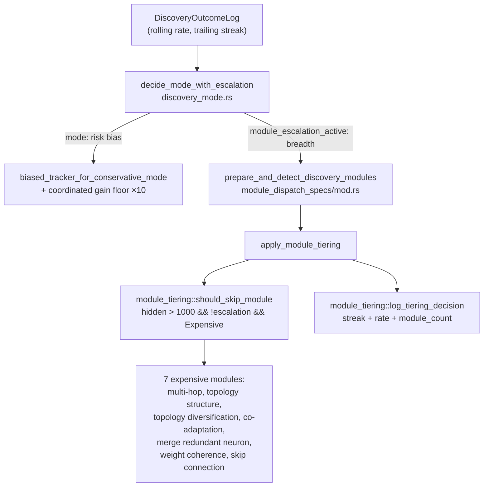
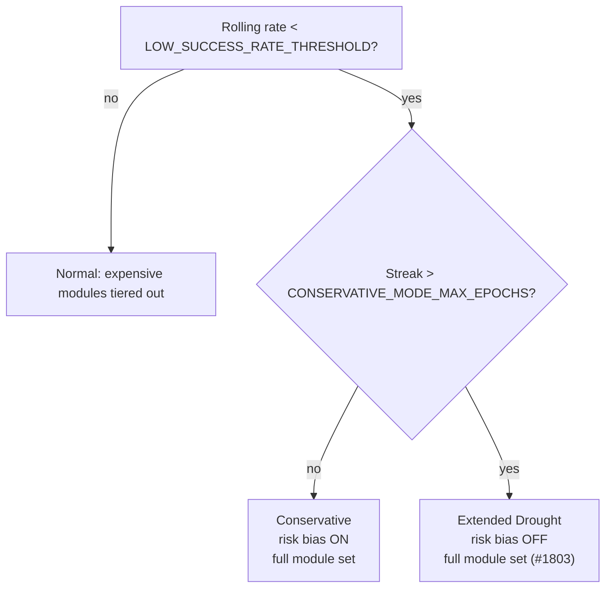

# Keep the expensive discovery modules through a deep drought (Issue #1803)

## Summary

`decide_mode` reverted to `DiscoveryMode::Normal` once the trailing-failure
streak exceeded `conservative_mode_max_epochs`, and `orchestration.rs` derived
the module-tiering escalation flag from `discovery_mode == Conservative`. So
crossing the cooldown also cleared `tiering_escalation_active`, tiering the seven
expensive discovery modules out of the dispatch set on creatures above 1000
hidden neurons — **the module set narrowed exactly when the drought was worst.**

`decide_mode_with_escalation` now returns a `ModeDecision` that separates the two
signals:

- `mode` — the **risk bias**. Unchanged: still reverts to Normal on the streak.
- `module_escalation_active` — module **breadth**. Follows the collapsed rolling
  success rate alone, so the expensive modules are retained for as long as the
  creature is struggling.

The `mode == Normal` **and** still-escalated state is the documented **Extended
Drought** regime (`ModeDecision::is_extended_drought`). Closes #1803.

### What the revert was originally protecting against

Walked back to Issue #1132, which introduced the constant: *"Exit conservative
mode as soon as one successful discovery occurs, or after a max cooldown of
`CONSERVATIVE_MODE_MAX_EPOCHS` (proposed: 20)."* It was a cooldown on the
**risk bias only** — stop paying the Conservative penalties (high-risk modules
down-weighted 1/1.5×, coordinated gain floor tightened 10×) once they had
demonstrably not helped. Creature-scale module tiering did not exist yet; Issue
#1547 added it 400 issues later and reused `mode == Conservative` as its
escalation signal, which is what silently coupled module breadth to a bias
cooldown. Nothing in #1132 intended the module set to narrow. This is recorded on
the issue and in `docs/analysis/candidate-rate-diagnosis-1777.md` (root cause B3).

### Why option 1, and why not options 2 or 3

| Option | Verdict |
|--------|---------|
| **1. Keep the escalated module set, revert only the risk bias** | **Chosen.** It restores exactly the scope #1132 specified, so the anti-thrash guard keeps working while breadth outlives it. |
| 2. Make the revert conditional on `candidate_starvation::classify` | Rejected — not implementable at this point. `classify` reads a pass's `RejectionBreakdown`, which only exists *after* dispatch (`ffi_internal/analysis.rs`), whereas tiering must decide *before* the module set is built. It is already applied where it does fit, on the post-pass `novelty_escalation_active` handshake output. |
| 3. Re-arm escalation after a cooldown | Rejected — strictly worse than option 1 for the same cost. It reintroduces a window in which the modules are dropped, and adds cross-pass state the pure `decide_mode` path deliberately avoids. |

### Escalation path, confirmed end-to-end



The `>1000` threshold is `DEFAULT_MODULE_TIERING_HIDDEN_THRESHOLD`
(`module_tiering.rs`), overridable by
`NEAT_AI_DISCOVERY_MODULE_TIERING_HIDDEN_THRESHOLD`; `0` disables tiering.

### Regime transitions



## Evidence

Backend/library change with no web interface, so no screenshot applies. The
evidence is the test suite plus the new observability line.

`./quality.sh < /dev/null` passes cleanly (fmt, clippy, `cargo deny`, unit +
integration tests, doc build, release build).

The transition is observable from a single line — `extended_drought=true` with
`discovery_mode="normal"` is the state that used to drop the modules:

```text
INFO Issue #1547: drought/novelty escalation active — full discovery module set re-enabled on large creature
    hidden_neuron_count=1662 threshold=1000 module_count=48
    trailing_failure_streak=25 rolling_success_rate=0.0
    discovery_mode="normal" extended_drought=true
```

The complementary tiered-out line carries the same three fields, so an operator
can always tell why the set they are looking at has the width it has.

## Test Plan

New integration tests in `tests/issue_1803_drought_module_escalation.rs`:

| Test | Acceptance criterion |
|------|----------------------|
| `ac1_long_streak_still_reverts_risk_bias_to_normal` | Pins the pre-existing behaviour — Normal is still returned on a 25-epoch streak despite a 0.0 rolling rate — so the change is visible in the diff. |
| `ac2_deep_drought_retains_expensive_modules_on_large_creature` | On a 1662-hidden-neuron creature in a deep drought, `should_skip_module` returns `false` for every `EXPENSIVE_MODULES` entry. |
| `ac2_deriving_escalation_from_mode_alone_would_drop_them` | The regression itself: the pre-fix `mode == Conservative` flag skips all seven on the same log. Fails against the fixed semantics, passes against the old ones. |
| `ac2_conservative_regime_still_escalates` | Inside the cooldown nothing changes. |
| `ac2_healthy_creature_is_still_tiered` | A 0.8 rolling rate is not a drought — tiering still applies, so the fix does not escalate every large creature permanently. |
| `ac2_empty_log_does_not_escalate` | An empty log knows nothing. |
| `ac2_streak_reset_by_one_success_keeps_escalation_while_rate_is_collapsed` | Breadth keys off the rolling rate, not the streak. |
| `ac2_mode_agrees_with_decide_mode_across_streak_range` | `decide_mode` and `decide_mode_with_escalation().mode` never disagree across streaks 0–23. |
| `ac3_extended_drought_escalation_logs_streak_rate_and_module_count` | Captures the real `tracing` event and asserts `trailing_failure_streak`, `rolling_success_rate`, `module_count`, `discovery_mode` and `extended_drought`. |
| `ac3_tiered_out_path_logs_streak_rate_and_module_count` | The tiered-out line carries the same three fields plus `skipped_count`. |
| `ac3_small_creature_logs_nothing` | Below the threshold there is no decision, so no line — the drought lines stay meaningful. |

New unit tests in `src/analysis/discovery_mode.rs`:
`extended_drought_keeps_module_escalation_after_bias_reverts`,
`conservative_regime_is_not_extended_drought`,
`healthy_rate_never_escalates_modules`, `empty_log_escalates_nothing`.

No existing test was modified, commented out, or removed. The pre-existing
`cooldown_exit_after_max_epochs` and `cooldown_does_not_exit_within_max_epochs`
unit tests still pass unchanged, confirming `decide_mode`'s contract is intact.

## Documentation

- `docs/DROUGHT_PLAYBOOK.md` — the three-regime table gains an "Expensive modules
  on a large creature" column; a note explains that
  `CONSERVATIVE_MODE_MAX_EPOCHS` is a *bias* cooldown, not a *breadth* cooldown;
  the module-tiering section gains the new log fields and a regime flowchart; the
  `discoveryMode` diagnostic lever, the two env-var rows and the 30-epoch worked
  example are updated.
- `docs/analysis/candidate-rate-diagnosis-1777.md` — root cause B3 records the fix.
- `src/analysis/discovery_mode.rs` — module docs explain the bias/breadth split.

## Security Self-Check

- **Input validation** — no new external input; `decide_mode_with_escalation`
  consumes an already-validated `DiscoveryOutcomeLog`.
- **Secrets** — none staged; the diff is source, tests and docs only.
- **Injection surface / output encoding** — no new SQL, shell, filesystem or HTTP
  calls. The new log line emits structured `tracing` fields (integers, an `f32`
  and a fixed `&'static str` mode name), no interpolated external strings.
- **Authentication / authorisation** — unchanged; no new endpoints.
- **Error handling** — no new fallible path; the decision is a pure function with
  no error state to swallow.
- **Dependencies** — none added.
