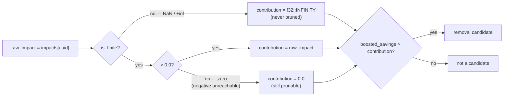

# PR Summary — Issue #1804

## Summary

The **shipped** removal path treated a non-finite structural impact as
*maximally prunable*. `identify_structural_removal_candidates`
(`src/focus/ranking/removal_candidates.rs`) mapped a NaN/infinite impact to a
`0.0` contribution, so `boosted_savings <= contribution` was false for every
neuron with any savings at all — a neuron whose impact could not be reasoned
about became the **strongest** removal candidate. This is the live FFI path
(`src/ffi_internal/analysis.rs`), so the riskier default was the one that
shipped, while the near-duplicate `removal_triage.rs` already did the safe
thing.

The shipped path now adopts the defensive policy: a **non-finite** impact maps
to `f32::INFINITY`, so the savings can never exceed it and the neuron is never
pruned on bad numbers. A genuine `0.0` impact remains prunable (a
zero-contribution neuron *should* be removable), and the doc comment records
both the policy and its reason. A **negative** impact stays on the `0.0` arm and
is documented as unreachable by construction — every impact term is an `abs()`
times a non-negative child impact — rather than being silently folded in with
NaN. Closes #1804.



## Evidence

Backend/library change — no web interface to screenshot. Verified by tests.

**Regression detection proven.** Reverting only the five changed lines to the
old mapping turns the new NaN test red:

```
---- structural_removal_tests::nan_impact_neuron_absent_from_candidates stdout ----
a neuron with a non-finite structural impact must never be a removal candidate,
got ["h-nan", "h-zero"]
```

With the fix applied:

```
running 8 tests
test focus::ranking::removal_candidates::structural_removal_tests::nan_impact_neuron_absent_from_candidates ... ok
test focus::ranking::removal_candidates::structural_removal_tests::zero_impact_neuron_still_candidate ... ok
test focus::ranking::removal_candidates::structural_removal_tests::no_candidate_has_nonfinite_raw_impact ... ok
...
test result: ok. 8 passed; 0 failed

running 3 tests   (tests/issue_1804_nonfinite_impact_not_prunable.rs)
test zero_impact_neuron_still_candidate ... ok
test no_candidate_has_nonfinite_raw_impact ... ok
test overflowing_weight_is_rejected_at_the_ffi_boundary ... ok
test result: ok. 3 passed; 0 failed
```

### Why the NaN case is a unit test, not an FFI test

The issue suggested driving the NaN case from
`tests/issue_1804_nonfinite_impact_not_prunable.rs`. JSON has no `NaN` literal,
and an overflowing weight (`1e400` — the closest JSON gets to infinity) is
**rejected** by the deserialiser with `number out of range`, so a non-finite
weight cannot cross the FFI boundary at all. The NaN policy is therefore only
reachable in-process, and its test lives beside the code in
`src/focus/ranking/removal_candidates.rs` where a real `f32::NAN` weight can be
constructed. The integration file still guards the shipped surface for the parts
that *are* reachable there, and pins the boundary rejection so the assumption
fails loud if it ever changes.

## Test Plan

Unit tests added to `structural_removal_tests` in
`src/focus/ranking/removal_candidates.rs` (fixture: a hidden neuron with a
`f32::NAN` weight into an output, one with a `0.0`-weight path, one with a
`1.0`-weight path):

- `nan_impact_neuron_absent_from_candidates` — asserts the fixture really does
  produce a non-finite impact, then that the affected neuron is absent from the
  candidate list. **Fails against the unfixed code.**
- `zero_impact_neuron_still_candidate` — the genuine `0.0`-impact neuron is
  still a candidate (catches over-correcting zero to `INFINITY`), and the
  high-impact neuron is still not.
- `no_candidate_has_nonfinite_raw_impact` — the invariant asserted directly over
  the returned list, including `expected_error_reduction`.

Integration tests added in `tests/issue_1804_nonfinite_impact_not_prunable.rs`,
driving the live FFI entry point `rank_focus_neurons_internal`:

- `zero_impact_neuron_still_candidate` — zero-impact non-regression on the
  shipped surface.
- `no_candidate_has_nonfinite_raw_impact` — no emitted candidate carries a
  non-finite impact.
- `overflowing_weight_is_rejected_at_the_ffi_boundary` — an out-of-range weight
  fails loud (`success: false` plus a descriptive error) rather than being
  silently coerced.

No existing tests were modified or removed. `Cargo.toml` version bumped
`0.74.180` → `0.74.181`.
