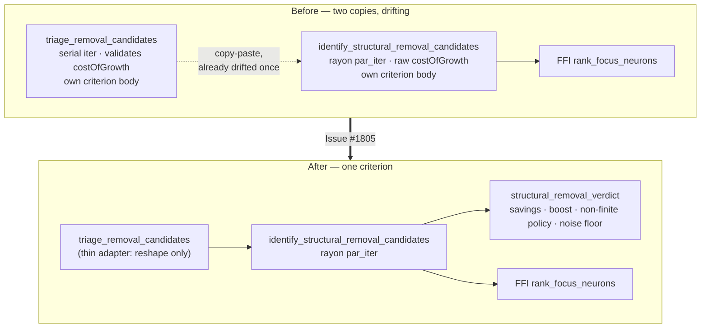

# Collapse the duplicate structural removal-triage implementations into one

## Summary

Two near-identical implementations of the same least-impact removal criterion
existed side by side and had already drifted once. The criterion now exists in
**exactly one place**. Closes #1805.

`identify_structural_removal_candidates` (the path the FFI ships) keeps the
decision logic — delegated to a new private `structural_removal_verdict` helper —
and `triage_removal_candidates` is reduced to a thin adapter that reshapes the
result into the record-free `StructuralRemovalCandidate`.

Everything that used to be copy-pasted now lives once: `calculate_removal_savings`,
the `REMOVAL_CANDIDATE_BOOST` multiplier applied *before* the comparison, the
`boosted_savings <= impact` gate, the non-finite-impact policy (#1804), the
`remove_low_impact_noise_floor()` re-gate (#1142), the hidden-only filter, and the
net-improvement-descending sort with `total_cmp` tie-breaks.

### API-surface decision: **kept** as documented adapters

`triage_removal_candidates`, `StructuralRemovalTriage` and
`StructuralRemovalCandidate` are **retained** — no public item was removed, so
this is not a breaking change. Why:

1. This is a published FFI library; the items are `pub` and out-of-tree consumers
   are not visible from here. Deleting them buys nothing the adapter does not
   already give (the adapter is ~20 lines and holds no logic).
2. The two output shapes are genuinely different contracts. `RemovalCandidate`
   carries record-derived fields (`mean_activation`, `activation_weighted_impact`,
   `total_error`) that are structurally meaningless at focus time;
   `StructuralRemovalCandidate` deliberately has none of them, which is what
   documents "this value never required a parquet decode".
3. The adapter's `Option<f32>` cost-of-growth contract is the *better* one, and it
   has now been pushed down into the shipped path rather than deleted.

The CHANGELOG records the two observable changes to the retained surface: the
per-candidate `reason` wording is now the shipped path's, and the pass is
`rayon`-parallel rather than serial.

### Bug fixed on the way

The shipped FFI path took `costOfGrowth` **raw**, so a caller bug produced silent
nonsense instead of a loud fallback:

| `costOfGrowth` | Before (FFI path) | After (both paths) |
|---|---|---|
| `-1e-4` / `0.0` | zero candidates, zero rejections reported | falls back to `1e-7` default, WARN logged |
| `NaN` | **every** hidden neuron emitted — including high-impact ones — with `NaN` savings | falls back to `1e-7` default, WARN logged |

Bad numbers must not license a destructive edit, and the absence of candidates
must not be reported as a clean pass.

## Evidence

Backend/CLI change — no web interface to screenshot. Verified by tests and the
full quality gate.

**The `NaN` row above is measured, not asserted from theory.** Temporarily
restoring the pre-fix raw behaviour in the shipped path turns the new parity test
red exactly there:

```
---- unification_parity_tests::entry_points_agree_on_an_invalid_cost_of_growth ----
assertion `left == right` failed: costOfGrowth NaN must fall back to the default on the shipped path too
  left: ["h-1", "h-3", "h-5", "h-0", "h-2", "h-4"]
 right: []
```

`left` is the pre-fix shipped path emitting all six hidden neurons; `right` is the
validated default. With the fix in place all four parity tests pass.

### Before / after



### Quality gate

`./quality.sh < /dev/null` → **All quality checks passed** (fmt, clippy
`-D warnings` on `--all-targets --all-features`, full test suite, docs, release
build).

## Test Plan

### Added — the drift detector this issue exists to create

- `tests/focus/issue_1783_removal_triage_unification.rs` (new, 4 tests) — compares
  the public adapter against the shipped path **through the FFI boundary**
  (`rank_focus_neurons_internal`) for the same creature and cost of growth:
  - `both_entry_points_agree_on_candidates_and_ordering` — identical candidate
    sets *and* identical ordering (acceptance criterion 2).
  - `both_entry_points_agree_on_impact_and_boosted_savings` — identical
    per-candidate impact and post-boost savings, so the `REMOVAL_CANDIDATE_BOOST`
    application point cannot move on one path only.
  - `both_entry_points_agree_on_noise_floor_rejections` — the #1142 report-never-
    swallow contract holds on both.
  - `invalid_cost_of_growth_falls_back_to_the_default_on_both_paths` — the
    validation fix, observed at the FFI surface.
- `src/focus/ranking/removal_triage.rs::unification_parity_tests` (new, 4 tests) —
  field-by-field bitwise parity (`to_bits`) including the **non-finite-impact**
  case where the two copies previously disagreed (`INFINITY` vs `0.0`). These live
  in-crate because the shipped path is `pub(crate)` and because a `NaN` synapse
  weight cannot cross the JSON FFI boundary (serde rejects it), so the case is
  only reachable here.

### Unchanged and still passing (regression guards named in the issue)

- `tests/focus/issue_1767_structural_removal_triage.rs` — pins the adapter's
  candidate selection, boost application, noise-floor rejections, ordering and
  `costOfGrowth` fallback. No test was modified, commented out, or deleted.
- `tests/ffi/issue_1767_structural_removal_triage.rs`,
  `tests/ffi/issue_1766_structural_focus_selection.rs` — the live FFI path.
- `tests/focus/issue_892_removal_candidate_boost.rs` — boost application point.
- `tests/issue_1804_nonfinite_impact_not_prunable.rs` and the in-crate
  `structural_removal_tests` — non-finite-impact policy.

### Documentation

- Module-level rationale in `removal_triage.rs` preserved verbatim (the "opposite
  axes" table and the #1766 parquet-stall explanation), extended with a "One
  criterion, two shapes" section stating that the module holds no decision logic.
  `#[must_use]` and every public doc comment survive; no documentation describes a
  deleted implementation.
- `docs/IMPACT_CALCULATION.md` — triage phase now points at the single
  implementation with the adapter noted.
- `CHANGELOG.md` — under `Fixed`, recording the unification, the retained public
  surface with its two observable changes, and the `costOfGrowth` bug.

## Security Self-Check

- **Input validation** — strengthened: `costOfGrowth` is now validated on the FFI
  path as well (non-finite / non-positive → default + WARN).
- **Secrets** — none staged; no hidden files touched.
- **Injection surface** — none; no new SQL, shell, filesystem or HTTP calls.
- **Error handling** — no new user-facing error text; the invalid-input case logs
  at WARN and never silently reports a clean pass.
- **Dependencies** — none added or changed.
