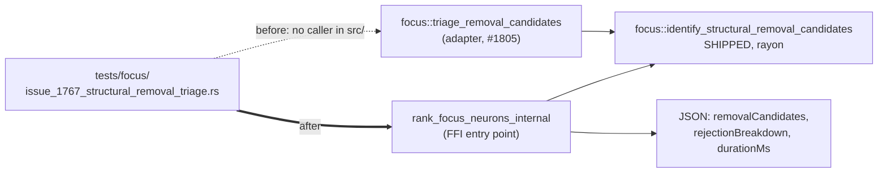

## Summary

The whole #1767 regression suite pinned `focus::triage_removal_candidates`, which
had no caller in `src/` when the suite was written — every behaviour it asserted
was unverified on the code that actually runs. This re-points all seven tests at
the shipped path: `rank_focus_neurons_internal`
(`src/ffi_internal/analysis.rs`), which calls
`focus::identify_structural_removal_candidates`. Driving the FFI entry point was
chosen over widening the crate export or moving the suite in-tree because it is
closest to production and additionally covers the JSON mapping onto
`removalCandidates` / `rejectionBreakdown`. No test-only public API was
introduced. Closes #1806.

Test-only change: the creature fixtures (`make_creature`,
`make_production_shaped_creature`) and the `EnvVarGuard` helper are preserved, not
rewritten.



### Fixture adjustments the FFI gate required

The FFI validates forward-only synapses (#1184), so two fixtures needed their
neuron **order** corrected while keeping their topology identical:

- `make_production_shaped_creature` — the output neuron moves from index 1 to
  last, so each `h-N -> out` synapse points forward.
- `candidates_are_sorted_by_net_improvement_descending` — the two extra inputs
  are inserted ahead of the hidden neurons rather than appended after the output.

### One behaviour that could not be ported as-is

`invalid_cost_of_growth_falls_back_to_the_default` previously covered
`f32::NAN`, `f32::INFINITY`, `-1.0` and `0.0`. `NaN` and `Infinity` are not
representable in JSON, so they can never reach the FFI — the ported test covers
the two reachable non-positive values, and the non-finite half stays pinned
directly against the shipped function by
`unification_parity_tests::entry_points_agree_on_an_invalid_cost_of_growth` in
`src/focus/ranking/removal_triage.rs`. Nothing was dropped silently; the test
documents this in its doc comment.

## Evidence

Backend/test-only change — no web interface to screenshot.

**Suite passes against the shipped path** (`cargo test --test focus issue_1767`):

```
running 7 tests
test issue_1767_structural_removal_triage::inputs_and_outputs_are_never_triaged_for_removal ... ok
test issue_1767_structural_removal_triage::candidates_are_sorted_by_net_improvement_descending ... ok
test issue_1767_structural_removal_triage::triage_needs_no_parquet_while_the_ranker_does ... ok
test issue_1767_structural_removal_triage::removal_axis_is_opposite_to_the_focus_axis ... ok
test issue_1767_structural_removal_triage::triage_meets_the_seconds_bar_on_a_production_shaped_creature ... ok
test issue_1767_structural_removal_triage::noise_floor_rejections_are_reported_not_silently_dropped ... ok
test issue_1767_structural_removal_triage::invalid_cost_of_growth_falls_back_to_the_default ... ok

test result: ok. 7 passed; 0 failed
```

**Mutation evidence — the tests genuinely fail when the shipped path breaks.**
Each mutation was applied to `identify_structural_removal_candidates` only, then
reverted:

| Mutation to the shipped path | Result |
|---|---|
| Hidden-only gate widened to `!= "input"` | `inputs_and_outputs_are_never_triaged_for_removal` FAILED (`out` appeared as a candidate) |
| Net-improvement sort flipped to ascending | `candidates_are_sorted_by_net_improvement_descending` FAILED (`h-low-a` led instead of `h-low-b`) |
| Noise-floor rejection counter removed | `noise_floor_rejections_are_reported_not_silently_dropped` FAILED (`rejectionBreakdown` reported 0, expected 3) |
| Savings-vs-contribution criterion inverted | 6 of 7 tests FAILED, including `removal_axis_is_opposite_to_the_focus_axis` |

Before the change these mutations were invisible to this suite's FFI surface,
because the suite never reached it.

**Performance bar:** `triage_meets_the_seconds_bar_on_a_production_shaped_creature`
now times the rayon-parallel shipped implementation through the FFI and asserts
both the harness wall clock and the path's own reported `durationMs` stay under
one second (observed `durationMs: 0`, suite wall clock 0.03 s for all 7 tests).

**Drift regression check** (from the issue's failure-detection section):
`grep -rn 'triage_removal_candidates' tests/` now matches only a doc comment in
this file plus `tests/focus/issue_1783_removal_triage_unification.rs`, where the
adapter is the deliberate subject under test (the #1805 parity suite).

`./quality.sh` passes cleanly: `✅ All quality checks passed!`

## Test Plan

Rewrote `tests/focus/issue_1767_structural_removal_triage.rs` — same seven tests,
same names, now driven through `rank_focus_neurons_internal`:

- `triage_needs_no_parquet_while_the_ranker_does` — the parquet-backed
  `rank_focus_neurons` still errors on a missing file while the shipped FFI path
  returns candidates for the same path; also asserts no `loadingMode` is
  reported, so a decode that never happened cannot be claimed.
- `removal_axis_is_opposite_to_the_focus_axis` — the focus pick is derived from
  the shipped response's own ranked pool (`neurons[].impact`), then asserted
  absent from `removalCandidates` and strictly above every candidate's impact.
- `inputs_and_outputs_are_never_triaged_for_removal` — `costOfGrowth: 1e3`;
  additionally asserts the candidate list is non-empty so the gate assertion is
  not vacuous.
- `noise_floor_rejections_are_reported_not_silently_dropped` — asserts the count
  on the wire under the stable `removal_below_noise_floor` reason key.
- `candidates_are_sorted_by_net_improvement_descending` — ordering checked on
  `removalSavings − impact` as serialised.
- `invalid_cost_of_growth_falls_back_to_the_default` — `-1.0` and `0.0` produce
  the default run's candidate list and rejection count (see the note above for
  `NaN` / `Infinity`).
- `triage_meets_the_seconds_bar_on_a_production_shaped_creature` — seconds bar
  plus the expected eight candidates on the 17-selectable fixture.

No existing tests were commented out or removed.
