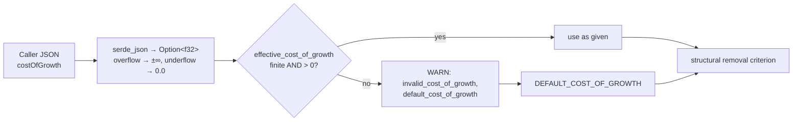

## Summary

`costOfGrowth` arriving over FFI had no regression guard of its own: the
validation (`effective_cost_of_growth`) was pinned only by tests on the in-crate
adapter, and the default was still spelled as a bare `1e-7` literal in three doc
comments that could drift from the constant. This PR pins the guard on the
**shipped** entry point (`rank_focus_neurons_internal` →
`identify_structural_removal_candidates`), makes the substitution's WARN a tested
contract, and removes the last cost-of-growth `1e-7` literals outside the
constant's definition. Closes #1807.

Changes:

- `DEFAULT_COST_OF_GROWTH` is now `pub` (re-exported from `focus`) and documented
  as the single definition of the default, so callers and tests reference it
  rather than repeating `1e-7`.
- The three doc comments that hard-coded `1e-7` for `costOfGrowth`
  (`ffi_types/requests.rs`, `ffi_internal/analysis.rs`, `focus/ranking/mod.rs`)
  now point at the constant.
- New regression suite
  `tests/analysis/issue_1807_ffi_cost_of_growth_validation.rs` covering the FFI
  entry point, the WARN, and a drift guard against a re-introduced literal.
- `docs/IMPACT_CALCULATION.md` documents the rejection behaviour, including the
  `f32` overflow/underflow cases.

### The FFI-reachable non-finite cases

`NaN` and `Infinity` are not JSON literals, so the earlier note that they "can
never reach the FFI" was only half right — a JSON number outside `f32` range
still reaches the criterion as a non-finite or zero value:

| Request JSON | Value the criterion sees | Outcome |
|--------------|--------------------------|---------|
| `0.0`, `-1.0`, `-1e-4` | as written | WARN + default |
| `1e39` / `-1e39` | `+∞` / `-∞` (f32 overflow) | WARN + default |
| `1e-60` | `0.0` (f32 underflow) | WARN + default |
| `NaN` / `Infinity` token | — (not valid JSON) | `success: false`, `errorKind: data_validation` |



## Evidence

Backend/FFI change — no web interface to screenshot.

**Tests fail against a regressed guard.** Temporarily reverting the call site to
`cost_of_growth.unwrap_or(1e-7)` (the shape #1807 describes) fails four of the
six new tests, including the drift guard:

```
test ..::invalid_ffi_cost_of_growth_is_logged_at_warn ... FAILED
test ..::nan_and_infinite_cost_of_growth_fall_back_on_the_shipped_criterion ... FAILED
test ..::invalid_ffi_cost_of_growth_falls_back_to_the_default ... FAILED
test ..::no_cost_of_growth_default_literal_survives_outside_the_constant ... FAILED
test result: FAILED. 2 passed; 4 failed
```

**With the guard in place** (`cargo test --test analysis issue_1807`):

```
running 6 tests
test ..::a_valid_ffi_cost_of_growth_is_neither_replaced_nor_warned_about ... ok
test ..::invalid_ffi_cost_of_growth_falls_back_to_the_default ... ok
test ..::invalid_ffi_cost_of_growth_is_logged_at_warn ... ok
test ..::nan_and_infinite_cost_of_growth_fall_back_on_the_shipped_criterion ... ok
test ..::non_json_cost_of_growth_tokens_are_rejected_loudly ... ok
test ..::no_cost_of_growth_default_literal_survives_outside_the_constant ... ok

test result: ok. 6 passed; 0 failed
```

The existing focus suite (186 tests, including the #1767 and #1783 removal-triage
tests) still passes, and `./quality.sh` passes cleanly.

## Test Plan

Added `tests/analysis/issue_1807_ffi_cost_of_growth_validation.rs`:

- `invalid_ffi_cost_of_growth_falls_back_to_the_default` — `0.0`, `-1.0`,
  `-1e-4`, `1e39` (`+∞`), `-1e39` (`-∞`) and `1e-60` (`0.0`) over the FFI all
  produce exactly the candidate list and rejection breakdown of an omitted
  `costOfGrowth`.
- `invalid_ffi_cost_of_growth_is_logged_at_warn` — each rejection emits a WARN
  carrying `invalid_cost_of_growth` (the value the criterion saw) and
  `default_cost_of_growth` (equal to `DEFAULT_COST_OF_GROWTH`), so the
  substitution is observable rather than silent.
- `a_valid_ffi_cost_of_growth_is_neither_replaced_nor_warned_about` — a valid
  `1e-4` is used as given, warns nothing, and yields a *different* list, so the
  fallback assertions are not vacuous.
- `non_json_cost_of_growth_tokens_are_rejected_loudly` — `NaN` / `Infinity` /
  `-Infinity` tokens fail loudly at the JSON boundary
  (`success: false`, `errorKind: data_validation`) instead of being ignored.
- `nan_and_infinite_cost_of_growth_fall_back_on_the_shipped_criterion` — the
  `NaN` half of the guard, driven through the public `triage_removal_candidates`
  adapter that delegates to the shipped criterion, asserting both the fallback
  and that `NaN` does not nominate the whole hidden layer.
- `no_cost_of_growth_default_literal_survives_outside_the_constant` — drift guard:
  no `1e-7` literal remains on a cost-of-growth line in `src/` outside the
  `DEFAULT_COST_OF_GROWTH` definition.

Doc comments in `tests/focus/issue_1767_structural_removal_triage.rs` were
corrected (they claimed non-finite values were unreachable over FFI) and now
cross-reference the new suite. No existing test was removed or disabled.

## Security Self-Check

- **Input validation**: this PR *is* input validation — an untrusted
  `costOfGrowth` from the request JSON is now provably range-checked on the
  shipped path before it reaches the removal criterion.
- **Secrets / injection / output encoding**: no new secrets, no new SQL, shell,
  filesystem or HTTP calls, no new user-facing rendering.
- **Error handling**: the WARN reports only the numeric value and the substituted
  default — no paths or internal state leak.
- **Dependencies**: none added.
