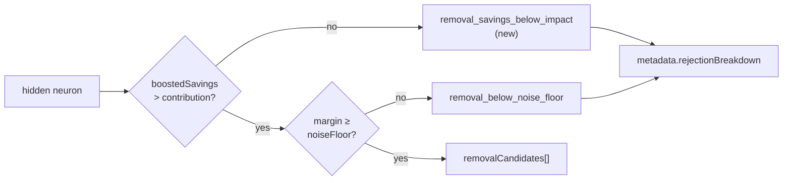

# Removal-triage rejection accounting: every hidden neuron is now accounted for

## Summary

The two removal-triage entry points diverged on rejection accounting and
under-reported why neurons were dropped. `RemovalCandidateOutcome` exposed a
`rejection_breakdown()` the FFI could merge; `StructuralRemovalTriage` carried a
bare `noise_floor_rejections: u32` with no reason string. Worse, **both** paths
counted only one rejection class — neurons dropped by the
`boosted_savings <= impact` gate (the common case) returned a bare `None` and
were counted nowhere, so "how many hidden neurons were considered, and why did
each fail?" was unanswerable.

This change gives both paths the same reporting shape and closes the accounting
holes. Closes #1808.

- Two new stable reason constants: `removal_savings_below_impact` (the
  savings-vs-impact gate) and `removal_active_neuron` (the record-derived
  mean-activation gate, previously a second silent `return None`). Both are
  registered in `ALL_REJECTION_REASONS` and classified into
  `GATE_SIDE_REJECTION_REASONS` — the neuron was measured against the removal
  criterion and lost there — so `partitions_cover_every_reason_exactly_once`
  stays green.
- `RemovalCandidateOutcome` and `StructuralRemovalTriage` both gained
  per-class counters, a neurons-considered count, `total_rejections()` and a
  `rejection_breakdown()` returning the shared reason vocabulary. A caller of
  the public `triage_removal_candidates` no longer has to hard-code a reason
  constant to merge its counts.
- Both verdict enums now return one variant per neuron (no `filter_map`), and a
  `debug_assert` at each construction site enforces
  `candidates + rejections == considered`, so a future gate that drops a neuron
  with a bare `continue` fails immediately rather than under-reporting.
- Removed the duplicate breakdown builder in `focus/ranking/mod.rs`; the
  record-derived path now calls the same `rejection_breakdown()` the structural
  path does, which is what stops the two shapes re-diverging.

### Verdict flow

Before, the `G1 -- no` edge went nowhere.

## Evidence

Backend-only change — no web interface to screenshot. Verified by tests through
the shipped FFI entry point (`rank_focus_neurons_internal`), which is how
production reaches this code.

`./quality.sh` passes (fmt, clippy with `-D warnings`, check, full test suite,
release build).

The FFI-level assertion pins the acceptance criteria end to end: for a creature
with four hidden neurons, one is rejected on the savings gate and the other
three flip between candidates and noise-floor rejections with `costOfGrowth`,
and `candidates + Σ rejectionBreakdown == 4` in both configurations.

## Test Plan

Added:

- `src/focus/ranking/removal_triage.rs::removal_triage_accounts_for_every_hidden_neuron`
  — the conservation test the issue specifies: a creature tripping **both** the
  savings-vs-impact and noise-floor gates while still emitting candidates, with
  `candidates + Σ rejection_breakdown == hidden_neurons_considered`.
- `src/focus/ranking/removal_triage.rs::triage_reports_rejections_under_named_reasons`
  — the breakdown is keyed by the shared reason vocabulary, not a raw number.
- `src/focus/ranking/removal_candidates.rs::every_triaged_neuron_lands_in_exactly_one_class`
  — the same conservation invariant on the record-derived path, exercising all
  three gates (savings, mean-activation, noise floor).
- `tests/focus/issue_1767_structural_removal_triage.rs::savings_vs_impact_rejections_reach_the_ffi_breakdown`
  — the companion FFI-merge assertion: the savings-vs-impact count lands in
  `metadata.rejection_breakdown` alongside the noise-floor count, and the two
  together account for every hidden neuron.

Extended:

- `assert_parity` in the #1783/#1805 unification suite now compares the new
  counters and the full `rejection_breakdown()` map, so the two entry points
  cannot re-diverge on reporting shape.

Existing coverage kept green (no test was modified to pass):

- `src/analysis/candidate_starvation.rs::partitions_cover_every_reason_exactly_once`
  — pins the two new reasons into exactly one partition.
- The #1142 noise-floor tests and the #1767/#1783/#1804/#1806 removal suites.

## Documentation

`docs/FOCUS_SELECTION.md` §4.1 gained a "Rejection accounting" subsection with
the verdict table and the flowchart above.
