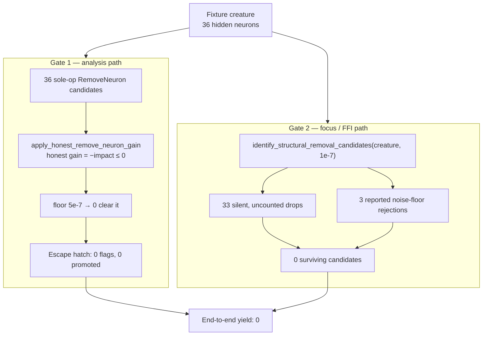

# Characterise the remove-neuron zero yield end to end (Issue #1810)

## Summary

Milestone #1785 cited a reproduction that does not exist on `Develop` —
`tests/issue_1777_discovery_diagnostic.rs` is not a file in this repository, and
`docs/analysis/candidate-rate-diagnosis-1777.md` has no "Fresh-run evidence"
section — so none of its quoted measurements were re-derivable and no test
pinned the end-to-end zero yield the milestone is trying to change.

This PR adds that missing evidence base: a characterisation suite that drives
**both** shipped remove-neuron gates over one committed production-shaped
fixture, and a reference table recording what they emit today. Measurement only
— no production behaviour changes. Closes #1810.

## Evidence

Backend/library change with no web interface, so no screenshot applies. The
evidence is the test's `--nocapture` output:

```text
$ cargo test --test issue_1785_remove_neuron_reachability -- --nocapture --test-threads=1

=== Block 1 — Gate 1 (analysis path, honest remove-neuron gain) ===
hidden neurons (candidate set): 36
removable neurons (gain overridden): 36
honest gain min:    -1e0
honest gain median: -1.666666865348816e-1
honest gain max:    -0e0
coordinated_post_discount_noise_floor(1): 5e-7
neurons clearing the floor: 0

=== Block 2 — promotion escape hatch (#1622 / #1779) ===
functionally_constant_neuron_uuids: 0
candidates carrying a constant_neuron_bias_fold: 0
bias_folded_constant_neuron_uuids: 0
candidates promoted: 0

=== Block 3 — Gate 2 (focus / FFI structural removal triage) ===
hidden neurons considered: 36
surviving candidates: 0
noise_floor_rejections (reported): 3
silent `boosted_savings <= contribution` drops (uncounted): 33
best boosted savings across the fixture: 3.3e-7
REMOVE_LOW_IMPACT_NOISE_FLOOR: 1e-5

=== Block 4 — noise-floor break-even (zero-contribution neuron) ===
costOfGrowth: 1e-7
REMOVAL_CANDIDATE_BOOST: 1.5
REMOVE_LOW_IMPACT_NOISE_FLOOR: 1e-5
break-even synapse count: 657
boosted savings at 657: 1.0005e-5
boosted savings at 656: 9.99e-6

test result: ok. 4 passed; 0 failed
```



`./quality.sh` passes cleanly (fmt, clippy `-D warnings`, `cargo deny`, full test
suite, docs, release build).

### Numbers reconciled with #1785

| #1785 quotes | Status |
|---|---|
| 36 removable neurons | Reproduced (fixture sized to match) |
| Best honest gain `−1.84e-2` | **Not reproducible** — a property of the unavailable production creature; the signed, non-positive shape is reproduced (`−0e0` best on this fixture) |
| 0 neurons clearing the floor | Reproduced, and shown to be structural (gain `= −impact ≤ 0` vs a strictly positive floor) |
| 0 promotion entries | Reproduced |
| Best boosted savings `3.30e-7` | Reproduced (degree-12 hub) |
| 657 synapses needed | Reproduced by construction, not quoted |

#1785's source line references were also verified and corrected against `a36e9ba`
in the new doc — two of them pointed at the wrong code
(`removal_candidates.rs:160-170` is `rejection_breakdown`; the silent drop is at
`:387-389`, and the shipped triage is `identify_structural_removal_candidates`,
not `removal_triage.rs`).

## Test Plan

Added `tests/issue_1785_remove_neuron_reachability.rs` (4 tests, one per
measurement block):

- `gate_1_analysis_path_yields_no_floor_clearing_remove_neuron_candidate` —
  builds the sole-op `RemoveNeuron` set, runs `apply_honest_remove_neuron_gain`,
  records the gain distribution and asserts 0 clear
  `coordinated_post_discount_noise_floor(1)`.
- `gate_1_promotion_escape_hatch_promotes_nothing` — asserts
  `functionally_constant_neuron_uuids` is empty, counts bias-fold-carrying
  candidates, and asserts `promote_constant_remove_neuron_candidates` promotes 0.
- `gate_2_focus_path_yields_no_surviving_removal_candidate` — reaches the
  `pub(crate)` `identify_structural_removal_candidates` through the shipped FFI
  entry point (the #1806 convention), recording survivors, reported rejections,
  the uncounted `boosted_savings <= contribution` residue, and the best boosted
  savings.
- `gate_2_break_even_needs_657_synapses_on_a_zero_contribution_neuron` — searches
  the shipped `calculate_removal_savings` for the break-even degree.

Every assertion carries the message "this pin is expected to break when a gate is
fixed — update the pin and `docs/analysis/remove-neuron-reachability-1785.md`",
so a fix to either gate fails loudly rather than silently drifting. The suite
also asserts its own preconditions (≥ 20 hidden neurons, non-empty candidate set,
empty constant-neuron flag set) so it cannot pass vacuously on a hollowed-out
fixture.

New files:

- `tests/fixtures/remove_neuron_reachability/network.json` + `README.md` —
  hand-authored synthetic creature: 6 inputs, 36 hidden neurons (12/10/8/3 plus 3
  orphans), 2 outputs, 102 synapses, degree-12 hub. Passes the
  `fixtures_self_contained` provenance and size guards.
- `docs/analysis/remove-neuron-reachability-1785.md` — the reference table the
  rest of the milestone cites.

No existing tests were modified or removed.
